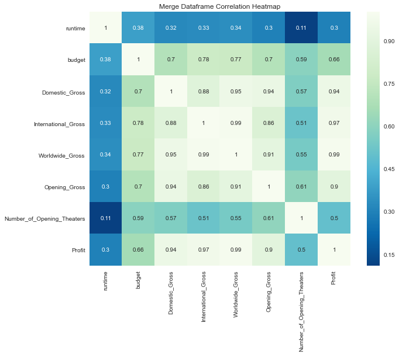
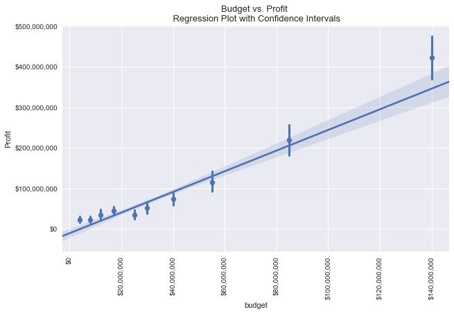
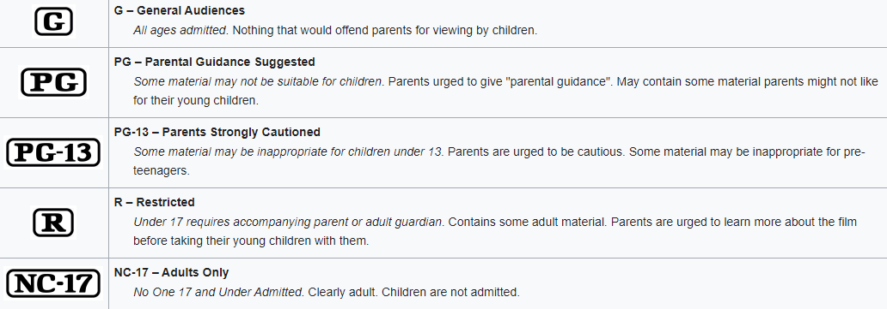

# An Examination of Trends in Film


## Introduction

A journey to any theater to view a film, in a pre-pandemic world, was an experience for anyone willing. Take the time to immerse yourself in another world, another time, or another romance and let the world outside of the air conditioned screening rooms just melt away. These experiences can break ennui, provide artistic fulfillment, and be fun. 

On the other hand, however, film is a business. According to Forbes, in 2019 the film industry surpassed [$100 Billion USD](https://www.forbes.com/sites/rosaescandon/2020/03/12/the-film-industry-made-a-record-breaking-100-billion-last-year/#1e22642e34cd) in earnings. Therefore, if a formula can be cracked - or even a new formula devised - certain entities could stand to take a decent slice of this proverbial pie. 

We have selected the previous decade of film minus the current year due to industry changes related to the pandemic. This provides a relevant look at the film industry. Following this logic we have chose to focus on films produced domestically, but with international considerations. 

## Points of Analysis

### Optimal Budget

Looking deeper into the subject of film one of the obvious and most functionally useful questions to ask is: Does a higher budget, actually make more money?

### Most Profitable Rating

Ratings are an exclusionary system. Does this exclusivity block out a large sector of the market at the higher ratings, or does it entice them in?

### Profitability of Genre

Does a gun-totin' cowboy with a hearth of gold bring in the most box office dollars? Or is it the family friendly comedy produced by a large production company. We take a dive into genres across the decade to find what is on the up-trend and what is falling down. 

# Data Retrieval


## Libraries and Data Retrieval 

### Library Importations


```python
import pandas as pd 
import numpy as np
import matplotlib.pyplot as plt
import matplotlib.ticker as mtick
import seaborn as sns
import plotly.express as px
import plotly.graph_objects as go
import plotly
from plotly.subplots import make_subplots
import tmdbsimple as tmdb
import requests
from tqdm.notebook import tqdm
import pprint
import time
import csv

%matplotlib inline

## Opens API key
f = open('C:/Users/Nero_/apikeys/tmdb.txt', 'r')
key = f.readline()

tmdb.API_KEY = key

## Pretty print aestheics 
pp = pprint.PrettyPrinter(indent=2)
```

### Datasets and Retrieval


```python
## If you would like to scrape, set scraping to True
scraping = False

## Creating an ID list to scrape with
discover = tmdb.Discover()

id_list = []

## For loop scrapes 500 pages of data to return the tmdb id of each
## entry for later use in scraping
if scraping:
    for pages in tqdm(range(1,501), desc='ID Append'):
        page = discover.movie(language='en-US', sort_by='revenue.desc', page=pages, 
                              certification_country='US', certification_lte='NC-17', 
                              certification_gte='G', primary_release_date_gte='2010-01-01', 
                              with_original_language='en')
        for film in page['results']:
            id_list.append(film['id'])
        time.sleep(.16)
```


```python
## Movie info scraping function
def movie_info(list_id):
    
    """Movie Info Scraper_test.csv
       ---------------------------
       Function takes a list of The Movie Database Unique IDs
       and returns a dictionary of data that includes: title, release date,
       MPAA rating, IMDB_ID, TMDB_ID, running time, genres, budget, and revenue
       information. """
    
    ## Pulling tmdbsimple object methods and passing them into variables
    movie = tmdb.Movies(list_id).info()
    ratings = tmdb.Movies(list_id).release_dates()
    
    ## Search ratings variables for MPAA certification
    iso = 'iso_3166_1'
    for result in ratings['results']:
        if result[iso] == 'US':
            if result['release_dates'][0]['certification'] == '':
                rating = result['release_dates'][1]['certification']
            else: 
                rating = result['release_dates'][0]['certification']
    ## Sleep timer = No accidental DDoS
    time.sleep(.05)
    
    ## Dictionary to catch and store information requested
    movie_dict = {
        'title': movie['original_title'],
        'release_date': movie['release_date'],
        'rating': rating,
        'imdb_id': movie['imdb_id'],
        'tmbd_id': movie['id'],
        'runtime': movie['runtime'],
        'genres': [[genre.get('name') for genre in movie['genres']]],
        'budget': movie['budget'],
        'revenue': movie['revenue']
    }
    
    return movie_dict
```


```python
## Scraping loop

## Initialize the list of dicts to store scraped data
film_dict = []

## For loop used to scrape using the scraping function with error handling for
## cases of HTTP errors.
if scraping:
    for movie in tqdm(id_list):
        try:
            film_dict.append(movie_info(movie))
        except:
            film_dict.append('Missing')
```


```python
## Remove any missing entires in the list as well as removing
## empty values in two strings of the movie information

miss = 'Missing'
for count, film in enumerate(film_dict):
    if film == miss:
        film_dict.pop(count)
    if film_dict[count]['rating'] == '':
        film_dict.pop(count)
    if film_dict[count]['imdb_id'] == '':
        film_dict.pop(count)
```


```python
## Convert the list of movie dicts into a pandas dataframe if scraping and save to CSV
if scraping:
    film = pd.DataFrame.from_records(film_dict)
    film.to_csv('film.csv', index=False)
```


```python
## Read from CSV if not scraping
film = pd.read_csv('film.csv', converters={'genres':pd.eval})

## Convert the release_date column from an object (string) to a datetime object
film['release_date'] = pd.to_datetime(film['release_date'])
```


```python
## Bring in previously scraped data and convert to dataframe
bomFrame = pd.read_csv('Scraper_test.csv')
bom_frame = pd.DataFrame(bomFrame)
```


```python
## Removing unwanted zero values from the dataframe to provide a clearer picture
## of the data. 

## Working with a copy to protect the original from transformative work
film_copy = film.copy()

## Removing the unwanted zero values from budget, revenue, and runtime
indexNames = film_copy[film_copy['budget'] == 0].index
film_copy.drop(indexNames, inplace=True)

revenueNames = film_copy[film_copy['revenue'] == 0].index
film_copy.drop(revenueNames, inplace=True)

runtimeNames = film_copy[film_copy['runtime'] == 0].index
film_copy.drop(runtimeNames, inplace=True)

## Casting the tmbd_id as str to avoid any mathematical operations during
## further analysis steps.
film_copy['tmbd_id'] = film_copy['tmbd_id'].apply(str)
film_copy.drop(['revenue'], axis=1, inplace=True)

## Check the data for correct operations
print(film_copy.info())
display(film_copy.head())
```

    <class 'pandas.core.frame.DataFrame'>
    Int64Index: 1720 entries, 0 to 2188
    Data columns (total 8 columns):
     #   Column        Non-Null Count  Dtype         
    ---  ------        --------------  -----         
     0   title         1720 non-null   object        
     1   release_date  1720 non-null   datetime64[ns]
     2   rating        1718 non-null   object        
     3   imdb_id       1696 non-null   object        
     4   tmbd_id       1720 non-null   object        
     5   runtime       1720 non-null   float64       
     6   genres        1720 non-null   object        
     7   budget        1720 non-null   int64         
    dtypes: datetime64[ns](1), float64(1), int64(1), object(5)
    memory usage: 120.9+ KB
    None
    


<div>
<style scoped>
    .dataframe tbody tr th:only-of-type {
        vertical-align: middle;
    }

    .dataframe tbody tr th {
        vertical-align: top;
    }

    .dataframe thead th {
        text-align: right;
    }
</style>
<table border="1" class="dataframe">
  <thead>
    <tr style="text-align: right;">
      <th></th>
      <th>title</th>
      <th>release_date</th>
      <th>rating</th>
      <th>imdb_id</th>
      <th>tmbd_id</th>
      <th>runtime</th>
      <th>genres</th>
      <th>budget</th>
    </tr>
  </thead>
  <tbody>
    <tr>
      <th>0</th>
      <td>Avengers: Endgame</td>
      <td>2019-04-24</td>
      <td>PG-13</td>
      <td>tt4154796</td>
      <td>299534</td>
      <td>181.0</td>
      <td>[[Adventure, Science Fiction, Action]]</td>
      <td>356000000</td>
    </tr>
    <tr>
      <th>1</th>
      <td>Star Wars: The Force Awakens</td>
      <td>2015-12-15</td>
      <td>PG-13</td>
      <td>tt2488496</td>
      <td>140607</td>
      <td>136.0</td>
      <td>[[Action, Adventure, Science Fiction, Fantasy]]</td>
      <td>245000000</td>
    </tr>
    <tr>
      <th>2</th>
      <td>Avengers: Infinity War</td>
      <td>2018-04-25</td>
      <td>PG-13</td>
      <td>tt4154756</td>
      <td>299536</td>
      <td>149.0</td>
      <td>[[Adventure, Action, Science Fiction]]</td>
      <td>300000000</td>
    </tr>
    <tr>
      <th>3</th>
      <td>Jurassic World</td>
      <td>2015-06-06</td>
      <td>PG-13</td>
      <td>tt0369610</td>
      <td>135397</td>
      <td>124.0</td>
      <td>[[Action, Adventure, Science Fiction, Thriller]]</td>
      <td>150000000</td>
    </tr>
    <tr>
      <th>4</th>
      <td>The Lion King</td>
      <td>2019-07-12</td>
      <td>PG</td>
      <td>tt6105098</td>
      <td>420818</td>
      <td>118.0</td>
      <td>[[Adventure, Family, Music]]</td>
      <td>260000000</td>
    </tr>
  </tbody>
</table>
</div>


```python
## Merging the partially cleaned film dataframe and the previously scraped data
merge = pd.merge(left=film_copy, right=bom_frame, left_on='title', right_on='Title')
```


```python
## Dropping unwanted values from the newly merged dataset

## Dropping the extra Title column
merge = merge.drop(['Title'], axis=1)

## Removing zero and extraneous values from the newly merged dataframe
mergeRuntimes = merge[merge['runtime'] == 0].index
merge.drop(mergeRuntimes, inplace=True)

mergeOpen = merge[merge['Number_of_Opening_Theaters'] == '('].index
merge.drop(mergeOpen, inplace=True)

mergeOpen = merge[merge['Number_of_Opening_Theaters'] == 0].index
merge.drop(mergeOpen, inplace=True)

mergeBudget = merge[merge['budget'] == 0].index
merge.drop(mergeBudget, inplace=True)
```


```python
## Casting the tmbd_id, runtime, and Number_of_Opening_Theaters columns
## as more useful datatypes for analysis.
merge = merge.astype({'tmbd_id':'object', 'runtime':'int64','Number_of_Opening_Theaters':'int64'})
```


```python
## Dropping doubles that may have been introduced in the merge
merge = merge.sort_values('imdb_id', ascending=False)
merge = merge.drop_duplicates(subset='imdb_id', keep='first')
```


```python
## Feature engineering
## Creating a profit column from Worldwide_Gross - budget
merge['Profit'] = merge['Worldwide_Gross'] - merge['budget']
```


```python
## Checking the newly created column
merge
```


<div>
<style scoped>
    .dataframe tbody tr th:only-of-type {
        vertical-align: middle;
    }

    .dataframe tbody tr th {
        vertical-align: top;
    }

    .dataframe thead th {
        text-align: right;
    }
</style>
<table border="1" class="dataframe">
  <thead>
    <tr style="text-align: right;">
      <th></th>
      <th>title</th>
      <th>release_date</th>
      <th>rating</th>
      <th>imdb_id</th>
      <th>tmbd_id</th>
      <th>runtime</th>
      <th>genres</th>
      <th>budget</th>
      <th>Domestic_Gross</th>
      <th>International_Gross</th>
      <th>Worldwide_Gross</th>
      <th>Opening_Gross</th>
      <th>Number_of_Opening_Theaters</th>
      <th>Profit</th>
    </tr>
  </thead>
  <tbody>
    <tr>
      <th>1175</th>
      <td>Playing with Fire</td>
      <td>2019-11-08</td>
      <td>PG</td>
      <td>tt9134216</td>
      <td>554241</td>
      <td>96</td>
      <td>[[Comedy, Family]]</td>
      <td>29900000</td>
      <td>44451847</td>
      <td>24179822</td>
      <td>68631669</td>
      <td>12723781</td>
      <td>3125</td>
      <td>38731669</td>
    </tr>
    <tr>
      <th>331</th>
      <td>Knives Out</td>
      <td>2019-11-27</td>
      <td>PG-13</td>
      <td>tt8946378</td>
      <td>546554</td>
      <td>131</td>
      <td>[[Mystery, Thriller, Comedy, Drama, Crime]]</td>
      <td>40000000</td>
      <td>165363234</td>
      <td>143869563</td>
      <td>309232797</td>
      <td>26769548</td>
      <td>3461</td>
      <td>269232797</td>
    </tr>
    <tr>
      <th>1143</th>
      <td>Midsommar</td>
      <td>2019-07-03</td>
      <td>R</td>
      <td>tt8772262</td>
      <td>530385</td>
      <td>148</td>
      <td>[[Horror, Drama, Mystery]]</td>
      <td>9000000</td>
      <td>27426361</td>
      <td>20437004</td>
      <td>47863365</td>
      <td>6560030</td>
      <td>2707</td>
      <td>38863365</td>
    </tr>
    <tr>
      <th>1152</th>
      <td>21 Bridges</td>
      <td>2019-10-24</td>
      <td>R</td>
      <td>tt8688634</td>
      <td>535292</td>
      <td>99</td>
      <td>[[Crime, Action, Drama]]</td>
      <td>33000000</td>
      <td>28539757</td>
      <td>21400000</td>
      <td>49939757</td>
      <td>9261268</td>
      <td>2665</td>
      <td>16939757</td>
    </tr>
    <tr>
      <th>1171</th>
      <td>Child's Play</td>
      <td>2019-06-19</td>
      <td>R</td>
      <td>tt8663516</td>
      <td>533642</td>
      <td>90</td>
      <td>[[Horror]]</td>
      <td>10000000</td>
      <td>29208403</td>
      <td>15693834</td>
      <td>44902237</td>
      <td>14094594</td>
      <td>3007</td>
      <td>34902237</td>
    </tr>
    <tr>
      <th>...</th>
      <td>...</td>
      <td>...</td>
      <td>...</td>
      <td>...</td>
      <td>...</td>
      <td>...</td>
      <td>...</td>
      <td>...</td>
      <td>...</td>
      <td>...</td>
      <td>...</td>
      <td>...</td>
      <td>...</td>
      <td>...</td>
    </tr>
    <tr>
      <th>1390</th>
      <td>The Rum Diary</td>
      <td>2011-10-13</td>
      <td>R</td>
      <td>tt0376136</td>
      <td>23514</td>
      <td>120</td>
      <td>[[Drama, Comedy]]</td>
      <td>45000000</td>
      <td>13109815</td>
      <td>17025143</td>
      <td>30134958</td>
      <td>5135369</td>
      <td>2273</td>
      <td>-14865042</td>
    </tr>
    <tr>
      <th>2</th>
      <td>Jurassic World</td>
      <td>2015-06-06</td>
      <td>PG-13</td>
      <td>tt0369610</td>
      <td>135397</td>
      <td>124</td>
      <td>[[Action, Adventure, Science Fiction, Thriller]]</td>
      <td>150000000</td>
      <td>652270625</td>
      <td>1018130012</td>
      <td>1670400637</td>
      <td>208806270</td>
      <td>4274</td>
      <td>1520400637</td>
    </tr>
    <tr>
      <th>1091</th>
      <td>A Walk Among the Tombstones</td>
      <td>2014-09-18</td>
      <td>R</td>
      <td>tt0365907</td>
      <td>169917</td>
      <td>113</td>
      <td>[[Crime, Drama, Mystery, Thriller]]</td>
      <td>28000000</td>
      <td>26307600</td>
      <td>32526784</td>
      <td>58834384</td>
      <td>12758780</td>
      <td>2712</td>
      <td>30834384</td>
    </tr>
    <tr>
      <th>520</th>
      <td>The Secret Life of Walter Mitty</td>
      <td>2013-12-18</td>
      <td>PG</td>
      <td>tt0359950</td>
      <td>116745</td>
      <td>114</td>
      <td>[[Adventure, Comedy, Drama, Fantasy]]</td>
      <td>90000000</td>
      <td>58236838</td>
      <td>129896484</td>
      <td>188133322</td>
      <td>12765508</td>
      <td>2909</td>
      <td>98133322</td>
    </tr>
    <tr>
      <th>1617</th>
      <td>On the Road</td>
      <td>2012-05-22</td>
      <td>R</td>
      <td>tt0337692</td>
      <td>83770</td>
      <td>137</td>
      <td>[[Adventure, Drama]]</td>
      <td>25000000</td>
      <td>744296</td>
      <td>8873081</td>
      <td>9617377</td>
      <td>39550</td>
      <td>4</td>
      <td>-15382623</td>
    </tr>
  </tbody>
</table>
<p>1547 rows × 14 columns</p>
</div>


```python
merge['genres'] = merge['genres'].apply(lambda x: x[0])
```

# Data Analysis


### Exploratory Data Analysis

After very minor feature engineering to pull out a basic profit calculation of each film by subtracting the `budget` from the `Worldwide_Gross` in the retrieval and cleaning process.

It is a good idea to look at the various values and to take note of any correlations between the values of the data. 


```python
plt.figure(figsize=(10, 8))
plt.title('Merge Dataframe Correlation Heatmap')
mergeCorr = merge.corr()
sns.heatmap(mergeCorr, annot=True,cmap='GnBu_r')
plt.show()
```





This correlation heatmap is the perfect visual to display the correlations of values at a glance. The information gleamed here is valuable for further analysis. First, it can be surmised that variables with low correlation coefficients such as `runtime` to `Number_of_Opening_Theaters` are not information worth looking in to. On the other side of this issue are things with a very obvious correlation, such as `International_Gross` and `Worldwide_Gross` - it bears to reason that those few regions not included in `International_Gross` would follow with similar results. 

Some of the more interesting results that could bear further fruit in analysis would be things like how `budget` effects `runtime` or what the relationship between something like `domestic_gross` and `opening_gross` is. 

### How profitable is a movie?

A determination on what kind of movie to make hinges on the profitability of a movie, and it is important to determine exactly how profitable a movie is. To do this there must be a measure more of feature engineering. We are going to determine a basic Return on Investment.

$$ \frac{Profit}{Worldwide Gross} = ROI$$


```python
merge_profit = merge['Profit']
merge_WWGross = merge['Worldwide_Gross']
percent_profit = round(merge_profit/merge_WWGross, 3)*100

merge.loc[:,'ROI'] = percent_profit
```

Using a mathematical determination of the profitability it is easier to surmise what will make a film profitable. Taking this measure of profitability it is much easier to sift through the data. Further, a step is taken to eliminate further extraneous data by setting the budget to a figure no less than $10,000. 


```python
top_100 = merge.sort_values(by='ROI', ascending=False)
print(len(top_100))
top_100 = top_100[top_100['budget'] >= 10000]
print(len(top_100))
display(top_100.head())
```

    1547
    1541
    


<div>
<style scoped>
    .dataframe tbody tr th:only-of-type {
        vertical-align: middle;
    }

    .dataframe tbody tr th {
        vertical-align: top;
    }

    .dataframe thead th {
        text-align: right;
    }
</style>
<table border="1" class="dataframe">
  <thead>
    <tr style="text-align: right;">
      <th></th>
      <th>title</th>
      <th>release_date</th>
      <th>rating</th>
      <th>imdb_id</th>
      <th>tmbd_id</th>
      <th>runtime</th>
      <th>genres</th>
      <th>budget</th>
      <th>Domestic_Gross</th>
      <th>International_Gross</th>
      <th>Worldwide_Gross</th>
      <th>Opening_Gross</th>
      <th>Number_of_Opening_Theaters</th>
      <th>Profit</th>
      <th>ROI</th>
    </tr>
  </thead>
  <tbody>
    <tr>
      <th>144</th>
      <td>Logan</td>
      <td>2010-09-10</td>
      <td>G</td>
      <td>tt1483010</td>
      <td>44010</td>
      <td>94</td>
      <td>[Comedy, Drama, Family]</td>
      <td>135000</td>
      <td>226277068</td>
      <td>392744368</td>
      <td>619021436</td>
      <td>88411916</td>
      <td>4071</td>
      <td>618886436</td>
      <td>100.0</td>
    </tr>
    <tr>
      <th>1973</th>
      <td>Arrival</td>
      <td>2018-12-20</td>
      <td>PG-13</td>
      <td>tt8259442</td>
      <td>696430</td>
      <td>56</td>
      <td>[Adventure]</td>
      <td>10000</td>
      <td>100546139</td>
      <td>102842047</td>
      <td>203388186</td>
      <td>24074047</td>
      <td>2317</td>
      <td>203378186</td>
      <td>100.0</td>
    </tr>
    <tr>
      <th>1196</th>
      <td>The Gallows</td>
      <td>2015-07-10</td>
      <td>R</td>
      <td>tt2309260</td>
      <td>299245</td>
      <td>87</td>
      <td>[Horror, Thriller]</td>
      <td>100000</td>
      <td>22764410</td>
      <td>20200000</td>
      <td>42964410</td>
      <td>9808463</td>
      <td>2720</td>
      <td>42864410</td>
      <td>99.8</td>
    </tr>
    <tr>
      <th>153</th>
      <td>Fifty Shades of Grey</td>
      <td>2015-02-11</td>
      <td>R</td>
      <td>tt2322441</td>
      <td>216015</td>
      <td>125</td>
      <td>[Drama, Romance, Thriller]</td>
      <td>4000000</td>
      <td>166167230</td>
      <td>403484237</td>
      <td>569651467</td>
      <td>85171450</td>
      <td>3646</td>
      <td>565651467</td>
      <td>99.3</td>
    </tr>
    <tr>
      <th>1768</th>
      <td>Catfish</td>
      <td>2010-09-17</td>
      <td>PG-13</td>
      <td>tt1584016</td>
      <td>42296</td>
      <td>87</td>
      <td>[Documentary]</td>
      <td>30000</td>
      <td>3237343</td>
      <td>296368</td>
      <td>3533711</td>
      <td>257285</td>
      <td>12</td>
      <td>3503711</td>
      <td>99.2</td>
    </tr>
  </tbody>
</table>
</div>


Taking a look at some of the most profitable films using the Profitability Percentage metric will allow deeper insights to be drawn into what exactly makes a film profitable. The first conclusion that can be drawn is that there is an optimum budget range that will produce the most profit.

## Optimal Budget to Maximize Profit


Looking at the plot below it can be surmised that the the distribution of the data has a strongly positive skew. Taking this information and comparing it to a scatter plot will allow for further derivation of further insights to confirm ideas that can be drawn from the data. 

The scatter plot reveals a large cluster of data and betrays the few outliers that trail at the tail of the data. Working with his information an inference can be made about where our optimal budget may be derived from. This ends can be achieved with the use of a regression line, mean estimation, and confidence intervals to look where the data is most useful for estimation of the optimal budget.


```python
## Create boxplot/scatterplot in plotly express
fig = make_subplots(rows=2, cols=1)

fig = px.scatter(x='budget', y='Profit', data_frame=top_100,
                 title="Budget vs Profit Distribution with Profit and Budget Boxplots", 
                 hover_data=['title'], marginal_x='box', marginal_y='box',
                 width=1000, height=700)
fig.show()

## Create and manage regplot with Seaborn
plt.figure(figsize=(10, 6))

plt.ticklabel_format(axis='both', style='plain')
plt.title('Budget vs. Profit \n Regression Plot with Confidence Intervals', fontsize=13)
ax = sns.regplot(x='budget', y='Profit', data=top_100, fit_reg=True, x_bins=10, x_ci='ci')

fmt = '${x:,.0f}'
tick = mtick.StrMethodFormatter(fmt)
ax.xaxis.set_major_formatter(tick)
ax.yaxis.set_major_formatter(tick)
plt.xticks(rotation=90)

plt.style.use('seaborn')
plt.show()
plt.savefig('regplot.png')

```


<div>


            <div id="ab662ba5-b177-4d87-a53c-954dcd8a4e80" class="plotly-graph-div" style="height:700px; width:1000px;"></div>
            <script type="text/javascript">
                require(["plotly"], function(Plotly) {
                    window.PLOTLYENV=window.PLOTLYENV || {};

                if (document.getElementById("ab662ba5-b177-4d87-a53c-954dcd8a4e80")) {
                    Plotly.newPlot(
                        'ab662ba5-b177-4d87-a53c-954dcd8a4e80',
                        [{"customdata": [["Logan"], ["Arrival"], ["The Gallows"], ["Fifty Shades of Grey"], ["Catfish"], ["The Devil Inside"], ["The Quiet Ones"], ["Snow Flower and the Secret Fan"], ["Searching"], ["Insidious"], ["Unfriended"], ["Paranormal Activity 2"], ["Get Out"], ["The Woman in Black 2: Angel of Death"], ["Paranormal Activity 3"], ["Annabelle"], ["The Last Exorcism"], ["Like Crazy"], ["Courageous"], ["Split"], ["Lights Out"], ["The Purge"], ["Paranormal Activity 4"], ["The King's Speech"], ["Sinister"], ["Truth or Dare"], ["Happy Death Day"], ["Black Swan"], ["The Fault in Our Stars"], ["Your Sister's Sister"], ["Dope"], ["Halloween"], ["The Conjuring"], ["War Room"], ["A Haunted House"], ["Magic Mike"], ["Ouija"], ["Annabelle: Creation"], ["A Quiet Place"], ["It"], ["A Ghost Story"], ["Joker"], ["The Visit"], ["Another Earth"], ["Paranormal Activity: The Marked Ones"], ["Escape Room"], ["Bohemian Rhapsody"], ["A Beautiful Day in the Neighborhood"], ["The Imitation Game"], ["Insidious: The Last Key"], ["The Nun"], ["Moonlight"], ["Unfriended: Dark Web"], ["Don't Breathe"], ["Sleight"], ["Minions"], ["Wonder"], ["La La Land"], ["Whiplash"], ["Neighbors"], ["Hello, My Name Is Doris"], ["Green Book"], ["The Best Exotic Marigold Hotel"], ["Life in a Day"], ["Deadpool"], ["2016: Obama's America"], ["The Boy Next Door"], ["Despicable Me 3"], ["Despicable Me 2"], ["Us"], ["Winchester"], ["The Purge: Anarchy"], ["Glass"], ["The Grace Card"], ["Ma"], ["Grandma"], ["A Star Is Born"], ["Boyhood"], ["The Purge: Election Year"], ["Beasts of the Southern Wild"], ["The Gift"], ["Lion"], ["The Lazarus Effect"], ["The Secret Life of Pets"], ["The Witch"], ["Lucy"], ["47 Meters Down"], ["Silver Linings Playbook"], ["Insidious: Chapter 3"], ["The Big Sick"], ["Jurassic World"], ["Dallas Buyers Club"], ["Ted"], ["No Escape"], ["It Follows"], ["Harry Potter and the Deathly Hallows: Part 2"], ["Bad Teacher"], ["Jumanji: Welcome to the Jungle"], ["The Sessions"], ["Call Me by Your Name"], ["The First Purge"], ["Book Club"], ["Me Before You"], ["The Twilight Saga: Eclipse"], ["Jigsaw"], ["Bellflower"], ["The Maze Runner"], ["Monsters"], ["Meet the Blacks"], ["Jackass Presents: Bad Grandpa"], ["The Shape of Water"], ["The Kids Are All Right"], ["Pitch Perfect 2"], ["Mama"], ["Buried"], ["Frozen II"], ["Ready or Not"], ["Downton Abbey"], ["Unsane"], ["Hidden Figures"], ["American Sniper"], ["A Dog's Purpose"], ["Easy A"], ["12 Years a Slave"], ["The Hunger Games"], ["Ice Age: Continental Drift"], ["Bad Moms"], ["Ouija: Origin of Evil"], ["The Karate Kid"], ["Blair Witch"], ["Hunt for the Wilderpeople"], ["Still Alice"], ["The Artist"], ["The Iron Lady"], ["Oculus"], ["The Descendants"], ["Bridesmaids"], ["Manchester by the Sea"], ["The Help"], ["The Second Best Exotic Marigold Hotel"], ["Jackass 3D"], ["Frozen"], ["Project X"], ["Chronicle"], ["Sing"], ["Heaven Is for Real"], ["As Above, So Below"], ["Philomena"], ["I Am Not Your Negro"], ["Taken 2"], ["Silent House"], ["The Theory of Everything"], ["Dirty Grandpa"], ["Tangerine"], ["Let's Be Cops"], ["The Conjuring 2"], ["Think Like a Man"], ["Furious 7"], ["Hereditary"], ["Begin Again"], ["Dark Skies"], ["Magic Mike XXL"], ["Crazy Rich Asians"], ["End of Watch"], ["Hustlers"], ["Beauty and the Beast"], ["Paranormal Activity: The Ghost Dimension"], ["Despicable Me"], ["Avengers: Endgame"], ["Resident Evil: The Final Chapter"], ["The Lego Movie"], ["Knives Out"], ["Loving Vincent"], ["Annabelle Comes Home"], ["Justin Bieber: Never Say Never"], ["Overboard"], ["The Woman in Black"], ["Captain Marvel"], ["Sausage Party"], ["Girls Trip"], ["Countdown"], ["10 Cloverfield Lane"], ["Venom"], ["The Hangover Part II"], ["We're the Millers"], ["Les Mis\u00e9rables"], ["About Time"], ["Straight Outta Compton"], ["Happy Death Day 2U"], ["K-12"], ["Aquaman"], ["Show Dogs"], ["Paper Towns"], ["Love & Friendship"], ["If I Stay"], ["Spider-Man: Far from Home"], ["Peter Rabbit"], ["Before Midnight"], ["The Shallows"], ["Fifty Shades Darker"], ["Chimpanzee"], ["Gravity"], ["Lowriders"], ["Winter's Bone"], ["Act of Valor"], ["The Twilight Saga: Breaking Dawn - Part 2"], ["The Avengers"], ["Avengers: Infinity War"], ["Crawl"], ["Taken 3"], ["The Grinch"], ["Pitch Perfect"], ["Zootopia"], ["Black Panther"], ["Fifty Shades Freed"], ["Skyline"], ["Baby Driver"], ["The Hunger Games: Catching Fire"], ["Deadpool 2"], ["True Grit"], ["22 Jump Street"], ["Hotel Transylvania 3: Summer Vacation"], ["The Vow"], ["The Twilight Saga: Breaking Dawn - Part 1"], ["Jojo Rabbit"], ["The Boy"], ["Murder on the Orient Express"], ["The Favourite"], ["House at the End of the Street"], ["The Lion King"], ["Johnny English Strikes Again"], ["Jumanji: The Next Level"], ["Logan"], ["Four Lions"], ["A Haunted House 2"], ["Spring Breakers"], ["American Hustle"], ["Devil"], ["BlacKkKlansman"], ["Incredibles 2"], ["Everything, Everything"], ["Ride Along"], ["Gifted"], ["Toy Story 4"], ["The Ides of March"], ["The Possession"], ["Iron Man 3"], ["Bridget Jones's Baby"], ["Gone Girl"], ["The Hunger Games: Mockingjay - Part 1"], ["Limitless"], ["It Chapter Two"], ["Horrible Bosses"], ["No Strings Attached"], ["John Wick: Chapter 3 - Parabellum"], ["Hotel Transylvania 2"], ["Room"], ["Yesterday"], ["The Hitman's Bodyguard"], ["Looper"], ["Safety Not Guaranteed"], ["The Martian"], ["20 Feet from Stardom"], ["Jumping the Broom"], ["The Grand Budapest Hotel"], ["Birdman or (The Unexpected Virtue of Ignorance)"], ["Evil Dead"], ["Aladdin"], ["Transformers: Dark of the Moon"], ["Paddington 2"], ["That Awkward Moment"], ["Cinderella"], ["Brooklyn"], ["Avengers: Age of Ultron"], ["The Social Network"], ["Margin Call"], ["Nightcrawler"], ["Late Night"], ["Woman in Gold"], ["The Possession of Hannah Grace"], ["The Intern"], ["Good Boys"], ["Skyfall"], ["Wonder Woman"], ["The Jungle Book"], ["Brightburn"], ["The Florida Project"], ["My Week with Marilyn"], ["An Inconvenient Sequel: Truth to Power"], ["Quartet"], ["Movie 43"], ["Gnomeo & Juliet"], ["Rio"], ["Pet Sematary"], ["The Secret Life of Pets 2"], ["The Heat"], ["Toy Story 3"], ["Step Up 3D"], ["Sinister 2"], ["Midsommar"], ["Rogue One: A Star Wars Story"], ["Mamma Mia! Here We Go Again"], ["Devil's Due"], ["Transformers: Age of Extinction"], ["Dunkirk"], ["The Call"], ["Little Women"], ["Apollo 18"], ["Argo"], ["Flight"], ["Super 8"], ["Inception"], ["The Greatest Showman"], ["Rise of the Planet of the Apes"], ["Paul, Apostle of Christ"], ["Slender Man"], ["Madagascar 3: Europe's Most Wanted"], ["Finding Dory"], ["The Babadook"], ["The DUFF"], ["Our Idiot Brother"], ["The Fighter"], ["October Baby"], ["Paddington"], ["Drive"], ["The Smurfs"], ["Kingsman: The Secret Service"], ["50/50"], ["Alice in Wonderland"], ["Maze Runner: The Scorch Trials"], ["Midnight in Paris"], ["Life of Pi"], ["Diary of a Wimpy Kid"], ["The Addams Family"], ["Tammy"], ["Spider-Man: Homecoming"], ["Race"], ["Darkest Hour"], ["My Big Fat Greek Wedding 2"], ["The Perfect Guy"], ["Resident Evil: Afterlife"], ["Fast Five"], ["The Lorax"], ["Identity Thief"], ["The Fate of the Furious"], ["Spotlight"], ["Fast & Furious 6"], ["The Other Woman"], ["God's Not Dead 2"], ["Inside Out"], ["I, Tonya"], ["Rocketman"], ["A Simple Favor"], ["The Shack"], ["Daddy's Home"], ["The Angry Birds Movie"], ["Rio 2"], ["Last Vegas"], ["21 Jump Street"], ["Parental Guidance"], ["Mission: Impossible - Ghost Protocol"], ["Planes"], ["The Big Short"], ["Thor: Ragnarok"], ["American Reunion"], ["Now You See Me"], ["Creed"], ["A Walk in the Woods"], ["Forever My Girl"], ["A Bad Moms Christmas"], ["Maze Runner: The Death Cure"], ["Miracles from Heaven"], ["Captain America: Civil War"], ["Source Code"], ["Dear John"], ["Coco"], ["Shrek Forever After"], ["Alvin and the Chipmunks: Chipwrecked"], ["Shazam!"], ["Captain Fantastic"], ["Guardians of the Galaxy"], ["Mission: Impossible - Rogue Nation"], ["Unknown"], ["Second Act"], ["Hansel & Gretel: Witch Hunters"], ["Fantastic Beasts and Where to Find Them"], ["The Lighthouse"], ["Hacksaw Ridge"], ["A Dog's Way Home"], ["Blockers"], ["Child's Play"], ["Nerve"], ["Beginners"], ["Non-Stop"], ["Ant-Man and the Wasp"], ["Mother's Day"], ["Mission: Impossible - Fallout"], ["Kung Fu Panda 2"], ["Southside with You"], ["The SpongeBob Movie: Sponge Out of Water"], ["Norm of the North"], ["In Time"], ["What We Do in the Shadows"], ["The Croods"], ["Central Intelligence"], ["The Emoji Movie"], ["Sherlock Holmes: A Game of Shadows"], ["The Dark Knight Rises"], ["Guardians of the Galaxy Vol. 2"], ["San Andreas"], ["John Wick"], ["Creed II"], ["Moana"], ["How to Train Your Dragon 2"], ["John Wick: Chapter 2"], ["The Best Man Holiday"], ["Friends with Benefits"], ["Puss in Boots"], ["The Danish Girl"], ["Moonrise Kingdom"], ["Suicide Squad"], ["Shaun the Sheep Movie"], ["Step Up Revolution"], ["Into the Woods"], ["Django Unchained"], ["Blue Valentine"], ["Journey 2: The Mysterious Island"], ["Dumb and Dumber To"], ["Lincoln"], ["Maleficent"], ["St. Vincent"], ["The Boss Baby"], ["Hotel Transylvania"], ["Captain America: The Winter Soldier"], ["Scary Stories to Tell in the Dark"], ["Dawn of the Planet of the Apes"], ["Spider-Man: Into the Spider-Verse"], ["The Town"], ["Valentine's Day"], ["Booksmart"], ["The Foreigner"], ["Bridge of Spies"], ["Doctor Strange"], ["Pitch Perfect 3"], ["The Hunger Games: Mockingjay - Part 2"], ["No Good Deed"], ["Krampus"], ["Interstellar"], ["The Hobbit: An Unexpected Journey"], ["xXx: Return of Xander Cage"], ["The Hundred-Foot Journey"], ["Bachelorette"], ["How to Train Your Dragon: The Hidden World"], ["The Bye Bye Man"], ["About Last Night"], ["Vampires Suck"], ["Trainwreck"], ["Sully"], ["Wind River"], ["Ant-Man"], ["The Commuter"], ["Big Hero 6"], ["Captain Phillips"], ["The Forest"], ["The Lucky One"], ["The Revenant"], ["Clash of the Titans"], ["It Comes at Night"], ["Kingsman: The Golden Circle"], ["One Day"], ["This Is the End"], ["Inside Job"], ["The Wolf of Wall Street"], ["Love, Simon"], ["The Lego Batman Movie"], ["Harry Potter and the Deathly Hallows: Part 1"], ["Ice Age: Collision Course"], ["Lone Survivor"], ["Teenage Mutant Ninja Turtles"], ["Contraband"], ["The Hobbit: The Desolation of Smaug"], ["The Hobbit: The Battle of the Five Armies"], ["God's Not Dead"], ["Fast & Furious Presents: Hobbs & Shaw"], ["Hope Springs"], ["Thor: The Dark World"], ["1917"], ["Now You See Me 2"], ["Monsters University"], ["Everest"], ["Fighting with My Family"], ["21 & Over"], ["Resident Evil: Retribution"], ["Shutter Island"], ["The Muppets"], ["Angel Has Fallen"], ["Jack Reacher"], ["Spy"], ["What Men Want"], ["The Post"], ["Alexander and the Terrible, Horrible, No Good, Very Bad Day"], ["Spectre"], ["Kung Fu Panda 3"], ["Johnny English Reborn"], ["The Amazing Spider-Man 2"], ["The Hateful Eight"], ["The Meg"], ["The Amazing Spider-Man"], ["The Accountant"], ["The Prodigy"], ["The Hangover Part III"], ["Diary of a Wimpy Kid: Dog Days"], ["Earth to Echo"], ["Jobs"], ["Pain & Gain"], ["Wild"], ["Sisters"], ["Batman v Superman: Dawn of Justice"], ["The Equalizer"], ["Remember Me"], ["The Mule"], ["Safe Haven"], ["The Wedding Ringer"], ["Bumblebee"], ["Vacation"], ["Money Monster"], ["Jason Bourne"], ["Pirates of the Caribbean: Dead Men Tell No Tales"], ["The Wolverine"], ["Piranha 3D"], ["Diary of a Wimpy Kid: Rodrick Rules"], ["RED"], ["The Expendables"], ["Kick-Ass"], ["London Has Fallen"], ["Love & Other Drugs"], ["Eat Pray Love"], ["The Bounty Hunter"], ["Going in Style"], ["Sing Street"], ["Mr. Popper's Penguins"], ["Divergent"], ["The Good Liar"], ["Grown Ups"], ["The American"], ["127 Hours"], ["The Great Gatsby"], ["Saving Mr. Banks"], ["The Upside"], ["Final Destination 5"], ["Madea's Witness Protection"], ["Selma"], ["Warm Bodies"], ["Atomic Blonde"], ["Ready Player One"], ["Rings"], ["Upgrade"], ["Zero Dark Thirty"], ["A Good Day to Die Hard"], ["The Smurfs 2"], ["Captain Underpants: The First Epic Movie"], ["A Nightmare on Elm Street"], ["Smurfs: The Lost Village"], ["The Mummy"], ["Fantastic Beasts: The Crimes of Grindelwald"], ["Before I Fall"], ["War for the Planet of the Apes"], ["Mud"], ["The Guard"], ["Due Date"], ["Into the Storm"], ["Robin Hood"], ["Son of God"], ["The Grey"], ["Old Fashioned"], ["Blended"], ["Game Night"], ["Predators"], ["Ted 2"], ["Focus"], ["Hell or High Water"], ["The Expendables 2"], ["Sex Tape"], ["Mechanic: Resurrection"], ["The Place Beyond the Pines"], ["Ride Along 2"], ["Fury"], ["Iron Man 2"], ["In a World..."], ["Prometheus"], ["Why Him?"], ["Home Again"], ["Dracula Untold"], ["Little Fockers"], ["Grown Ups 2"], ["Neighbors 2: Sorority Rising"], ["Water for Elephants"], ["Need for Speed"], ["Southpaw"], ["The Equalizer 2"], ["When the Bough Breaks"], ["300: Rise of an Empire"], ["Kong: Skull Island"], ["X-Men: Apocalypse"], ["Magic in the Moonlight"], ["Why Did I Get Married Too?"], ["Ralph Breaks the Internet"], ["Immortals"], ["How to Train Your Dragon"], ["I Am Number Four"], ["Thor"], ["Inside Llewyn Davis"], ["The Disaster Artist"], ["X-Men: Days of Future Past"], ["Man of Steel"], ["August: Osage County"], ["I Feel Pretty"], ["Arbitrage"], ["How to Be Single"], ["Shame"], ["Planes: Fire & Rescue"], ["Inferno"], ["Deliver Us from Evil"], ["Zombieland: Double Tap"], ["Think Like a Man Too"], ["Big Eyes"], ["Hop"], ["Tomb Raider"], ["The Transporter Refueled"], ["Sex and the City 2"], ["The 5th Wave"], ["America: Imagine the World Without Her"], ["Hail, Caesar!"], ["G.I. Joe: Retaliation"], ["The Nut Job"], ["The Adventures of Tintin"], ["Wreck-It Ralph"], ["Night at the Museum: Secret of the Tomb"], ["The Counselor"], ["Terminator Genisys"], ["Paul Blart: Mall Cop 2"], ["Sicario"], ["Penguins of Madagascar"], ["Carrie"], ["Cars 2"], ["Transformers: The Last Knight"], ["Tag"], ["Get Hard"], ["The Tourist"], ["Pixels"], ["Trolls"], ["Project Almanac"], ["Men in Black 3"], ["The Spectacular Now"], ["Date Night"], ["The Dictator"], ["Passengers"], ["Barbershop: The Next Cut"], ["Pirates of the Caribbean: On Stranger Tides"], ["Escape Plan"], ["Warcraft"], ["Middle School: The Worst Years of My Life"], ["The Crazies"], ["Goosebumps"], ["Poltergeist"], ["The Darkness"], ["Katy Perry: Part of Me"], ["Real Steel"], ["The Boss"], ["Tinker Tailor Soldier Spy"], ["Jack Reacher: Never Go Back"], ["World War Z"], ["American Made"], ["Miss Peregrine's Home for Peculiar Children"], ["Jackie"], ["Baggage Claim"], ["Just Go with It"], ["Mary Poppins Returns"], ["War Horse"], ["Fences"], ["Den of Thieves"], ["The Chronicles of Narnia: The Voyage of the Dawn Treader"], ["The Giver"], ["Epic"], ["Salt"], ["Ferdinand"], ["Goosebumps 2: Haunted Halloween"], ["Maleficent: Mistress of Evil"], ["The Words"], ["Prisoners"], ["The Beguiled"], ["Letters to Juliet"], ["The November Man"], ["Captain America: The First Avenger"], ["Footloose"], ["Christopher Robin"], ["Uncut Gems"], ["The Switch"], ["The Age of Adaline"], ["Daddy's Home 2"], ["Soul Surfer"], ["Storks"], ["The Rite"], ["Legion"], ["The To Do List"], ["Riddick"], ["The Pyramid"], ["Dolphin Tale"], ["Big Mommas: Like Father, Like Son"], ["Baywatch"], ["The Perks of Being a Wallflower"], ["Horrible Bosses 2"], ["Brick Mansions"], ["The Adjustment Bureau"], ["Yogi Bear"], ["Locke"], ["Beastly"], ["Office Christmas Party"], ["New Year's Eve"], ["Killing Them Softly"], ["The Green Inferno"], ["The Roommate"], ["Alpha and Omega"], ["This Is 40"], ["Rush"], ["Mad Max: Fury Road"], ["Larry Crowne"], ["Love the Coopers"], ["She's Out of My League"], ["Elysium"], ["The Peanuts Movie"], ["The Strangers: Prey at Night"], ["Unbroken"], ["Alien: Covenant"], ["Megamind"], ["Another Year"], ["The Glass Castle"], ["Star Trek Into Darkness"], ["Uncle Drew"], ["Ex Machina"], ["Collateral Beauty"], ["Paul"], ["Hercules"], ["Little"], ["Safe House"], ["Dora and the Lost City of Gold"], ["Skyscraper"], ["42"], ["Olympus Has Fallen"], ["Black or White"], ["J. Edgar"], ["Scream 4"], ["Abominable"], ["A Most Wanted Man"], ["This Means War"], ["We Bought a Zoo"], ["Hall Pass"], ["Oblivion"], ["Home Run"], ["The Expendables 3"], ["Percy Jackson & the Olympians: The Lightning Thief"], ["Alita: Battle Angel"], ["Traffik"], ["Flatliners"], ["Rough Night"], ["Independence Day: Resurgence"], ["Blue Ruin"], ["Hitman: Agent 47"], ["TRON: Legacy"], ["Abduction"], ["Super Troopers 2"], ["Tooth Fairy"], ["Mike and Dave Need Wedding Dates"], ["Death at a Funeral"], ["Snow White and the Huntsman"], ["The Cabin in the Woods"], ["Ghost Rider: Spirit of Vengeance"], ["Risen"], ["T2 Trainspotting"], ["Underworld: Blood Wars"], ["Men in Black: International"], ["Nebraska"], ["Ford v Ferrari"], ["The Choice"], ["The World's End"], ["Get Him to the Greek"], ["Playing with Fire"], ["Ricki and the Flash"], ["Season of the Witch"], ["Pacific Rim"], ["Suffragette"], ["The Debt"], ["Tangled"], ["The Angry Birds Movie 2"], ["Contagion"], ["Machete"], ["Godzilla: King of the Monsters"], ["The Circle"], ["Jack Ryan: Shadow Recruit"], ["The Next Three Days"], ["Prince of Persia: The Sands of Time"], ["The Odd Life of Timothy Green"], ["Knight and Day"], ["The Lobster"], ["The Great Wall"], ["Knock Knock"], ["The Monuments Men"], ["Percy Jackson: Sea of Monsters"], ["Only God Forgives"], ["The Belko Experiment"], ["Pete's Dragon"], ["Finding Your Feet"], ["X-Men: First Class"], ["Homefront"], ["Moneyball"], ["Max"], ["Red Sparrow"], ["Cars 3"], ["Justice League"], ["A Million Ways to Die in the West"], ["Kick-Ass 2"], ["The Lincoln Lawyer"], ["2 Guns"], ["Sicario: Day of the Soldado"], ["Takers"], ["The Darkest Hour"], ["War Dogs"], ["Peppermint"], ["Mirror Mirror"], ["Red Riding Hood"], ["Seven Psychopaths"], ["The Edge of Seventeen"], ["Hereafter"], ["The Last Airbender"], ["Lawless"], ["Hanna"], ["Every Day"], ["My Old Lady"], ["The Bourne Legacy"], ["Zookeeper"], ["Gulliver's Travels"], ["Rise of the Guardians"], ["Side Effects"], ["What to Expect When You're Expecting"], ["Her"], ["Moms' Night Out"], ["Annie"], ["A Walk Among the Tombstones"], ["The Night Before"], ["Chappie"], ["The Secret Life of Walter Mitty"], ["Turbo"], ["This Is Where I Leave You"], ["Frankenweenie"], ["Runner Runner"], ["Beyond the Lights"], ["Edge of Tomorrow"], ["Dumbo"], ["The Sweeney"], ["Delivery Man"], ["Tower Heist"], ["A Dangerous Method"], ["Stuber"], ["RoboCop"], ["Just Mercy"], ["Bernie"], ["Wrath of the Titans"], ["Free Birds"], ["Eddie the Eagle"], ["When the Game Stands Tall"], ["The Book of Life"], ["Monte Carlo"], ["The Legend of Tarzan"], ["Molly's Game"], ["The Birth of a Nation"], ["The Book of Eli"], ["Wish Upon"], ["Mother's Day"], ["Pacific Rim: Uprising"], ["Boo 2! A Madea Halloween"], ["12 Strong"], ["Alpha"], ["Nine Lives"], ["Assassin's Creed"], ["Wall Street: Money Never Sleeps"], ["Robot & Frank"], ["The Lego Movie 2: The Second Part"], ["Paterson"], ["Step Up All In"], ["Exodus: Gods and Kings"], ["Young Adult"], ["The Mechanic"], ["A Very Harold & Kumar Christmas"], ["Mr. Peabody & Sherman"], ["3 Days to Kill"], ["The 15:17 to Paris"], ["Frank"], ["The Green Hornet"], ["Jack and Jill"], ["Mile 22"], ["The Dark Tower"], ["The Spy Who Dumped Me"], ["Black Mass"], ["After Earth"], ["Mary Queen of Scots"], ["Fist Fight"], ["Escape from Planet Earth"], ["Bombshell"], ["Something Borrowed"], ["Cop Out"], ["Star Trek Beyond"], ["We Are Your Friends"], ["The Longest Ride"], ["Geostorm"], ["Savages"], ["Burnt"], ["Rambo: Last Blood"], ["The Three Stooges"], ["The Tree of Life"], ["The Predator"], ["Diary of a Wimpy Kid: The Long Haul"], ["Rango"], ["Ramona and Beezus"], ["Teenage Mutant Ninja Turtles: Out of the Shadows"], ["Widows"], ["Incarnate"], ["The Five-Year Engagement"], ["The Boxtrolls"], ["The Magnificent Seven"], ["Hot Tub Time Machine"], ["The Mountain Between Us"], ["Secret in Their Eyes"], ["ParaNorman"], ["Nobody's Fool"], ["The Three Musketeers"], ["RED 2"], ["Alice Through the Looking Glass"], ["Sparkle"], ["The Lego Ninjago Movie"], ["Gangster Squad"], ["Made in Dagenham"], ["Legend of the Guardians: The Owls of Ga'Hoole"], ["The Walk"], ["Endless Love"], ["Life"], ["The D Train"], ["While We're Young"], ["Blade Runner 2049"], ["Secretariat"], ["Leap Year"], ["Hitchcock"], ["The Nut Job 2: Nutty by Nature"], ["Legend"], ["If Beale Street Could Talk"], ["Spies in Disguise"], ["Left Behind"], ["The Other Guys"], ["Piranha 3DD"], ["The Water Diviner"], ["Jersey Boys"], ["Abraham Lincoln: Vampire Hunter"], ["The Art of Racing in the Rain"], ["The Judge"], ["Joy"], ["Florence Foster Jenkins"], ["Voiceless"], ["Hardcore Henry"], ["Unstoppable"], ["Filth"], ["Marmaduke"], ["Logan Lucky"], ["The Good Dinosaur"], ["Winnie the Pooh"], ["Kidnap"], ["The Meddler"], ["Death Wish"], ["Snitch"], ["Lockout"], ["Swiss Army Man"], ["Entourage"], ["Dark Shadows"], ["For a Good Time, Call..."], ["The Last Witch Hunter"], ["Burlesque"], ["Allegiant"], ["Camp"], ["The Spy Next Door"], ["The Internship"], ["The A-Team"], ["Muppets Most Wanted"], ["Doctor Sleep"], ["Dolphin Tale 2"], ["You Again"], ["The Mortal Instruments: City of Bones"], ["Colombiana"], ["Last Night"], ["The Gambler"], ["Solo: A Star Wars Story"], ["The Innkeepers"], ["Proud Mary"], ["Ghost in the Shell"], ["Million Dollar Arm"], ["Marrowbone"], ["Sherlock Gnomes"], ["Don't Be Afraid of the Dark"], ["Our Family Wedding"], ["Charlie's Angels"], ["Belle"], ["The Little Prince"], ["What's Your Number?"], ["The Hate U Give"], ["The Eagle"], ["All Is Lost"], ["21 Bridges"], ["First Man"], ["Haywire"], ["Morning Glory"], ["The Best of Me"], ["Faster"], ["Unforgettable"], ["The Drop"], ["Shark Night 3D"], ["Hot Pursuit"], ["Machete Kills"], ["Ad Astra"], ["Caf\u00e9 Society"], ["Diana"], ["30 Minutes or Less"], ["The Change-Up"], ["Battleship"], ["The Nutcracker and the Four Realms"], ["Snatched"], ["The Host"], ["Animal Kingdom"], ["Loving"], ["The Sorcerer's Apprentice"], ["The Awakening"], ["The Huntsman: Winter's War"], ["Admission"], ["Run All Night"], ["The Man from U.N.C.L.E."], ["Power Rangers"], ["Terminator: Dark Fate"], ["And So It Goes"], ["Allied"], ["Captive"], ["The Sitter"], ["Fantastic Four"], ["The BFG"], ["All Eyez on Me"], ["I'm Not Ashamed"], ["Concussion"], ["Safe"], ["Extremely Loud & Incredibly Close"], ["White House Down"], ["The Man with the Iron Fists"], ["Country Strong"], ["Phantom"], ["Fright Night"], ["Phantom Thread"], ["American Animals"], ["Crimson Peak"], ["Khumba"], ["Let Me In"], ["Nocturnal Animals"], ["Long Shot"], ["Iron Sky"], ["The Railway Man"], ["Parker"], ["The Ghost Writer"], ["The Bling Ring"], ["Prom"], ["The Big Wedding"], ["Cats & Dogs: The Revenge of Kitty Galore"], ["Going the Distance"], ["Shut In"], ["I Don't Know How She Does It"], ["Killers"], ["The Zookeeper's Wife"], ["Priest"], ["The Light Between Oceans"], ["A Wrinkle in Time"], ["Cloud Atlas"], ["Batman: The Killing Joke"], ["Valerian and the City of a Thousand Planets"], ["Point Break"], ["Cold Pursuit"], ["Kubo and the Two Strings"], ["Vice"], ["Dinner for Schmucks"], ["Gemini Man"], ["Midway"], ["The Nice Guys"], ["The Snowman"], ["Criminal"], ["Carnage"], ["Self/less"], ["Happy Feet Two"], ["Trance"], ["The Darkest Minds"], ["Hearts Beat Loud"], ["Arthur"], ["Seventh Son"], ["Woodlawn"], ["Wonder Park"], ["Draft Day"], ["Masterminds"], ["I, Frankenstein"], ["Pompeii"], ["The Losers"], ["Fair Game"], ["Seeking a Friend for the End of the World"], ["Patriots Day"], ["The Girl with the Dragon Tattoo"], ["Triple 9"], ["Steve Jobs"], ["The Raven"], ["Ender's Game"], ["Ruby Sparks"], ["All the Money in the World"], ["John Carter"], ["Zoolander 2"], ["Man on a Ledge"], ["The Hunt"], ["Labor Day"], ["Grudge Match"], ["Get on Up"], ["Fifty Shades of Black"], ["Deepwater Horizon"], ["First Reformed"], ["The Campaign"], ["Morgan"], ["A Monster Calls"], ["Tomorrowland"], ["Green Lantern"], ["Sleepless"], ["Overlord"], ["Sucker Punch"], ["Charlie St. Cloud"], ["Hugo"], ["Early Man"], ["Win Win"], ["Macbeth"], ["Only Lovers Left Alive"], ["Danny Collins"], ["The Canyons"], ["Gods of Egypt"], ["Annihilation"], ["Scouts Guide to the Zombie Apocalypse"], ["Cowboys & Aliens"], ["The Guilt Trip"], ["Jupiter Ascending"], ["Kill the Messenger"], ["Bel Ami"], ["Furry Vengeance"], ["A United Kingdom"], ["20th Century Women"], ["Wish I Was Here"], ["The Lords of Salem"], ["Transcendence"], ["Rabbit Hole"], ["Miss Bala"], ["Isle of Dogs"], ["Father Figures"], ["The Lone Ranger"], ["From Paris with Love"], ["Edge of Darkness"], ["Jack the Giant Slayer"], ["Red Lights"], ["Table 19"], ["Stoker"], ["The Watch"], ["Beautiful Creatures"], ["The Vatican Tapes"], ["Thunderstruck"], ["Smashed"], ["The Dilemma"], ["American Ultra"], ["Richard Jewell"], ["90 Minutes in Heaven"], ["The Founder"], ["Holmes & Watson"], ["One for the Money"], ["Green Zone"], ["Albert Nobbs"], ["Ben-Hur"], ["In the Heart of the Sea"], ["Hot Tub Time Machine 2"], ["Snowden"], ["MacGruber"], ["Warrior"], ["The Hurricane Heist"], ["Bad Santa 2"], ["The Incredible Burt Wonderstone"], ["The Beach Bum"], ["Kill List"], ["The Thing"], ["White Boy Rick"], ["Hellboy"], ["Flypaper"], ["Premium Rush"], ["Conviction"], ["The Diary of a Teenage Girl"], ["Hotel Artemis"], ["The Master"], ["Little Boy"], ["Predestination"], ["Big Game"], ["The Legend of Hercules"], ["Red Tails"], ["47 Ronin"], ["Killer Elite"], ["My Soul to Take"], ["Pan"], ["Victor Frankenstein"], ["King Arthur: Legend of the Sword"], ["For Greater Glory: The True Story of Cristiada"], ["The Cold Light of Day"], ["Marshall"], ["The Infiltrator"], ["Seeking Justice"], ["Battle of the Year"], ["That's My Boy"], ["Bad Words"], ["Dredd"], ["Drive Angry"], ["The Girl in the Spider's Web"], ["Fun Size"], ["It's Kind of a Funny Story"], ["Downsizing"], ["The Way Back"], ["Before I Go to Sleep"], ["Foxcatcher"], ["Dream House"], ["Denial"], ["Mandela: Long Walk to Freedom"], ["Scott Pilgrim vs. the World"], ["Rock of Ages"], ["Mortdecai"], ["The Loft"], ["People Like Us"], ["Judy Moody and the Not Bummer Summer"], ["Red Dawn"], ["When in Rome"], ["Cats"], ["What If"], ["Alex Cross"], ["Certain Women"], ["Trumbo"], ["Green Room"], ["Take Shelter"], ["Keeping Up with the Joneses"], ["Battle of the Sexes"], ["Gold"], ["Promised Land"], ["Inherent Vice"], ["Operation Finale"], ["Clouds of Sils Maria"], ["Whiskey Tango Foxtrot"], ["Shaft"], ["Out of the Furnace"], ["Motherless Brooklyn"], ["Aloha"], ["Anomalisa"], ["Conan the Barbarian"], ["The Joneses"], ["Miss Sloane"], ["Queen of Katwe"], ["The Happytime Murders"], ["Detroit"], ["Chalet Girl"], ["Wanderlust"], ["Tusk"], ["The Rum Diary"], ["Ratchet & Clank"], ["The Apparition"], ["A Cure for Wellness"], ["Never Let Me Go"], ["Getaway"], ["The Finest Hours"], ["The Signal"], ["Hostiles"], ["The Lost City of Z"], ["Gotti"], ["I Spit on Your Grave"], ["Wonder Wheel"], ["Sabotage"], ["Max Steel"], ["The Conspirator"], ["Stake Land"], ["Broken City"], ["Big Miracle"], ["Tomorrow, When the War Began"], ["Joe"], ["The Gunman"], ["R.I.P.D."], ["A Most Violent Year"], ["Roman J. Israel, Esq."], ["Pride and Prejudice and Zombies"], ["Serenity"], ["Repo Men"], ["Centurion"], ["31"], ["Anthropoid"], ["Everything Must Go"], ["Your Highness"], ["Truth"], ["Nothing Left to Fear"], ["Walk of Shame"], ["The Guest"], ["The Company Men"], ["Chappaquiddick"], ["The Space Between Us"], ["Free Fire"], ["Vampire Academy"], ["A Thousand Words"], ["Monster Trucks"], ["Winter's Tale"], ["Anonymous"], ["A Hidden Life"], ["Love"], ["Suburbicon"], ["2 Days in New York"], ["Free State of Jones"], ["Extraordinary Measures"], ["The Neon Demon"], ["This Must Be the Place"], ["Laggies"], ["Personal Shopper"], ["Austenland"], ["Jeff, Who Lives at Home"], ["Red State"], ["The Runaways"], ["Stone"], ["Jem and the Holograms"], ["Everybody Wants Some!!"], ["Killer Joe"], ["Welcome to the Punch"], ["The Book of Henry"], ["Tolkien"], ["What Maisie Knew"], ["The Face of Love"], ["Straw Dogs"], ["The East"], ["Paranoia"], ["Demolition"], ["Wild Target"], ["Robin Hood"], ["Attack the Block"], ["Under the Skin"], ["Black Nativity"], ["Higher Ground"], ["Unfinished Business"], ["Intruders"], ["How Do You Know"], ["Barney's Version"], ["Bullet to the Head"], ["Take Me Home Tonight"], ["Suspiria"], ["The Young Messiah"], ["Rock Dog"], ["On the Road"], ["Afflicted"], ["Midnight Special"], ["The Immigrant"], ["Heist"], ["Upside Down"], ["Tulip Fever"], ["No One Lives"], ["Shadow Dancer"], ["Captive State"], ["Maggie"], ["The Beaver"], ["Just Getting Started"], ["The Sisters Brothers"], ["Kin"], ["Cosmopolis"], ["Disconnect"], ["Overdrive"], ["The Grand Seduction"], ["Cake"], ["Welcome to Marwen"], ["By the Sea"], ["London Boulevard"], ["The Oranges"], ["Escobar: Paradise Lost"], ["Salinger"], ["The Fifth Estate"], ["The Virginity Hit"], ["Collide"], ["Coriolanus"], ["Restless"], ["Replicas"], ["Legends of Oz: Dorothy's Return"], ["The Perfect Game"], ["Atlas Shrugged: Part I"], ["Lost River"], ["ATM"], ["A Hologram for the King"], ["Lean on Pete"], ["Our Brand Is Crisis"], ["The Paperboy"], ["Maps to the Stars"], ["The Devil's Double"], ["Pawn Sacrifice"], ["Dylan Dog: Dead of Night"], ["The Young and Prodigious T.S. Spivet"], ["Stronger"], ["Trespass"], ["Blackhat"], ["'71"], ["Infinitely Polar Bear"], ["Action Point"], ["The Interview"], ["Mars Needs Moms"], ["Child 44"], ["Colonia"], ["Ain't Them Bodies Saints"], ["Howl"], ["Under the Silver Lake"], ["Repentance"], ["High Life"], ["The Homesman"], ["Jonah Hex"], ["The House That Jack Built"], ["99 Homes"], ["The Iceman"], ["Rock the Kasbah"], ["Man of Tai Chi"], ["Freeheld"], ["Live by Night"], ["The Rover"], ["Rubber"], ["The Big Year"], ["A Better Life"], ["Gimme Shelter"], ["Henry's Crime"], ["Song to Song"], ["Creature"], ["The Bronze"], ["Oldboy"], ["Chain Letter"], ["Super"], ["The Zero Theorem"], ["Vanishing on 7th Street"], ["13 Sins"], ["Another Happy Day"], ["Deadfall"], ["Lovelace"], ["Rules Don't Apply"], ["Parkland"], ["Crooked Arrows"], ["W.E."], ["I Saw the Light"], ["Equals"], ["Rampart"], ["Flipped"], ["The Ledge"], ["Jane Got a Gun"], ["Universal Soldier: Day of Reckoning"], ["Life of Crime"], ["In the Land of Blood and Honey"], ["Middle of Nowhere"], ["Manglehorn"], ["Life After Beth"], ["Machine Gun Preacher"], ["50 to 1"], ["Make Your Move"], ["Blood Ties"], ["Adore"], ["The Double"], ["Casino Jack"], ["Third Person"], ["The Extra Man"], ["Byzantium"], ["Life Itself"], ["Camp X-Ray"], ["Mr. Right"], ["Song One"], ["The 5th Quarter"], ["The Music Never Stopped"], ["Hesher"], ["Trust"], ["Hatchet II"], ["London Fields"], ["Lay the Favorite"], ["Falcon Rising"], ["Blackway"], ["Bitter Harvest"], ["Anchorman 2: The Legend Continues"], ["The Romantics"], ["Sleeping Beauty"], ["Margaret"], ["Freakonomics"], ["Dirty Girl"], ["Aloft"], ["The Bad Batch"], ["Road to Nowhere"], ["Not Fade Away"], ["Decoding Annie Parker"], ["Pink Ribbons, Inc."], ["Saint John of Las Vegas"], ["Ghostbusters"], ["Band Aid"], ["Honeymoon"], ["All I See Is You"], ["Stonewall"], ["The Tempest"], ["Bilal: A New Breed of Hero"], ["Home"], ["5 Days of War"], ["Term Life"], ["Strangerland"], ["The Ottoman Lieutenant"], ["The Good Doctor"], ["Noah"], ["CBGB"], ["Inhale"], ["Ca$h"], ["Meet Monica Velour"], ["Beautiful Boy"], ["The Adventurer: The Curse of the Midas Box"], ["Brave"], ["Only the Brave"], ["About Cherry"], ["Passion Play"], ["A Perfect Man"], ["Barefoot"], ["The Sacrament"], ["Mi America"], ["Area 51"], ["Best Man Down"], ["The Samaritan"], ["Thank You for Your Service"], ["Godzilla"], ["Aftermath"], ["Stolen"], ["Night School"], ["Total Recall"], ["The Family"], ["The Girl on the Train"]], "hovertemplate": "budget=%{x}<br>Profit=%{y}<br>title=%{customdata[0]}<extra></extra>", "legendgroup": "", "marker": {"color": "#636efa", "symbol": "circle"}, "mode": "markers", "name": "", "showlegend": false, "type": "scattergl", "x": [135000, 10000, 100000, 4000000, 30000, 1000000, 200000, 134005, 1000000, 1500000, 1000000, 3000000, 4500000, 1000000, 5000000, 6500000, 1800000, 250000, 1000000, 9000000, 4900000, 3000000, 5000000, 15000000, 3000000, 3500000, 4800000, 13000000, 12000000, 125000, 700000, 10000000, 13000000, 3000000, 2500000, 7000000, 5000000, 15000000, 17000000, 35000000, 100000, 55000000, 5000000, 100000, 5000000, 9000000, 52000000, 4000000, 14000000, 10000000, 22000000, 4000000, 1000000, 9900000, 250000, 74000000, 20000000, 30000000, 3300000, 18000000, 1000000, 23000000, 10000000, 45202, 58000000, 2500000, 4000000, 80000000, 76000000, 20000000, 3500000, 9000000, 20000000, 200000, 5000000, 600000, 36000000, 4000000, 10000000, 1800000, 5000000, 12000000, 3300000, 75000000, 3500000, 40000000, 5500000, 21000000, 10000000, 5000000, 150000000, 5000000, 50000000, 5000000, 2000000, 125000000, 20000000, 90000000, 1000000, 4000000, 13000000, 10000000, 20000000, 68000000, 10000000, 17000, 34000000, 500000, 900000, 15000000, 19500000, 3500000, 29000000, 15000000, 1987650, 150000000, 6000000, 20000000, 1500000, 25000000, 58800000, 22000000, 8000000, 20000000, 75000000, 95000000, 20000000, 9000000, 40000000, 5000000, 2500000, 5000000, 15000000, 13000000, 5000000, 20000000, 32500000, 9000000, 25000000, 10000000, 20000000, 150000000, 12000000, 15000000, 75000000, 12000000, 5000000, 12000000, 1000000, 45000000, 2000000, 15000000, 11500000, 100000, 17000000, 40000000, 12000000, 190000000, 10000000, 8000000, 3500000, 14800000, 30000000, 7000000, 20000000, 160000000, 10000000, 69000000, 356000000, 40000000, 60000000, 40000000, 5500000, 30000000, 13000000, 12000000, 17000000, 152000000, 19000000, 19000000, 6500000, 15000000, 116000000, 80000000, 37000000, 61000000, 12000000, 28000000, 9000000, 50000, 160000000, 5500000, 12000000, 3000000, 11000000, 160000000, 50000000, 3000000, 17000000, 55000000, 5000000, 105000000, 916000, 2000000, 12000000, 120000000, 220000000, 300000000, 13500000, 48000000, 75000000, 17000000, 150000000, 200000000, 55000000, 10000000, 34000000, 130000000, 110000000, 38000000, 50000000, 80000000, 30000000, 110000000, 14000000, 10000000, 55000000, 15000000, 6900000, 260000000, 25000000, 125000000, 97000000, 967686, 4000000, 5000000, 40000000, 10000000, 15000000, 200000000, 10000000, 25000000, 7000000, 175000000, 12500000, 14000000, 200000000, 35000000, 61000000, 125000000, 27000000, 79000000, 35000000, 25000000, 55000000, 80000000, 6000000, 26000000, 30000000, 30000000, 750000, 108000000, 1000000, 6600000, 30000000, 18000000, 17000000, 183000000, 195000000, 40000000, 8000000, 95000000, 11000000, 250000000, 40000000, 3500000, 8500000, 4000000, 11000000, 7700000, 35000000, 20000000, 200000000, 149000000, 175000000, 6000000, 2000000, 6400000, 1000000, 11000000, 6000000, 36000000, 90000000, 21000000, 80000000, 43000000, 200000000, 30000000, 10000000, 9000000, 200000000, 75000000, 7000000, 210000000, 100000000, 13000000, 40000000, 5000000, 44500000, 31000000, 50000000, 160000000, 84000000, 93000000, 5000000, 10000000, 145000000, 200000000, 2000000, 8500000, 5000000, 25000000, 1000000, 55000000, 15000000, 110000000, 81000000, 8000000, 200000000, 61000000, 30000000, 120000000, 15000000, 40000000, 20000000, 175000000, 5000000, 30000000, 18000000, 12000000, 60000000, 125000000, 70000000, 35000000, 250000000, 20000000, 160000000, 40000000, 5000000, 175000000, 11000000, 40000000, 20000000, 20000000, 50000000, 73000000, 103000000, 28000000, 42000000, 25000000, 145000000, 50000000, 28000000, 180000000, 50000000, 75000000, 37000000, 8000000, 3500000, 28000000, 62000000, 16000000, 250000000, 32000000, 25000000, 175000000, 165000000, 75000000, 80000000, 5000000, 170000000, 150000000, 30000000, 16000000, 50000000, 180000000, 4000000, 40000000, 18000000, 21000000, 10000000, 19000000, 3200000, 50000000, 140000000, 11000000, 178000000, 150000000, 1500000, 74000000, 7000000, 40000000, 1600000, 135000000, 50000000, 50000000, 125000000, 250000000, 200000000, 110000000, 20000000, 50000000, 150000000, 145000000, 40000000, 17000000, 35000000, 130000000, 15000000, 16000000, 175000000, 25000000, 33000000, 50000000, 100000000, 3500000, 79000000, 40000000, 65000000, 180000000, 13000000, 125000000, 85000000, 170000000, 25000000, 170000000, 90000000, 37000000, 52000000, 6000000, 35000000, 40000000, 165000000, 45000000, 160000000, 13200000, 15000000, 165000000, 250000000, 85000000, 22000000, 3000000, 129000000, 7400000, 12500000, 20000000, 35000000, 60000000, 11000000, 130000000, 30000000, 165000000, 55000000, 10000000, 25000000, 135000000, 125000000, 5000000, 104000000, 15000000, 32000000, 2000000, 100000000, 17000000, 80000000, 250000000, 105000000, 40000000, 125000000, 25000000, 250000000, 250000000, 17000000, 200000000, 30000000, 170000000, 100000000, 90000000, 200000000, 55000000, 11000000, 13000000, 65000000, 80000000, 45000000, 40000000, 60000000, 65000000, 20000000, 50000000, 28000000, 245000000, 145000000, 45000000, 200000000, 44000000, 150000000, 215000000, 44000000, 6000000, 103000000, 22000000, 13000000, 12000000, 25000000, 15000000, 30000000, 250000000, 55000000, 16000000, 50000000, 28000000, 23000000, 135000000, 31000000, 27000000, 120000000, 230000000, 120000000, 24000000, 21000000, 58000000, 80000000, 28000000, 60000000, 30000000, 60000000, 40000000, 25000000, 4000000, 55000000, 85000000, 10000000, 80000000, 20000000, 18000000, 105000000, 35000000, 37500000, 47000000, 20000000, 20000000, 35000000, 30000000, 175000000, 25000000, 5000000, 40000000, 92000000, 105000000, 38000000, 35000000, 60000000, 125000000, 200000000, 5000000, 150000000, 10000000, 6000000, 65000000, 50000000, 100000000, 22000000, 25000000, 600000, 40000000, 37000000, 40000000, 68000000, 50100000, 12000000, 100000000, 40000000, 40000000, 15000000, 40000000, 68000000, 200000000, 1000000, 130000000, 38000000, 12000000, 70000000, 100000000, 80000000, 35000000, 38000000, 66000000, 30000000, 62000000, 10000000, 110000000, 185000000, 178000000, 16800000, 20000000, 175000000, 75000000, 165000000, 50000000, 150000000, 11000000, 10000000, 250000000, 225000000, 25000000, 32000000, 12000000, 38000000, 6500000, 50000000, 75000000, 30000000, 42000000, 24000000, 10000000, 63000000, 94000000, 25000000, 100000000, 38000000, 5000000, 22000000, 130000000, 42000000, 130000000, 165000000, 127000000, 25000000, 155000000, 38000000, 30000000, 132000000, 30000000, 200000000, 217000000, 28000000, 40000000, 100000000, 88000000, 125000000, 12000000, 225000000, 2500000, 55000000, 65000000, 110000000, 20000000, 380000000, 50000000, 160000000, 8500000, 20000000, 58000000, 35000000, 4000000, 12000000, 110000000, 29000000, 30000000, 60000000, 200000000, 50000000, 110000000, 9000000, 8500000, 80000000, 130000000, 66000000, 24000000, 30000000, 155000000, 25000000, 100000000, 110000000, 111000000, 35000000, 185000000, 6000000, 46000000, 10500000, 30000000, 15000000, 140000000, 24000000, 75000000, 19000000, 19000000, 25000000, 69000000, 18000000, 70000000, 37000000, 26000000, 1500000, 38000000, 6500000, 37000000, 32000000, 69000000, 13000000, 42000000, 28000000, 50200000, 80000000, 2000000, 17000000, 45000000, 56000000, 15000000, 5000000, 16000000, 20000000, 35000000, 38000000, 150000000, 30000000, 17000000, 20000000, 115000000, 99000000, 12500000, 65000000, 97000000, 130000000, 8000000, 9000000, 190000000, 19000000, 15000000, 36000000, 40000000, 100000000, 20000000, 85000000, 49000000, 125000000, 40000000, 70000000, 9000000, 35000000, 40000000, 75000000, 15000000, 65000000, 50000000, 36000000, 120000000, 1200000, 90000000, 95000000, 170000000, 4000000, 19000000, 20000000, 165000000, 420000, 35000000, 170000000, 35000000, 13500000, 48000000, 33000000, 21000000, 170000000, 30000000, 57000000, 20000000, 18000000, 35000000, 110000000, 12000000, 97600000, 10000000, 20000000, 40000000, 29900000, 18000000, 40000000, 180000000, 14000000, 20000000, 260000000, 65000000, 60000000, 20000000, 170000000, 18000000, 60000000, 30000000, 150000000, 25000000, 117000000, 4000000, 150000000, 2500000, 70000000, 90000000, 4800000, 5000000, 65000000, 7154497, 160000000, 22000000, 50000000, 20000000, 69000000, 175000000, 300000000, 40000000, 28000000, 40000000, 61000000, 35000000, 32000000, 30000000, 40000000, 25000000, 85000000, 42000000, 15000000, 9000000, 50000000, 150000000, 26000000, 30000000, 4900000, 5000000, 130000000, 80000000, 112000000, 145000000, 30000000, 40000000, 23000000, 5000000, 65000000, 28000000, 25000000, 49000000, 90000000, 135000000, 19800000, 39000000, 30000000, 7000000, 178000000, 170000000, 3730500, 26000000, 75000000, 15000000, 16000000, 120000000, 25000000, 5000000, 150000000, 55000000, 23000000, 15000000, 50000000, 20000000, 180000000, 30000000, 8500000, 80000000, 12000000, 25000000, 150000000, 25000000, 35000000, 51000000, 30000000, 125000000, 70000000, 2500000, 100000000, 5000000, 45000000, 140000000, 12000000, 40000000, 19000000, 145000000, 28000000, 30000000, 1000000, 120000000, 79000000, 35000000, 60000000, 40000000, 53000000, 130000000, 25000000, 22000000, 40000000, 32000000, 35000000, 30000000, 185000000, 6000000, 34000000, 120000000, 45000000, 20000000, 50000000, 30000000, 32000000, 88000000, 22000000, 135000000, 15000000, 135000000, 42000000, 5000000, 30000000, 60000000, 90000000, 36000000, 35000000, 19500000, 60000000, 19000000, 75000000, 84000000, 170000000, 14000000, 70000000, 60000000, 7200000, 80000000, 35000000, 20000000, 58000000, 447524, 10000000, 150000000, 35000000, 19000000, 15700000, 40000000, 25000000, 12000000, 100000000, 16000000, 100000000, 5000000, 22500000, 40000000, 69000000, 20000000, 50000000, 60000000, 29000000, 250000, 10000000, 100000000, 5000000, 50000000, 29000000, 200000000, 30000000, 21000000, 3200000, 30000000, 35000000, 20000000, 3000000, 30000000, 150000000, 850000, 90000000, 55000000, 110000000, 200000, 28000000, 58000000, 110000000, 50000000, 45000000, 36000000, 20000000, 60000000, 40000000, 7000000, 25000000, 250000000, 750000, 14000000, 110000000, 25000000, 8000000, 59000000, 25000000, 14000000, 48000000, 10900000, 64000000, 20000000, 23000000, 25000000, 9000000, 33000000, 70000000, 23000000, 40000000, 26000000, 24000000, 12000000, 12600000, 28000000, 35000000, 12000000, 87500000, 30000000, 15000000, 28000000, 52000000, 209000000, 120000000, 42000000, 44000000, 5000000, 9000000, 150000000, 4798235, 115000000, 13000000, 50000000, 75000000, 100000000, 185000000, 18000000, 85000000, 2000000, 25000000, 120000000, 140000000, 40000000, 1500000, 35000000, 30000000, 40000000, 150000000, 15000000, 15000000, 10000000, 30000000, 35000000, 3000000, 55000000, 20000000, 20000000, 22500000, 40000000, 7500000, 18000000, 35000000, 45000000, 15000000, 8000000, 35000000, 85000000, 32000000, 10000000, 24000000, 75000000, 20000000, 60000000, 20000000, 103000000, 102000000, 3500000, 177200000, 105000000, 60000000, 60000000, 60000000, 69000000, 138000000, 100000000, 50000000, 35000000, 31500000, 25000000, 26000000, 130000000, 20000000, 34000000, 2000000, 40000000, 95000000, 12000000, 100000000, 25000000, 25000000, 65000000, 100000000, 25000000, 22000000, 10000000, 45000000, 90000000, 20000000, 30000000, 26000000, 110000000, 8000000, 50000000, 250000000, 50000000, 42000000, 14000000, 18000000, 40000000, 30000000, 20000000, 110000000, 3500000, 95000000, 8000000, 43000000, 190000000, 200000000, 30000000, 38000000, 82000000, 44000000, 170000000, 50000000, 10831173, 15000000, 7000000, 10000000, 250000, 140000000, 40000000, 15000000, 163000000, 40000000, 176000003, 5000000, 9000000, 35000000, 14000000, 7000000, 5500000, 1500000, 100000000, 5000000, 15000000, 62770198, 25000000, 255000000, 52000000, 80000000, 195000000, 14000000, 5000000, 12000000, 68000000, 60000000, 13000000, 587211, 500000, 70000000, 28000000, 45000000, 5000000, 25000000, 42000000, 40000000, 100000000, 8000000, 100000000, 100000000, 14000000, 40000000, 10000000, 25000000, 35000000, 26000000, 30000000, 5000000, 500000, 35000000, 29000000, 50000000, 5000000, 35000000, 12500000, 2000000, 15000000, 32000000, 20000000, 5500000, 8500000, 70000000, 58000000, 175000000, 66000000, 25000000, 150000000, 40000000, 175000000, 12000000, 20000000, 12000000, 25000000, 17000000, 20000000, 70000000, 9500000, 50000000, 50000000, 43000000, 14000000, 8000000, 68000000, 30000000, 22000000, 24000000, 50000000, 10000000, 35000000, 60000000, 75000000, 60000000, 14000000, 16000000, 20000000, 65000000, 55000000, 95000000, 11000000, 45000000, 2000000, 15000000, 5000000, 5000000, 40000000, 25000000, 20000000, 15000000, 20000000, 24000000, 6600000, 35000000, 30000000, 22000000, 26000000, 37000000, 8000000, 90000000, 10000000, 13000000, 15000000, 40000000, 34000000, 8000000, 35000000, 2800000, 45000000, 20000000, 17000000, 40000000, 15000000, 18000000, 80000000, 4000000, 55000000, 30000000, 10000000, 2000000, 25000000, 35000000, 10000000, 25000000, 650000, 56000000, 40000000, 27000000, 4000000, 40000000, 130000000, 20000000, 22000000, 28000000, 25000000, 32000000, 12000000, 1500000, 9000000, 5000000, 49900000, 9600000, 3000000, 15000000, 5000000, 15000000, 34000000, 30000000, 7000000, 30000000, 40000000, 125000000, 60000000, 30000000, 9000000, 3000000, 25000000, 8000000, 50000000, 31000000, 7000000, 25000000, 5000000, 6000000, 4900000, 10000000, 4000000, 10000000, 22000000, 5000000, 10000000, 10000000, 8500000, 10000000, 20000000, 6000000, 4000000, 25000000, 6500000, 35000000, 10000000, 8000000, 200000000, 14350531, 13300000, 17500000, 2000000, 35000000, 13000000, 120000000, 30000000, 55000000, 19000000, 20000000, 18500000, 60000000, 25000000, 318000, 18000000, 16000000, 8900000, 60000000, 25000000, 2900000, 6300000, 25000000, 4000000, 21000000, 22000000, 38000000, 30000000, 20500000, 10000000, 28210303, 12700000, 7000000, 39000000, 10000000, 25000000, 7000000, 17000000, 2000000, 28000000, 2000000, 21500000, 7700000, 8000000, 30000000, 70000000, 12500000, 15000000, 2000000, 3000000, 30000000, 8000000, 28000000, 12500000, 15000000, 19100000, 19000000, 20000000, 33000000, 30000000, 36000000, 70000000, 11000000, 6700000, 19000000, 44000000, 150000000, 50000000, 14000000, 4000000, 5000000, 8500000, 5000000, 8933400, 16000000, 47000000, 9800000, 8000000, 20000000, 15000000, 25000000, 7000000, 108000000, 12250000, 500000, 41000000, 10000000, 7500000, 12000000, 10000000, 3000000, 3500000, 30000000, 5000000, 2500000, 8500000, 10000000, 5000000, 4000000, 12000000, 10000000, 25000000, 10000000, 13000000, 15000000, 13000000, 16000000, 12000000, 14000000, 10000000, 25000000, 11500000, 12000000, 10000000, 2000000, 4000000, 2400000, 30000000, 10000000, 15000000, 25500000, 16000000, 17000000, 12500000, 28000000, 7000000, 10000000, 10000000, 1000000, 8000000, 6000000, 6000000, 4000000, 7000000, 9500000, 2500000, 8000000, 26350000, 4500000, 8000000, 20000000, 50000000, 4500000, 10000000, 14000000, 3000000, 4000000, 8000000, 6000000, 5000000, 20000000, 2000000, 900000, 3800000, 144000000, 10000000, 1000000, 30000000, 13500000, 20000000, 30000000, 135000000, 20000000, 16500000, 10000000, 40000000, 6000000, 125000000, 5000000, 10000000, 7000000, 5000000, 25000000, 25000000, 185000000, 38000000, 2500000, 8000000, 5000000, 6000000, 4000000, 2100000, 5000000, 1500000, 12000000, 20000000, 160000000, 10500000, 35000000, 29000000, 125000000, 30000000, 45000000], "xaxis": "x", "y": [618886436, 203378186, 42864410, 565651467, 3503711, 100758490, 17635162, 11214200, 74462037, 98057032, 61882090, 174512032, 250907969, 47854305, 202039844, 250547661, 67632527, 8779150, 34185884, 269454358, 143968835, 86328627, 137802657, 408999102, 79515113, 91830493, 120679266, 316398046, 295166834, 3117802, 17286781, 245485178, 306494638, 70267874, 57659584, 160739368, 98590271, 291515884, 323939361, 665381748, 1851683, 1019251311, 93450062, 1838783, 85894962, 146712077, 851655259, 63760877, 219555708, 157885588, 343550119, 61336603, 15024987, 147930487, 3739705, 1085398397, 285937718, 416486224, 45682041, 252665134, 13659448, 298752656, 126836156, 561967, 724612155, 30949086, 48425855, 954799409, 894766005, 235184580, 40519588, 102928365, 226999039, 2230735, 56105672, 6605073, 400188866, 44137666, 108587880, 19307746, 53978653, 128312928, 35056892, 800457937, 36923945, 418863600, 56687529, 215412453, 102983889, 51411585, 1520400637, 50736588, 499368315, 49418872, 19528593, 1216511219, 196197492, 872077546, 9656155, 37887595, 124056262, 94438188, 188314186, 630491347, 92952888, 155935, 314319861, 4560438, 8197072, 136826547, 175833312, 31205850, 258144079, 131428180, 17452114, 1300026933, 51615777, 172949437, 12793601, 210956898, 488626372, 183035819, 67026216, 167733202, 619394724, 782244782, 163936074, 72705746, 319126022, 40173154, 20019390, 39779195, 118432856, 102890699, 39446287, 157243185, 255883523, 69988148, 191639112, 75978266, 151685792, 1130802282, 90731865, 111636097, 559151679, 89888019, 36898409, 88129872, 7345298, 331141306, 14527747, 108726688, 82573028, 714868, 121224951, 280392818, 84070507, 1325047671, 70200936, 55464861, 24358103, 103013057, 208532921, 48078146, 137563598, 1103521126, 68903124, 474113985, 2441800564, 272242626, 408060692, 269232797, 36687665, 201252591, 86036827, 79244913, 111955898, 976274794, 121705322, 121552359, 41521766, 95216998, 740085151, 506764305, 232994119, 380809770, 75100449, 173634991, 55600152, 309377, 988461807, 33656854, 73512300, 18401949, 67274843, 971927996, 301266433, 17994648, 102100758, 326545846, 29823764, 618192705, 5396033, 11796834, 70497035, 709746820, 1298812988, 1748359754, 78042097, 278479141, 436595957, 98350426, 873784195, 1146913161, 316985018, 56984887, 192945087, 735011746, 624546611, 214276927, 281333876, 448583774, 166114570, 602205856, 76335025, 54188367, 297789811, 80918706, 37387131, 1396943394, 133970776, 671575993, 522021436, 5181001, 21358716, 26724284, 211171807, 52695489, 78400823, 1042805359, 51621140, 129468902, 36046590, 898394593, 63838111, 71446075, 1014811252, 176952420, 308330363, 630356711, 134849455, 394093228, 174838559, 124228077, 271709727, 394800000, 29401758, 127089026, 146586701, 146506819, 3674699, 522161890, 4839368, 31558601, 142936941, 85215094, 80542952, 867693953, 928794079, 187978523, 37640143, 447351353, 51076141, 1152805868, 184920315, 16004039, 38898992, 18386555, 50619773, 35316528, 159564672, 91026990, 908561013, 672847012, 791550600, 26893421, 8971298, 28657696, 4433926, 48520298, 26438988, 157967670, 393866518, 92118226, 350051293, 186930771, 866969703, 129291809, 43329150, 38863365, 856057273, 320044706, 29921560, 894054072, 425245546, 55572631, 169101214, 21236153, 187825503, 130772375, 210095986, 668322032, 350993183, 388800873, 20915966, 41738549, 601921274, 828570889, 8312540, 35209744, 20804448, 104190869, 4157886, 227370135, 61976666, 453749323, 333351546, 33097853, 825467110, 251296056, 123959590, 489016565, 61196538, 163044905, 80375432, 705166924, 20070261, 120847207, 72632641, 48273173, 240228084, 501137675, 278840316, 138965010, 986005118, 78690254, 628679850, 156710396, 19487848, 682611174, 42939297, 155179299, 77644617, 76942115, 192786137, 279333929, 395781117, 106402450, 159585328, 94772232, 549713380, 189258712, 105440870, 673977126, 184989584, 276723989, 136567581, 29461274, 12876066, 102560428, 226175335, 57983003, 903296293, 115332697, 89984666, 632082196, 587600867, 267695435, 285971656, 17787526, 602776600, 532714267, 105710029, 56282227, 176349749, 634037575, 14082592, 140450918, 62708134, 73017294, 34902237, 66251425, 11111701, 172809600, 482674139, 37782670, 613115104, 515692281, 5128603, 251186032, 23734502, 133930596, 5346808, 452204668, 166972543, 167776646, 418848418, 831041287, 663756051, 363990832, 66013056, 164215889, 493331111, 476537519, 131539887, 55835710, 114542245, 424987477, 49191523, 52263166, 571846894, 81209378, 107470746, 162902372, 325368238, 11392418, 256260290, 129837010, 210293450, 578410378, 41837234, 402965936, 273375603, 544421503, 79545505, 540644566, 285540831, 117026136, 164485654, 18863452, 110374099, 125478348, 512718395, 140400345, 498344137, 41123210, 46548707, 512463813, 767003568, 261118277, 67514453, 9128575, 392799505, 22474280, 37945860, 60547866, 105795793, 180797623, 32980821, 389311965, 89942387, 492827828, 163791811, 29712000, 74357138, 397950503, 368214993, 14735344, 306902662, 44389433, 94041322, 5871522, 292000694, 49316289, 231950384, 726536918, 303579038, 114802912, 360004754, 71262212, 708366855, 706019788, 47667874, 559056935, 84281051, 474783140, 274717445, 244897606, 543559607, 148427584, 29811919, 35065672, 175159255, 214804195, 120184237, 106661977, 158340595, 170666219, 52216294, 129769457, 72654149, 635674609, 376170825, 115078586, 508982323, 111760117, 380243742, 542930663, 111160045, 15150265, 259000072, 55229695, 32681062, 30128352, 62305549, 37501541, 75011053, 623634919, 137330738, 40032889, 124804407, 69594140, 56799880, 332989645, 76228221, 66282604, 295484914, 564861794, 294828246, 59188165, 51526996, 141006387, 194470394, 68188903, 145754447, 72820008, 144594016, 96333522, 59918541, 9624522, 132361754, 203885818, 23856058, 191430189, 47876281, 42738797, 248641895, 82867984, 88352517, 110887643, 46899242, 46787908, 81980662, 70014025, 407890172, 58080890, 11593554, 92820716, 212654182, 242545360, 87427681, 80694863, 137183546, 284231607, 454855901, 11373843, 340719763, 22613173, 13561904, 146780824, 111502194, 221669741, 48829270, 54781695, 1314090, 87994610, 80679066, 87233108, 147863606, 108662963, 25879877, 214975955, 86069509, 85729635, 32052899, 84605297, 143817906, 423933331, 2114953, 273354469, 80102725, 25270721, 147124280, 210650585, 166984278, 73007109, 79094902, 137277636, 61970827, 128400157, 20658387, 227580051, 381652812, 365934105, 34229361, 40673972, 354323962, 151904017, 329878759, 99878437, 299326618, 21935319, 19820616, 496045700, 443045518, 49188937, 62539426, 23485056, 74343513, 12623767, 96965787, 145021259, 57937815, 80810399, 46181428, 19253166, 120953723, 180650803, 47629670, 190745055, 71906372, 9444502, 41647656, 245740705, 78885527, 243993951, 306222889, 236204635, 46009334, 285603537, 69588225, 54872444, 241515621, 54790678, 359852396, 388425157, 50130625, 71711453, 178780441, 156874809, 221864462, 21213241, 399026776, 4418591, 97263880, 114379533, 193144152, 35030051, 665713802, 87328301, 279048914, 14816139, 34806823, 100260952, 60437994, 6898293, 20726956, 189268508, 49844582, 51244605, 102146076, 340007876, 84866593, 186482446, 15270399, 14371096, 134945591, 219537494, 111584879, 40414761, 50509622, 260686217, 41980456, 168426634, 183503354, 185069199, 58320380, 306730089, 9950164, 76126687, 17369129, 49293444, 24661919, 230569774, 39543328, 122744377, 31023780, 30830607, 40663276, 111613180, 29120948, 113388953, 59560591, 41918658, 2409596, 60337295, 10361137, 58932565, 50686066, 108856751, 20384127, 65645357, 43416730, 77669379, 123510197, 3090608, 26202283, 69501299, 86044638, 22930465, 7666449, 24492652, 30507267, 53215156, 57224595, 224736354, 45055070, 25426912, 29779728, 171140700, 147233113, 18539126, 96459297, 143891763, 191885765, 11722766, 13088533, 277365246, 27664414, 21869414, 52528280, 57984015, 144819862, 28987096, 123076205, 70682635, 179868961, 57470701, 100270201, 12833967, 49920539, 57138686, 106714959, 21233517, 91491279, 70081841, 50157237, 166168572, 1661020, 124657577, 131497209, 234852543, 5515914, 26158254, 27347283, 224681935, 573313, 47347656, 230062763, 47087155, 18126386, 64462508, 44068246, 28050886, 226592829, 39935600, 75563930, 26432579, 23681746, 46093313, 143890701, 15682872, 127908210, 13064015, 26089287, 51720255, 38731669, 23325328, 51627228, 231002906, 17972096, 25636368, 332461732, 82792047, 76515867, 25491656, 216600138, 22656399, 75503748, 37448651, 186365676, 31012642, 144930436, 4952351, 184933831, 3067103, 85641650, 109850315, 5835126, 6084630, 78695338, 8691096, 192616690, 26449416, 60206216, 23967255, 82572634, 208930656, 357924295, 47189756, 32795985, 46752352, 70940411, 40837743, 37055695, 34626786, 46234523, 28918723, 98018522, 48260376, 17226382, 10370020, 56956330, 169713881, 29404159, 33782078, 5521847, 5606667, 146144750, 89852759, 125382724, 161941670, 33414135, 44384002, 25517427, 5536956, 71853506, 30834384, 27395996, 53811889, 98133322, 147570682, 21496320, 42491068, 32675095, 7618727, 192541256, 183284621, 3977812, 27120346, 77930623, 15519436, 16390945, 122688965, 25401502, 5090641, 151970083, 55387072, 23152800, 15138754, 49783556, 19782683, 176700357, 29284015, 8279212, 77107755, 11468586, 23782670, 140930148, 23333932, 32450815, 47203196, 27814445, 115697856, 64748021, 2306423, 92306508, 4588282, 41165646, 128175631, 10939027, 36130093, 17192775, 130698039, 25260230, 27076286, 897363, 107817248, 70673788, 31308758, 53231078, 35320680, 46775678, 113611982, 21710283, 19087017, 34597643, 27636523, 30100369, 25611001, 158471816, 5122090, 28944815, 101600160, 37966152, 16606743, 41490353, 24819301, 26409247, 72542134, 18140972, 110724603, 12293743, 110623848, 33984700, 4037058, 24169363, 48255770, 72360636, 28735752, 27832209, 15354990, 47139399, 14705333, 57274484, 64075565, 129457024, 10637800, 53081555, 45200903, 5429471, 60073390, 26181942, 14718173, 42541806, 327256, 7287309, 109239658, 25321861, 13686500, 11339669, 28743485, 17972994, 8596567, 71616764, 11405896, 70458922, 3493728, 15676317, 27647013, 47471580, 13766787, 34419388, 41134059, 19902953, 169952, 6810562, 67805466, 3377987, 33761844, 19453605, 132207671, 19871429, 13814102, 2094643, 19562710, 22824674, 12948113, 1935501, 19263404, 95527149, 536088, 56936910, 34519773, 69246868, 124977, 17236543, 35492844, 67238796, 30383113, 27381712, 21824533, 12054369, 35396573, 23458440, 4027222, 14280992, 142924807, 419750, 7753365, 59801921, 13483455, 4294931, 31497778, 13269529, 7409028, 25279888, 5707575, 33571250, 10426096, 11934009, 12989684, 4627519, 16939757, 35697415, 11513760, 20040976, 12609668, 11626958, 5768012, 6058381, 13363927, 16380201, 5496820, 39961872, 13763247, 6766271, 12662632, 23450437, 94025485, 53961069, 18845711, 19365859, 2208231, 3957265, 65283742, 2081432, 49989338, 5637201, 21561644, 32045109, 42337240, 76119292, 7312387, 34520023, 801508, 9942188, 47882881, 55243411, 15668698, 582980, 13623572, 11564670, 15247881, 55366737, 5546518, 5529194, 3676590, 11002607, 12756590, 1080073, 19679822, 7187375, 7093592, 7811857, 13873809, 2609659, 6174885, 11922566, 15331447, 5045576, 2702246, 11522137, 27483764, 10059111, 3082071, 7410151, 23159963, 6152835, 18309505, 5975621, 29675864, 28482868, 962034, 48674228, 28718711, 16419755, 16249438, 16073488, 17855739, 35469516, 25648512, 12788218, 8155261, 7303993, 5722632, 5807156, 29196259, 4261569, 7142379, 417165, 8147945, 19178613, 2401617, 19559110, 4824199, 4674699, 11801179, 17831631, 4397654, 3798915, 1681781, 7185751, 14414200, 3177948, 4441873, 3699345, 15544024, 1128263, 6996304, 34139100, 6722693, 5636031, 1843274, 2275812, 4907260, 3448971, 2227514, 11790373, 362498, 9907746, 809407, 4309313, 19035668, 19851172, 2917353, 3657844, 7792502, 4190704, 15770160, 4622814, 958440, 1322067, 609187, 835752, 20185, 10680864, 3070915, 1137046, 11822325, 1863726, 7887720, 218973, 374932, 1288132, 459330, 214806, 170776, 44989, 3039258, 140925, 383580, 1471301, 601244, 5502115, 830951, 1126522, 2687603, 107313, 42014, 77441, 267862, 52138, 15764, 0, -275, -278034, -737626, -1254458, -157301, -878755, -1533030, -1919211, -5117451, -467741, -5938689, -6079242, -918349, -2642784, -677105, -1691385, -2482752, -1920732, -2562119, -445584, -49725, -3494713, -3042518, -5333865, -546366, -3916401, -1395445, -224867, -1686419, -3741940, -2427711, -675501, -1044602, -8720548, -7634502, -23216161, -8915478, -3499187, -21611680, -5772702, -26324934, -1826318, -3136417, -1883184, -3988890, -2910472, -3450523, -12280907, -1695663, -8962258, -9090091, -7835080, -2582638, -1508760, -12996110, -5827799, -4330224, -4793487, -10015600, -2005473, -7014212, -12335441, -15581387, -12724305, -2983557, -3441069, -4308360, -14049704, -11946624, -21263856, -2473712, -10381133, -473302, -3569975, -1230786, -1258902, -10081255, -6401393, -5119061, -3960969, -5289025, -6387901, -1871599, -10027861, -8639785, -6339332, -7522264, -10749980, -2340714, -26476717, -2968271, -3898454, -4632839, -12493548, -10644900, -2531350, -11187184, -917926, -14865042, -6614263, -5649335, -13379998, -5095205, -6193568, -27900910, -1404378, -19330983, -10736062, -3587651, -721350, -9110876, -12873158, -3727597, -9376817, -244620, -21262801, -15280785, -10466405, -1568557, -15822863, -51675780, -7992930, -8974140, -11542506, -10545378, -13590109, -5109568, -649581, -3920781, -2179510, -21886267, -4216903, -1324619, -6877010, -2299949, -6913000, -15736530, -13919525, -3280617, -14357654, -19196158, -60506085, -29199769, -14604913, -4385781, -1466126, -12248333, -3941887, -24964050, -15865707, -3622570, -13071091, -2620846, -3159592, -2586491, -5295243, -2125540, -5318349, -11699584, -2666316, -5355528, -5366332, -4573614, -5403295, -10909960, -3288621, -2193452, -13831288, -3608188, -19499356, -5633540, -4505846, -113510969, -8144509, -7564037, -10045815, -1156630, -20568747, -7651951, -71331093, -17895235, -33052791, -11449927, -12057907, -11169662, -36842354, -15382623, -196821, -11259353, -10047116, -5605683, -37812187, -15795451, -1851296, -4046181, -16191389, -2605948, -13705200, -14365978, -24856944, -19686981, -13470905, -6571952, -18559751, -8407483, -4639719, -25938509, -6665073, -16692773, -4683029, -11447504, -1349325, -18941436, -1363294, -14682465, -5264675, -5481988, -20669925, -48244582, -8621007, -10372625, -1384500, -2078248, -20830493, -5556416, -19472342, -8716135, -10489066, -13371787, -13421481, -14217485, -23505211, -21496342, -25882034, -50347943, -7937822, -4875322, -13896337, -32217375, -110766322, -37048907, -10378954, -2968757, -3721610, -6446531, -3805039, -6800367, -12180579, -36096688, -7531038, -6171768, -15447030, -11605826, -19535115, -5525529, -85321445, -9739993, -398271, -32820584, -8136494, -6137982, -9830201, -8221979, -2466765, -2884184, -24813233, -4144815, -2077382, -7071638, -8328804, -4173087, -3340063, -10053746, -8414417, -21114658, -8587819, -11167459, -12957797, -11232037, -13915372, -10456387, -12244788, -8752812, -21932469, -10097693, -10543325, -8796301, -1763194, -3540364, -2125283, -26661310, -8935546, -13416313, -22933565, -14424251, -15337485, -11290291, -25375239, -6350374, -9171716, -9184355, -920376, -7392405, -5591082, -5591841, -3741777, -6550298, -8904198, -2343810, -7512580, -24773313, -4232524, -7573509, -19095601, -47814745, -4308981, -9591320, -13435136, -2882322, -3856515, -7729029, -5798110, -4838381, -19363601, -1939952, -873392, -3688269, -140419657, -9751630, -975657, -29321850, -13207331, -19594139, -29423195, -132813284, -19683056, -16256207, -9888893, -39586156, -5948983, -123964397, -4959600, -9919888, -6953512, -4966958, -24859877, -24871529, -184138370, -37850000, -2491685, -7974397, -4985853, -5984929, -3990779, -2096670, -4992444, -1498062, -11984780, -19978503, -159849809, -10496549, -34992057, -28995337, -124981919, -29996304, -44996876], "yaxis": "y"}, {"alignmentgroup": "True", "customdata": [["Logan"], ["Arrival"], ["The Gallows"], ["Fifty Shades of Grey"], ["Catfish"], ["The Devil Inside"], ["The Quiet Ones"], ["Snow Flower and the Secret Fan"], ["Searching"], ["Insidious"], ["Unfriended"], ["Paranormal Activity 2"], ["Get Out"], ["The Woman in Black 2: Angel of Death"], ["Paranormal Activity 3"], ["Annabelle"], ["The Last Exorcism"], ["Like Crazy"], ["Courageous"], ["Split"], ["Lights Out"], ["The Purge"], ["Paranormal Activity 4"], ["The King's Speech"], ["Sinister"], ["Truth or Dare"], ["Happy Death Day"], ["Black Swan"], ["The Fault in Our Stars"], ["Your Sister's Sister"], ["Dope"], ["Halloween"], ["The Conjuring"], ["War Room"], ["A Haunted House"], ["Magic Mike"], ["Ouija"], ["Annabelle: Creation"], ["A Quiet Place"], ["It"], ["A Ghost Story"], ["Joker"], ["The Visit"], ["Another Earth"], ["Paranormal Activity: The Marked Ones"], ["Escape Room"], ["Bohemian Rhapsody"], ["A Beautiful Day in the Neighborhood"], ["The Imitation Game"], ["Insidious: The Last Key"], ["The Nun"], ["Moonlight"], ["Unfriended: Dark Web"], ["Don't Breathe"], ["Sleight"], ["Minions"], ["Wonder"], ["La La Land"], ["Whiplash"], ["Neighbors"], ["Hello, My Name Is Doris"], ["Green Book"], ["The Best Exotic Marigold Hotel"], ["Life in a Day"], ["Deadpool"], ["2016: Obama's America"], ["The Boy Next Door"], ["Despicable Me 3"], ["Despicable Me 2"], ["Us"], ["Winchester"], ["The Purge: Anarchy"], ["Glass"], ["The Grace Card"], ["Ma"], ["Grandma"], ["A Star Is Born"], ["Boyhood"], ["The Purge: Election Year"], ["Beasts of the Southern Wild"], ["The Gift"], ["Lion"], ["The Lazarus Effect"], ["The Secret Life of Pets"], ["The Witch"], ["Lucy"], ["47 Meters Down"], ["Silver Linings Playbook"], ["Insidious: Chapter 3"], ["The Big Sick"], ["Jurassic World"], ["Dallas Buyers Club"], ["Ted"], ["No Escape"], ["It Follows"], ["Harry Potter and the Deathly Hallows: Part 2"], ["Bad Teacher"], ["Jumanji: Welcome to the Jungle"], ["The Sessions"], ["Call Me by Your Name"], ["The First Purge"], ["Book Club"], ["Me Before You"], ["The Twilight Saga: Eclipse"], ["Jigsaw"], ["Bellflower"], ["The Maze Runner"], ["Monsters"], ["Meet the Blacks"], ["Jackass Presents: Bad Grandpa"], ["The Shape of Water"], ["The Kids Are All Right"], ["Pitch Perfect 2"], ["Mama"], ["Buried"], ["Frozen II"], ["Ready or Not"], ["Downton Abbey"], ["Unsane"], ["Hidden Figures"], ["American Sniper"], ["A Dog's Purpose"], ["Easy A"], ["12 Years a Slave"], ["The Hunger Games"], ["Ice Age: Continental Drift"], ["Bad Moms"], ["Ouija: Origin of Evil"], ["The Karate Kid"], ["Blair Witch"], ["Hunt for the Wilderpeople"], ["Still Alice"], ["The Artist"], ["The Iron Lady"], ["Oculus"], ["The Descendants"], ["Bridesmaids"], ["Manchester by the Sea"], ["The Help"], ["The Second Best Exotic Marigold Hotel"], ["Jackass 3D"], ["Frozen"], ["Project X"], ["Chronicle"], ["Sing"], ["Heaven Is for Real"], ["As Above, So Below"], ["Philomena"], ["I Am Not Your Negro"], ["Taken 2"], ["Silent House"], ["The Theory of Everything"], ["Dirty Grandpa"], ["Tangerine"], ["Let's Be Cops"], ["The Conjuring 2"], ["Think Like a Man"], ["Furious 7"], ["Hereditary"], ["Begin Again"], ["Dark Skies"], ["Magic Mike XXL"], ["Crazy Rich Asians"], ["End of Watch"], ["Hustlers"], ["Beauty and the Beast"], ["Paranormal Activity: The Ghost Dimension"], ["Despicable Me"], ["Avengers: Endgame"], ["Resident Evil: The Final Chapter"], ["The Lego Movie"], ["Knives Out"], ["Loving Vincent"], ["Annabelle Comes Home"], ["Justin Bieber: Never Say Never"], ["Overboard"], ["The Woman in Black"], ["Captain Marvel"], ["Sausage Party"], ["Girls Trip"], ["Countdown"], ["10 Cloverfield Lane"], ["Venom"], ["The Hangover Part II"], ["We're the Millers"], ["Les Mis\u00e9rables"], ["About Time"], ["Straight Outta Compton"], ["Happy Death Day 2U"], ["K-12"], ["Aquaman"], ["Show Dogs"], ["Paper Towns"], ["Love & Friendship"], ["If I Stay"], ["Spider-Man: Far from Home"], ["Peter Rabbit"], ["Before Midnight"], ["The Shallows"], ["Fifty Shades Darker"], ["Chimpanzee"], ["Gravity"], ["Lowriders"], ["Winter's Bone"], ["Act of Valor"], ["The Twilight Saga: Breaking Dawn - Part 2"], ["The Avengers"], ["Avengers: Infinity War"], ["Crawl"], ["Taken 3"], ["The Grinch"], ["Pitch Perfect"], ["Zootopia"], ["Black Panther"], ["Fifty Shades Freed"], ["Skyline"], ["Baby Driver"], ["The Hunger Games: Catching Fire"], ["Deadpool 2"], ["True Grit"], ["22 Jump Street"], ["Hotel Transylvania 3: Summer Vacation"], ["The Vow"], ["The Twilight Saga: Breaking Dawn - Part 1"], ["Jojo Rabbit"], ["The Boy"], ["Murder on the Orient Express"], ["The Favourite"], ["House at the End of the Street"], ["The Lion King"], ["Johnny English Strikes Again"], ["Jumanji: The Next Level"], ["Logan"], ["Four Lions"], ["A Haunted House 2"], ["Spring Breakers"], ["American Hustle"], ["Devil"], ["BlacKkKlansman"], ["Incredibles 2"], ["Everything, Everything"], ["Ride Along"], ["Gifted"], ["Toy Story 4"], ["The Ides of March"], ["The Possession"], ["Iron Man 3"], ["Bridget Jones's Baby"], ["Gone Girl"], ["The Hunger Games: Mockingjay - Part 1"], ["Limitless"], ["It Chapter Two"], ["Horrible Bosses"], ["No Strings Attached"], ["John Wick: Chapter 3 - Parabellum"], ["Hotel Transylvania 2"], ["Room"], ["Yesterday"], ["The Hitman's Bodyguard"], ["Looper"], ["Safety Not Guaranteed"], ["The Martian"], ["20 Feet from Stardom"], ["Jumping the Broom"], ["The Grand Budapest Hotel"], ["Birdman or (The Unexpected Virtue of Ignorance)"], ["Evil Dead"], ["Aladdin"], ["Transformers: Dark of the Moon"], ["Paddington 2"], ["That Awkward Moment"], ["Cinderella"], ["Brooklyn"], ["Avengers: Age of Ultron"], ["The Social Network"], ["Margin Call"], ["Nightcrawler"], ["Late Night"], ["Woman in Gold"], ["The Possession of Hannah Grace"], ["The Intern"], ["Good Boys"], ["Skyfall"], ["Wonder Woman"], ["The Jungle Book"], ["Brightburn"], ["The Florida Project"], ["My Week with Marilyn"], ["An Inconvenient Sequel: Truth to Power"], ["Quartet"], ["Movie 43"], ["Gnomeo & Juliet"], ["Rio"], ["Pet Sematary"], ["The Secret Life of Pets 2"], ["The Heat"], ["Toy Story 3"], ["Step Up 3D"], ["Sinister 2"], ["Midsommar"], ["Rogue One: A Star Wars Story"], ["Mamma Mia! Here We Go Again"], ["Devil's Due"], ["Transformers: Age of Extinction"], ["Dunkirk"], ["The Call"], ["Little Women"], ["Apollo 18"], ["Argo"], ["Flight"], ["Super 8"], ["Inception"], ["The Greatest Showman"], ["Rise of the Planet of the Apes"], ["Paul, Apostle of Christ"], ["Slender Man"], ["Madagascar 3: Europe's Most Wanted"], ["Finding Dory"], ["The Babadook"], ["The DUFF"], ["Our Idiot Brother"], ["The Fighter"], ["October Baby"], ["Paddington"], ["Drive"], ["The Smurfs"], ["Kingsman: The Secret Service"], ["50/50"], ["Alice in Wonderland"], ["Maze Runner: The Scorch Trials"], ["Midnight in Paris"], ["Life of Pi"], ["Diary of a Wimpy Kid"], ["The Addams Family"], ["Tammy"], ["Spider-Man: Homecoming"], ["Race"], ["Darkest Hour"], ["My Big Fat Greek Wedding 2"], ["The Perfect Guy"], ["Resident Evil: Afterlife"], ["Fast Five"], ["The Lorax"], ["Identity Thief"], ["The Fate of the Furious"], ["Spotlight"], ["Fast & Furious 6"], ["The Other Woman"], ["God's Not Dead 2"], ["Inside Out"], ["I, Tonya"], ["Rocketman"], ["A Simple Favor"], ["The Shack"], ["Daddy's Home"], ["The Angry Birds Movie"], ["Rio 2"], ["Last Vegas"], ["21 Jump Street"], ["Parental Guidance"], ["Mission: Impossible - Ghost Protocol"], ["Planes"], ["The Big Short"], ["Thor: Ragnarok"], ["American Reunion"], ["Now You See Me"], ["Creed"], ["A Walk in the Woods"], ["Forever My Girl"], ["A Bad Moms Christmas"], ["Maze Runner: The Death Cure"], ["Miracles from Heaven"], ["Captain America: Civil War"], ["Source Code"], ["Dear John"], ["Coco"], ["Shrek Forever After"], ["Alvin and the Chipmunks: Chipwrecked"], ["Shazam!"], ["Captain Fantastic"], ["Guardians of the Galaxy"], ["Mission: Impossible - Rogue Nation"], ["Unknown"], ["Second Act"], ["Hansel & Gretel: Witch Hunters"], ["Fantastic Beasts and Where to Find Them"], ["The Lighthouse"], ["Hacksaw Ridge"], ["A Dog's Way Home"], ["Blockers"], ["Child's Play"], ["Nerve"], ["Beginners"], ["Non-Stop"], ["Ant-Man and the Wasp"], ["Mother's Day"], ["Mission: Impossible - Fallout"], ["Kung Fu Panda 2"], ["Southside with You"], ["The SpongeBob Movie: Sponge Out of Water"], ["Norm of the North"], ["In Time"], ["What We Do in the Shadows"], ["The Croods"], ["Central Intelligence"], ["The Emoji Movie"], ["Sherlock Holmes: A Game of Shadows"], ["The Dark Knight Rises"], ["Guardians of the Galaxy Vol. 2"], ["San Andreas"], ["John Wick"], ["Creed II"], ["Moana"], ["How to Train Your Dragon 2"], ["John Wick: Chapter 2"], ["The Best Man Holiday"], ["Friends with Benefits"], ["Puss in Boots"], ["The Danish Girl"], ["Moonrise Kingdom"], ["Suicide Squad"], ["Shaun the Sheep Movie"], ["Step Up Revolution"], ["Into the Woods"], ["Django Unchained"], ["Blue Valentine"], ["Journey 2: The Mysterious Island"], ["Dumb and Dumber To"], ["Lincoln"], ["Maleficent"], ["St. Vincent"], ["The Boss Baby"], ["Hotel Transylvania"], ["Captain America: The Winter Soldier"], ["Scary Stories to Tell in the Dark"], ["Dawn of the Planet of the Apes"], ["Spider-Man: Into the Spider-Verse"], ["The Town"], ["Valentine's Day"], ["Booksmart"], ["The Foreigner"], ["Bridge of Spies"], ["Doctor Strange"], ["Pitch Perfect 3"], ["The Hunger Games: Mockingjay - Part 2"], ["No Good Deed"], ["Krampus"], ["Interstellar"], ["The Hobbit: An Unexpected Journey"], ["xXx: Return of Xander Cage"], ["The Hundred-Foot Journey"], ["Bachelorette"], ["How to Train Your Dragon: The Hidden World"], ["The Bye Bye Man"], ["About Last Night"], ["Vampires Suck"], ["Trainwreck"], ["Sully"], ["Wind River"], ["Ant-Man"], ["The Commuter"], ["Big Hero 6"], ["Captain Phillips"], ["The Forest"], ["The Lucky One"], ["The Revenant"], ["Clash of the Titans"], ["It Comes at Night"], ["Kingsman: The Golden Circle"], ["One Day"], ["This Is the End"], ["Inside Job"], ["The Wolf of Wall Street"], ["Love, Simon"], ["The Lego Batman Movie"], ["Harry Potter and the Deathly Hallows: Part 1"], ["Ice Age: Collision Course"], ["Lone Survivor"], ["Teenage Mutant Ninja Turtles"], ["Contraband"], ["The Hobbit: The Desolation of Smaug"], ["The Hobbit: The Battle of the Five Armies"], ["God's Not Dead"], ["Fast & Furious Presents: Hobbs & Shaw"], ["Hope Springs"], ["Thor: The Dark World"], ["1917"], ["Now You See Me 2"], ["Monsters University"], ["Everest"], ["Fighting with My Family"], ["21 & Over"], ["Resident Evil: Retribution"], ["Shutter Island"], ["The Muppets"], ["Angel Has Fallen"], ["Jack Reacher"], ["Spy"], ["What Men Want"], ["The Post"], ["Alexander and the Terrible, Horrible, No Good, Very Bad Day"], ["Spectre"], ["Kung Fu Panda 3"], ["Johnny English Reborn"], ["The Amazing Spider-Man 2"], ["The Hateful Eight"], ["The Meg"], ["The Amazing Spider-Man"], ["The Accountant"], ["The Prodigy"], ["The Hangover Part III"], ["Diary of a Wimpy Kid: Dog Days"], ["Earth to Echo"], ["Jobs"], ["Pain & Gain"], ["Wild"], ["Sisters"], ["Batman v Superman: Dawn of Justice"], ["The Equalizer"], ["Remember Me"], ["The Mule"], ["Safe Haven"], ["The Wedding Ringer"], ["Bumblebee"], ["Vacation"], ["Money Monster"], ["Jason Bourne"], ["Pirates of the Caribbean: Dead Men Tell No Tales"], ["The Wolverine"], ["Piranha 3D"], ["Diary of a Wimpy Kid: Rodrick Rules"], ["RED"], ["The Expendables"], ["Kick-Ass"], ["London Has Fallen"], ["Love & Other Drugs"], ["Eat Pray Love"], ["The Bounty Hunter"], ["Going in Style"], ["Sing Street"], ["Mr. Popper's Penguins"], ["Divergent"], ["The Good Liar"], ["Grown Ups"], ["The American"], ["127 Hours"], ["The Great Gatsby"], ["Saving Mr. Banks"], ["The Upside"], ["Final Destination 5"], ["Madea's Witness Protection"], ["Selma"], ["Warm Bodies"], ["Atomic Blonde"], ["Ready Player One"], ["Rings"], ["Upgrade"], ["Zero Dark Thirty"], ["A Good Day to Die Hard"], ["The Smurfs 2"], ["Captain Underpants: The First Epic Movie"], ["A Nightmare on Elm Street"], ["Smurfs: The Lost Village"], ["The Mummy"], ["Fantastic Beasts: The Crimes of Grindelwald"], ["Before I Fall"], ["War for the Planet of the Apes"], ["Mud"], ["The Guard"], ["Due Date"], ["Into the Storm"], ["Robin Hood"], ["Son of God"], ["The Grey"], ["Old Fashioned"], ["Blended"], ["Game Night"], ["Predators"], ["Ted 2"], ["Focus"], ["Hell or High Water"], ["The Expendables 2"], ["Sex Tape"], ["Mechanic: Resurrection"], ["The Place Beyond the Pines"], ["Ride Along 2"], ["Fury"], ["Iron Man 2"], ["In a World..."], ["Prometheus"], ["Why Him?"], ["Home Again"], ["Dracula Untold"], ["Little Fockers"], ["Grown Ups 2"], ["Neighbors 2: Sorority Rising"], ["Water for Elephants"], ["Need for Speed"], ["Southpaw"], ["The Equalizer 2"], ["When the Bough Breaks"], ["300: Rise of an Empire"], ["Kong: Skull Island"], ["X-Men: Apocalypse"], ["Magic in the Moonlight"], ["Why Did I Get Married Too?"], ["Ralph Breaks the Internet"], ["Immortals"], ["How to Train Your Dragon"], ["I Am Number Four"], ["Thor"], ["Inside Llewyn Davis"], ["The Disaster Artist"], ["X-Men: Days of Future Past"], ["Man of Steel"], ["August: Osage County"], ["I Feel Pretty"], ["Arbitrage"], ["How to Be Single"], ["Shame"], ["Planes: Fire & Rescue"], ["Inferno"], ["Deliver Us from Evil"], ["Zombieland: Double Tap"], ["Think Like a Man Too"], ["Big Eyes"], ["Hop"], ["Tomb Raider"], ["The Transporter Refueled"], ["Sex and the City 2"], ["The 5th Wave"], ["America: Imagine the World Without Her"], ["Hail, Caesar!"], ["G.I. Joe: Retaliation"], ["The Nut Job"], ["The Adventures of Tintin"], ["Wreck-It Ralph"], ["Night at the Museum: Secret of the Tomb"], ["The Counselor"], ["Terminator Genisys"], ["Paul Blart: Mall Cop 2"], ["Sicario"], ["Penguins of Madagascar"], ["Carrie"], ["Cars 2"], ["Transformers: The Last Knight"], ["Tag"], ["Get Hard"], ["The Tourist"], ["Pixels"], ["Trolls"], ["Project Almanac"], ["Men in Black 3"], ["The Spectacular Now"], ["Date Night"], ["The Dictator"], ["Passengers"], ["Barbershop: The Next Cut"], ["Pirates of the Caribbean: On Stranger Tides"], ["Escape Plan"], ["Warcraft"], ["Middle School: The Worst Years of My Life"], ["The Crazies"], ["Goosebumps"], ["Poltergeist"], ["The Darkness"], ["Katy Perry: Part of Me"], ["Real Steel"], ["The Boss"], ["Tinker Tailor Soldier Spy"], ["Jack Reacher: Never Go Back"], ["World War Z"], ["American Made"], ["Miss Peregrine's Home for Peculiar Children"], ["Jackie"], ["Baggage Claim"], ["Just Go with It"], ["Mary Poppins Returns"], ["War Horse"], ["Fences"], ["Den of Thieves"], ["The Chronicles of Narnia: The Voyage of the Dawn Treader"], ["The Giver"], ["Epic"], ["Salt"], ["Ferdinand"], ["Goosebumps 2: Haunted Halloween"], ["Maleficent: Mistress of Evil"], ["The Words"], ["Prisoners"], ["The Beguiled"], ["Letters to Juliet"], ["The November Man"], ["Captain America: The First Avenger"], ["Footloose"], ["Christopher Robin"], ["Uncut Gems"], ["The Switch"], ["The Age of Adaline"], ["Daddy's Home 2"], ["Soul Surfer"], ["Storks"], ["The Rite"], ["Legion"], ["The To Do List"], ["Riddick"], ["The Pyramid"], ["Dolphin Tale"], ["Big Mommas: Like Father, Like Son"], ["Baywatch"], ["The Perks of Being a Wallflower"], ["Horrible Bosses 2"], ["Brick Mansions"], ["The Adjustment Bureau"], ["Yogi Bear"], ["Locke"], ["Beastly"], ["Office Christmas Party"], ["New Year's Eve"], ["Killing Them Softly"], ["The Green Inferno"], ["The Roommate"], ["Alpha and Omega"], ["This Is 40"], ["Rush"], ["Mad Max: Fury Road"], ["Larry Crowne"], ["Love the Coopers"], ["She's Out of My League"], ["Elysium"], ["The Peanuts Movie"], ["The Strangers: Prey at Night"], ["Unbroken"], ["Alien: Covenant"], ["Megamind"], ["Another Year"], ["The Glass Castle"], ["Star Trek Into Darkness"], ["Uncle Drew"], ["Ex Machina"], ["Collateral Beauty"], ["Paul"], ["Hercules"], ["Little"], ["Safe House"], ["Dora and the Lost City of Gold"], ["Skyscraper"], ["42"], ["Olympus Has Fallen"], ["Black or White"], ["J. Edgar"], ["Scream 4"], ["Abominable"], ["A Most Wanted Man"], ["This Means War"], ["We Bought a Zoo"], ["Hall Pass"], ["Oblivion"], ["Home Run"], ["The Expendables 3"], ["Percy Jackson & the Olympians: The Lightning Thief"], ["Alita: Battle Angel"], ["Traffik"], ["Flatliners"], ["Rough Night"], ["Independence Day: Resurgence"], ["Blue Ruin"], ["Hitman: Agent 47"], ["TRON: Legacy"], ["Abduction"], ["Super Troopers 2"], ["Tooth Fairy"], ["Mike and Dave Need Wedding Dates"], ["Death at a Funeral"], ["Snow White and the Huntsman"], ["The Cabin in the Woods"], ["Ghost Rider: Spirit of Vengeance"], ["Risen"], ["T2 Trainspotting"], ["Underworld: Blood Wars"], ["Men in Black: International"], ["Nebraska"], ["Ford v Ferrari"], ["The Choice"], ["The World's End"], ["Get Him to the Greek"], ["Playing with Fire"], ["Ricki and the Flash"], ["Season of the Witch"], ["Pacific Rim"], ["Suffragette"], ["The Debt"], ["Tangled"], ["The Angry Birds Movie 2"], ["Contagion"], ["Machete"], ["Godzilla: King of the Monsters"], ["The Circle"], ["Jack Ryan: Shadow Recruit"], ["The Next Three Days"], ["Prince of Persia: The Sands of Time"], ["The Odd Life of Timothy Green"], ["Knight and Day"], ["The Lobster"], ["The Great Wall"], ["Knock Knock"], ["The Monuments Men"], ["Percy Jackson: Sea of Monsters"], ["Only God Forgives"], ["The Belko Experiment"], ["Pete's Dragon"], ["Finding Your Feet"], ["X-Men: First Class"], ["Homefront"], ["Moneyball"], ["Max"], ["Red Sparrow"], ["Cars 3"], ["Justice League"], ["A Million Ways to Die in the West"], ["Kick-Ass 2"], ["The Lincoln Lawyer"], ["2 Guns"], ["Sicario: Day of the Soldado"], ["Takers"], ["The Darkest Hour"], ["War Dogs"], ["Peppermint"], ["Mirror Mirror"], ["Red Riding Hood"], ["Seven Psychopaths"], ["The Edge of Seventeen"], ["Hereafter"], ["The Last Airbender"], ["Lawless"], ["Hanna"], ["Every Day"], ["My Old Lady"], ["The Bourne Legacy"], ["Zookeeper"], ["Gulliver's Travels"], ["Rise of the Guardians"], ["Side Effects"], ["What to Expect When You're Expecting"], ["Her"], ["Moms' Night Out"], ["Annie"], ["A Walk Among the Tombstones"], ["The Night Before"], ["Chappie"], ["The Secret Life of Walter Mitty"], ["Turbo"], ["This Is Where I Leave You"], ["Frankenweenie"], ["Runner Runner"], ["Beyond the Lights"], ["Edge of Tomorrow"], ["Dumbo"], ["The Sweeney"], ["Delivery Man"], ["Tower Heist"], ["A Dangerous Method"], ["Stuber"], ["RoboCop"], ["Just Mercy"], ["Bernie"], ["Wrath of the Titans"], ["Free Birds"], ["Eddie the Eagle"], ["When the Game Stands Tall"], ["The Book of Life"], ["Monte Carlo"], ["The Legend of Tarzan"], ["Molly's Game"], ["The Birth of a Nation"], ["The Book of Eli"], ["Wish Upon"], ["Mother's Day"], ["Pacific Rim: Uprising"], ["Boo 2! A Madea Halloween"], ["12 Strong"], ["Alpha"], ["Nine Lives"], ["Assassin's Creed"], ["Wall Street: Money Never Sleeps"], ["Robot & Frank"], ["The Lego Movie 2: The Second Part"], ["Paterson"], ["Step Up All In"], ["Exodus: Gods and Kings"], ["Young Adult"], ["The Mechanic"], ["A Very Harold & Kumar Christmas"], ["Mr. Peabody & Sherman"], ["3 Days to Kill"], ["The 15:17 to Paris"], ["Frank"], ["The Green Hornet"], ["Jack and Jill"], ["Mile 22"], ["The Dark Tower"], ["The Spy Who Dumped Me"], ["Black Mass"], ["After Earth"], ["Mary Queen of Scots"], ["Fist Fight"], ["Escape from Planet Earth"], ["Bombshell"], ["Something Borrowed"], ["Cop Out"], ["Star Trek Beyond"], ["We Are Your Friends"], ["The Longest Ride"], ["Geostorm"], ["Savages"], ["Burnt"], ["Rambo: Last Blood"], ["The Three Stooges"], ["The Tree of Life"], ["The Predator"], ["Diary of a Wimpy Kid: The Long Haul"], ["Rango"], ["Ramona and Beezus"], ["Teenage Mutant Ninja Turtles: Out of the Shadows"], ["Widows"], ["Incarnate"], ["The Five-Year Engagement"], ["The Boxtrolls"], ["The Magnificent Seven"], ["Hot Tub Time Machine"], ["The Mountain Between Us"], ["Secret in Their Eyes"], ["ParaNorman"], ["Nobody's Fool"], ["The Three Musketeers"], ["RED 2"], ["Alice Through the Looking Glass"], ["Sparkle"], ["The Lego Ninjago Movie"], ["Gangster Squad"], ["Made in Dagenham"], ["Legend of the Guardians: The Owls of Ga'Hoole"], ["The Walk"], ["Endless Love"], ["Life"], ["The D Train"], ["While We're Young"], ["Blade Runner 2049"], ["Secretariat"], ["Leap Year"], ["Hitchcock"], ["The Nut Job 2: Nutty by Nature"], ["Legend"], ["If Beale Street Could Talk"], ["Spies in Disguise"], ["Left Behind"], ["The Other Guys"], ["Piranha 3DD"], ["The Water Diviner"], ["Jersey Boys"], ["Abraham Lincoln: Vampire Hunter"], ["The Art of Racing in the Rain"], ["The Judge"], ["Joy"], ["Florence Foster Jenkins"], ["Voiceless"], ["Hardcore Henry"], ["Unstoppable"], ["Filth"], ["Marmaduke"], ["Logan Lucky"], ["The Good Dinosaur"], ["Winnie the Pooh"], ["Kidnap"], ["The Meddler"], ["Death Wish"], ["Snitch"], ["Lockout"], ["Swiss Army Man"], ["Entourage"], ["Dark Shadows"], ["For a Good Time, Call..."], ["The Last Witch Hunter"], ["Burlesque"], ["Allegiant"], ["Camp"], ["The Spy Next Door"], ["The Internship"], ["The A-Team"], ["Muppets Most Wanted"], ["Doctor Sleep"], ["Dolphin Tale 2"], ["You Again"], ["The Mortal Instruments: City of Bones"], ["Colombiana"], ["Last Night"], ["The Gambler"], ["Solo: A Star Wars Story"], ["The Innkeepers"], ["Proud Mary"], ["Ghost in the Shell"], ["Million Dollar Arm"], ["Marrowbone"], ["Sherlock Gnomes"], ["Don't Be Afraid of the Dark"], ["Our Family Wedding"], ["Charlie's Angels"], ["Belle"], ["The Little Prince"], ["What's Your Number?"], ["The Hate U Give"], ["The Eagle"], ["All Is Lost"], ["21 Bridges"], ["First Man"], ["Haywire"], ["Morning Glory"], ["The Best of Me"], ["Faster"], ["Unforgettable"], ["The Drop"], ["Shark Night 3D"], ["Hot Pursuit"], ["Machete Kills"], ["Ad Astra"], ["Caf\u00e9 Society"], ["Diana"], ["30 Minutes or Less"], ["The Change-Up"], ["Battleship"], ["The Nutcracker and the Four Realms"], ["Snatched"], ["The Host"], ["Animal Kingdom"], ["Loving"], ["The Sorcerer's Apprentice"], ["The Awakening"], ["The Huntsman: Winter's War"], ["Admission"], ["Run All Night"], ["The Man from U.N.C.L.E."], ["Power Rangers"], ["Terminator: Dark Fate"], ["And So It Goes"], ["Allied"], ["Captive"], ["The Sitter"], ["Fantastic Four"], ["The BFG"], ["All Eyez on Me"], ["I'm Not Ashamed"], ["Concussion"], ["Safe"], ["Extremely Loud & Incredibly Close"], ["White House Down"], ["The Man with the Iron Fists"], ["Country Strong"], ["Phantom"], ["Fright Night"], ["Phantom Thread"], ["American Animals"], ["Crimson Peak"], ["Khumba"], ["Let Me In"], ["Nocturnal Animals"], ["Long Shot"], ["Iron Sky"], ["The Railway Man"], ["Parker"], ["The Ghost Writer"], ["The Bling Ring"], ["Prom"], ["The Big Wedding"], ["Cats & Dogs: The Revenge of Kitty Galore"], ["Going the Distance"], ["Shut In"], ["I Don't Know How She Does It"], ["Killers"], ["The Zookeeper's Wife"], ["Priest"], ["The Light Between Oceans"], ["A Wrinkle in Time"], ["Cloud Atlas"], ["Batman: The Killing Joke"], ["Valerian and the City of a Thousand Planets"], ["Point Break"], ["Cold Pursuit"], ["Kubo and the Two Strings"], ["Vice"], ["Dinner for Schmucks"], ["Gemini Man"], ["Midway"], ["The Nice Guys"], ["The Snowman"], ["Criminal"], ["Carnage"], ["Self/less"], ["Happy Feet Two"], ["Trance"], ["The Darkest Minds"], ["Hearts Beat Loud"], ["Arthur"], ["Seventh Son"], ["Woodlawn"], ["Wonder Park"], ["Draft Day"], ["Masterminds"], ["I, Frankenstein"], ["Pompeii"], ["The Losers"], ["Fair Game"], ["Seeking a Friend for the End of the World"], ["Patriots Day"], ["The Girl with the Dragon Tattoo"], ["Triple 9"], ["Steve Jobs"], ["The Raven"], ["Ender's Game"], ["Ruby Sparks"], ["All the Money in the World"], ["John Carter"], ["Zoolander 2"], ["Man on a Ledge"], ["The Hunt"], ["Labor Day"], ["Grudge Match"], ["Get on Up"], ["Fifty Shades of Black"], ["Deepwater Horizon"], ["First Reformed"], ["The Campaign"], ["Morgan"], ["A Monster Calls"], ["Tomorrowland"], ["Green Lantern"], ["Sleepless"], ["Overlord"], ["Sucker Punch"], ["Charlie St. Cloud"], ["Hugo"], ["Early Man"], ["Win Win"], ["Macbeth"], ["Only Lovers Left Alive"], ["Danny Collins"], ["The Canyons"], ["Gods of Egypt"], ["Annihilation"], ["Scouts Guide to the Zombie Apocalypse"], ["Cowboys & Aliens"], ["The Guilt Trip"], ["Jupiter Ascending"], ["Kill the Messenger"], ["Bel Ami"], ["Furry Vengeance"], ["A United Kingdom"], ["20th Century Women"], ["Wish I Was Here"], ["The Lords of Salem"], ["Transcendence"], ["Rabbit Hole"], ["Miss Bala"], ["Isle of Dogs"], ["Father Figures"], ["The Lone Ranger"], ["From Paris with Love"], ["Edge of Darkness"], ["Jack the Giant Slayer"], ["Red Lights"], ["Table 19"], ["Stoker"], ["The Watch"], ["Beautiful Creatures"], ["The Vatican Tapes"], ["Thunderstruck"], ["Smashed"], ["The Dilemma"], ["American Ultra"], ["Richard Jewell"], ["90 Minutes in Heaven"], ["The Founder"], ["Holmes & Watson"], ["One for the Money"], ["Green Zone"], ["Albert Nobbs"], ["Ben-Hur"], ["In the Heart of the Sea"], ["Hot Tub Time Machine 2"], ["Snowden"], ["MacGruber"], ["Warrior"], ["The Hurricane Heist"], ["Bad Santa 2"], ["The Incredible Burt Wonderstone"], ["The Beach Bum"], ["Kill List"], ["The Thing"], ["White Boy Rick"], ["Hellboy"], ["Flypaper"], ["Premium Rush"], ["Conviction"], ["The Diary of a Teenage Girl"], ["Hotel Artemis"], ["The Master"], ["Little Boy"], ["Predestination"], ["Big Game"], ["The Legend of Hercules"], ["Red Tails"], ["47 Ronin"], ["Killer Elite"], ["My Soul to Take"], ["Pan"], ["Victor Frankenstein"], ["King Arthur: Legend of the Sword"], ["For Greater Glory: The True Story of Cristiada"], ["The Cold Light of Day"], ["Marshall"], ["The Infiltrator"], ["Seeking Justice"], ["Battle of the Year"], ["That's My Boy"], ["Bad Words"], ["Dredd"], ["Drive Angry"], ["The Girl in the Spider's Web"], ["Fun Size"], ["It's Kind of a Funny Story"], ["Downsizing"], ["The Way Back"], ["Before I Go to Sleep"], ["Foxcatcher"], ["Dream House"], ["Denial"], ["Mandela: Long Walk to Freedom"], ["Scott Pilgrim vs. the World"], ["Rock of Ages"], ["Mortdecai"], ["The Loft"], ["People Like Us"], ["Judy Moody and the Not Bummer Summer"], ["Red Dawn"], ["When in Rome"], ["Cats"], ["What If"], ["Alex Cross"], ["Certain Women"], ["Trumbo"], ["Green Room"], ["Take Shelter"], ["Keeping Up with the Joneses"], ["Battle of the Sexes"], ["Gold"], ["Promised Land"], ["Inherent Vice"], ["Operation Finale"], ["Clouds of Sils Maria"], ["Whiskey Tango Foxtrot"], ["Shaft"], ["Out of the Furnace"], ["Motherless Brooklyn"], ["Aloha"], ["Anomalisa"], ["Conan the Barbarian"], ["The Joneses"], ["Miss Sloane"], ["Queen of Katwe"], ["The Happytime Murders"], ["Detroit"], ["Chalet Girl"], ["Wanderlust"], ["Tusk"], ["The Rum Diary"], ["Ratchet & Clank"], ["The Apparition"], ["A Cure for Wellness"], ["Never Let Me Go"], ["Getaway"], ["The Finest Hours"], ["The Signal"], ["Hostiles"], ["The Lost City of Z"], ["Gotti"], ["I Spit on Your Grave"], ["Wonder Wheel"], ["Sabotage"], ["Max Steel"], ["The Conspirator"], ["Stake Land"], ["Broken City"], ["Big Miracle"], ["Tomorrow, When the War Began"], ["Joe"], ["The Gunman"], ["R.I.P.D."], ["A Most Violent Year"], ["Roman J. Israel, Esq."], ["Pride and Prejudice and Zombies"], ["Serenity"], ["Repo Men"], ["Centurion"], ["31"], ["Anthropoid"], ["Everything Must Go"], ["Your Highness"], ["Truth"], ["Nothing Left to Fear"], ["Walk of Shame"], ["The Guest"], ["The Company Men"], ["Chappaquiddick"], ["The Space Between Us"], ["Free Fire"], ["Vampire Academy"], ["A Thousand Words"], ["Monster Trucks"], ["Winter's Tale"], ["Anonymous"], ["A Hidden Life"], ["Love"], ["Suburbicon"], ["2 Days in New York"], ["Free State of Jones"], ["Extraordinary Measures"], ["The Neon Demon"], ["This Must Be the Place"], ["Laggies"], ["Personal Shopper"], ["Austenland"], ["Jeff, Who Lives at Home"], ["Red State"], ["The Runaways"], ["Stone"], ["Jem and the Holograms"], ["Everybody Wants Some!!"], ["Killer Joe"], ["Welcome to the Punch"], ["The Book of Henry"], ["Tolkien"], ["What Maisie Knew"], ["The Face of Love"], ["Straw Dogs"], ["The East"], ["Paranoia"], ["Demolition"], ["Wild Target"], ["Robin Hood"], ["Attack the Block"], ["Under the Skin"], ["Black Nativity"], ["Higher Ground"], ["Unfinished Business"], ["Intruders"], ["How Do You Know"], ["Barney's Version"], ["Bullet to the Head"], ["Take Me Home Tonight"], ["Suspiria"], ["The Young Messiah"], ["Rock Dog"], ["On the Road"], ["Afflicted"], ["Midnight Special"], ["The Immigrant"], ["Heist"], ["Upside Down"], ["Tulip Fever"], ["No One Lives"], ["Shadow Dancer"], ["Captive State"], ["Maggie"], ["The Beaver"], ["Just Getting Started"], ["The Sisters Brothers"], ["Kin"], ["Cosmopolis"], ["Disconnect"], ["Overdrive"], ["The Grand Seduction"], ["Cake"], ["Welcome to Marwen"], ["By the Sea"], ["London Boulevard"], ["The Oranges"], ["Escobar: Paradise Lost"], ["Salinger"], ["The Fifth Estate"], ["The Virginity Hit"], ["Collide"], ["Coriolanus"], ["Restless"], ["Replicas"], ["Legends of Oz: Dorothy's Return"], ["The Perfect Game"], ["Atlas Shrugged: Part I"], ["Lost River"], ["ATM"], ["A Hologram for the King"], ["Lean on Pete"], ["Our Brand Is Crisis"], ["The Paperboy"], ["Maps to the Stars"], ["The Devil's Double"], ["Pawn Sacrifice"], ["Dylan Dog: Dead of Night"], ["The Young and Prodigious T.S. Spivet"], ["Stronger"], ["Trespass"], ["Blackhat"], ["'71"], ["Infinitely Polar Bear"], ["Action Point"], ["The Interview"], ["Mars Needs Moms"], ["Child 44"], ["Colonia"], ["Ain't Them Bodies Saints"], ["Howl"], ["Under the Silver Lake"], ["Repentance"], ["High Life"], ["The Homesman"], ["Jonah Hex"], ["The House That Jack Built"], ["99 Homes"], ["The Iceman"], ["Rock the Kasbah"], ["Man of Tai Chi"], ["Freeheld"], ["Live by Night"], ["The Rover"], ["Rubber"], ["The Big Year"], ["A Better Life"], ["Gimme Shelter"], ["Henry's Crime"], ["Song to Song"], ["Creature"], ["The Bronze"], ["Oldboy"], ["Chain Letter"], ["Super"], ["The Zero Theorem"], ["Vanishing on 7th Street"], ["13 Sins"], ["Another Happy Day"], ["Deadfall"], ["Lovelace"], ["Rules Don't Apply"], ["Parkland"], ["Crooked Arrows"], ["W.E."], ["I Saw the Light"], ["Equals"], ["Rampart"], ["Flipped"], ["The Ledge"], ["Jane Got a Gun"], ["Universal Soldier: Day of Reckoning"], ["Life of Crime"], ["In the Land of Blood and Honey"], ["Middle of Nowhere"], ["Manglehorn"], ["Life After Beth"], ["Machine Gun Preacher"], ["50 to 1"], ["Make Your Move"], ["Blood Ties"], ["Adore"], ["The Double"], ["Casino Jack"], ["Third Person"], ["The Extra Man"], ["Byzantium"], ["Life Itself"], ["Camp X-Ray"], ["Mr. Right"], ["Song One"], ["The 5th Quarter"], ["The Music Never Stopped"], ["Hesher"], ["Trust"], ["Hatchet II"], ["London Fields"], ["Lay the Favorite"], ["Falcon Rising"], ["Blackway"], ["Bitter Harvest"], ["Anchorman 2: The Legend Continues"], ["The Romantics"], ["Sleeping Beauty"], ["Margaret"], ["Freakonomics"], ["Dirty Girl"], ["Aloft"], ["The Bad Batch"], ["Road to Nowhere"], ["Not Fade Away"], ["Decoding Annie Parker"], ["Pink Ribbons, Inc."], ["Saint John of Las Vegas"], ["Ghostbusters"], ["Band Aid"], ["Honeymoon"], ["All I See Is You"], ["Stonewall"], ["The Tempest"], ["Bilal: A New Breed of Hero"], ["Home"], ["5 Days of War"], ["Term Life"], ["Strangerland"], ["The Ottoman Lieutenant"], ["The Good Doctor"], ["Noah"], ["CBGB"], ["Inhale"], ["Ca$h"], ["Meet Monica Velour"], ["Beautiful Boy"], ["The Adventurer: The Curse of the Midas Box"], ["Brave"], ["Only the Brave"], ["About Cherry"], ["Passion Play"], ["A Perfect Man"], ["Barefoot"], ["The Sacrament"], ["Mi America"], ["Area 51"], ["Best Man Down"], ["The Samaritan"], ["Thank You for Your Service"], ["Godzilla"], ["Aftermath"], ["Stolen"], ["Night School"], ["Total Recall"], ["The Family"], ["The Girl on the Train"]], "hovertemplate": "budget=%{x}<br>title=%{customdata[0]}<extra></extra>", "legendgroup": "", "marker": {"color": "#636efa", "symbol": "circle"}, "name": "", "notched": true, "offsetgroup": "", "showlegend": false, "type": "box", "x": [135000, 10000, 100000, 4000000, 30000, 1000000, 200000, 134005, 1000000, 1500000, 1000000, 3000000, 4500000, 1000000, 5000000, 6500000, 1800000, 250000, 1000000, 9000000, 4900000, 3000000, 5000000, 15000000, 3000000, 3500000, 4800000, 13000000, 12000000, 125000, 700000, 10000000, 13000000, 3000000, 2500000, 7000000, 5000000, 15000000, 17000000, 35000000, 100000, 55000000, 5000000, 100000, 5000000, 9000000, 52000000, 4000000, 14000000, 10000000, 22000000, 4000000, 1000000, 9900000, 250000, 74000000, 20000000, 30000000, 3300000, 18000000, 1000000, 23000000, 10000000, 45202, 58000000, 2500000, 4000000, 80000000, 76000000, 20000000, 3500000, 9000000, 20000000, 200000, 5000000, 600000, 36000000, 4000000, 10000000, 1800000, 5000000, 12000000, 3300000, 75000000, 3500000, 40000000, 5500000, 21000000, 10000000, 5000000, 150000000, 5000000, 50000000, 5000000, 2000000, 125000000, 20000000, 90000000, 1000000, 4000000, 13000000, 10000000, 20000000, 68000000, 10000000, 17000, 34000000, 500000, 900000, 15000000, 19500000, 3500000, 29000000, 15000000, 1987650, 150000000, 6000000, 20000000, 1500000, 25000000, 58800000, 22000000, 8000000, 20000000, 75000000, 95000000, 20000000, 9000000, 40000000, 5000000, 2500000, 5000000, 15000000, 13000000, 5000000, 20000000, 32500000, 9000000, 25000000, 10000000, 20000000, 150000000, 12000000, 15000000, 75000000, 12000000, 5000000, 12000000, 1000000, 45000000, 2000000, 15000000, 11500000, 100000, 17000000, 40000000, 12000000, 190000000, 10000000, 8000000, 3500000, 14800000, 30000000, 7000000, 20000000, 160000000, 10000000, 69000000, 356000000, 40000000, 60000000, 40000000, 5500000, 30000000, 13000000, 12000000, 17000000, 152000000, 19000000, 19000000, 6500000, 15000000, 116000000, 80000000, 37000000, 61000000, 12000000, 28000000, 9000000, 50000, 160000000, 5500000, 12000000, 3000000, 11000000, 160000000, 50000000, 3000000, 17000000, 55000000, 5000000, 105000000, 916000, 2000000, 12000000, 120000000, 220000000, 300000000, 13500000, 48000000, 75000000, 17000000, 150000000, 200000000, 55000000, 10000000, 34000000, 130000000, 110000000, 38000000, 50000000, 80000000, 30000000, 110000000, 14000000, 10000000, 55000000, 15000000, 6900000, 260000000, 25000000, 125000000, 97000000, 967686, 4000000, 5000000, 40000000, 10000000, 15000000, 200000000, 10000000, 25000000, 7000000, 175000000, 12500000, 14000000, 200000000, 35000000, 61000000, 125000000, 27000000, 79000000, 35000000, 25000000, 55000000, 80000000, 6000000, 26000000, 30000000, 30000000, 750000, 108000000, 1000000, 6600000, 30000000, 18000000, 17000000, 183000000, 195000000, 40000000, 8000000, 95000000, 11000000, 250000000, 40000000, 3500000, 8500000, 4000000, 11000000, 7700000, 35000000, 20000000, 200000000, 149000000, 175000000, 6000000, 2000000, 6400000, 1000000, 11000000, 6000000, 36000000, 90000000, 21000000, 80000000, 43000000, 200000000, 30000000, 10000000, 9000000, 200000000, 75000000, 7000000, 210000000, 100000000, 13000000, 40000000, 5000000, 44500000, 31000000, 50000000, 160000000, 84000000, 93000000, 5000000, 10000000, 145000000, 200000000, 2000000, 8500000, 5000000, 25000000, 1000000, 55000000, 15000000, 110000000, 81000000, 8000000, 200000000, 61000000, 30000000, 120000000, 15000000, 40000000, 20000000, 175000000, 5000000, 30000000, 18000000, 12000000, 60000000, 125000000, 70000000, 35000000, 250000000, 20000000, 160000000, 40000000, 5000000, 175000000, 11000000, 40000000, 20000000, 20000000, 50000000, 73000000, 103000000, 28000000, 42000000, 25000000, 145000000, 50000000, 28000000, 180000000, 50000000, 75000000, 37000000, 8000000, 3500000, 28000000, 62000000, 16000000, 250000000, 32000000, 25000000, 175000000, 165000000, 75000000, 80000000, 5000000, 170000000, 150000000, 30000000, 16000000, 50000000, 180000000, 4000000, 40000000, 18000000, 21000000, 10000000, 19000000, 3200000, 50000000, 140000000, 11000000, 178000000, 150000000, 1500000, 74000000, 7000000, 40000000, 1600000, 135000000, 50000000, 50000000, 125000000, 250000000, 200000000, 110000000, 20000000, 50000000, 150000000, 145000000, 40000000, 17000000, 35000000, 130000000, 15000000, 16000000, 175000000, 25000000, 33000000, 50000000, 100000000, 3500000, 79000000, 40000000, 65000000, 180000000, 13000000, 125000000, 85000000, 170000000, 25000000, 170000000, 90000000, 37000000, 52000000, 6000000, 35000000, 40000000, 165000000, 45000000, 160000000, 13200000, 15000000, 165000000, 250000000, 85000000, 22000000, 3000000, 129000000, 7400000, 12500000, 20000000, 35000000, 60000000, 11000000, 130000000, 30000000, 165000000, 55000000, 10000000, 25000000, 135000000, 125000000, 5000000, 104000000, 15000000, 32000000, 2000000, 100000000, 17000000, 80000000, 250000000, 105000000, 40000000, 125000000, 25000000, 250000000, 250000000, 17000000, 200000000, 30000000, 170000000, 100000000, 90000000, 200000000, 55000000, 11000000, 13000000, 65000000, 80000000, 45000000, 40000000, 60000000, 65000000, 20000000, 50000000, 28000000, 245000000, 145000000, 45000000, 200000000, 44000000, 150000000, 215000000, 44000000, 6000000, 103000000, 22000000, 13000000, 12000000, 25000000, 15000000, 30000000, 250000000, 55000000, 16000000, 50000000, 28000000, 23000000, 135000000, 31000000, 27000000, 120000000, 230000000, 120000000, 24000000, 21000000, 58000000, 80000000, 28000000, 60000000, 30000000, 60000000, 40000000, 25000000, 4000000, 55000000, 85000000, 10000000, 80000000, 20000000, 18000000, 105000000, 35000000, 37500000, 47000000, 20000000, 20000000, 35000000, 30000000, 175000000, 25000000, 5000000, 40000000, 92000000, 105000000, 38000000, 35000000, 60000000, 125000000, 200000000, 5000000, 150000000, 10000000, 6000000, 65000000, 50000000, 100000000, 22000000, 25000000, 600000, 40000000, 37000000, 40000000, 68000000, 50100000, 12000000, 100000000, 40000000, 40000000, 15000000, 40000000, 68000000, 200000000, 1000000, 130000000, 38000000, 12000000, 70000000, 100000000, 80000000, 35000000, 38000000, 66000000, 30000000, 62000000, 10000000, 110000000, 185000000, 178000000, 16800000, 20000000, 175000000, 75000000, 165000000, 50000000, 150000000, 11000000, 10000000, 250000000, 225000000, 25000000, 32000000, 12000000, 38000000, 6500000, 50000000, 75000000, 30000000, 42000000, 24000000, 10000000, 63000000, 94000000, 25000000, 100000000, 38000000, 5000000, 22000000, 130000000, 42000000, 130000000, 165000000, 127000000, 25000000, 155000000, 38000000, 30000000, 132000000, 30000000, 200000000, 217000000, 28000000, 40000000, 100000000, 88000000, 125000000, 12000000, 225000000, 2500000, 55000000, 65000000, 110000000, 20000000, 380000000, 50000000, 160000000, 8500000, 20000000, 58000000, 35000000, 4000000, 12000000, 110000000, 29000000, 30000000, 60000000, 200000000, 50000000, 110000000, 9000000, 8500000, 80000000, 130000000, 66000000, 24000000, 30000000, 155000000, 25000000, 100000000, 110000000, 111000000, 35000000, 185000000, 6000000, 46000000, 10500000, 30000000, 15000000, 140000000, 24000000, 75000000, 19000000, 19000000, 25000000, 69000000, 18000000, 70000000, 37000000, 26000000, 1500000, 38000000, 6500000, 37000000, 32000000, 69000000, 13000000, 42000000, 28000000, 50200000, 80000000, 2000000, 17000000, 45000000, 56000000, 15000000, 5000000, 16000000, 20000000, 35000000, 38000000, 150000000, 30000000, 17000000, 20000000, 115000000, 99000000, 12500000, 65000000, 97000000, 130000000, 8000000, 9000000, 190000000, 19000000, 15000000, 36000000, 40000000, 100000000, 20000000, 85000000, 49000000, 125000000, 40000000, 70000000, 9000000, 35000000, 40000000, 75000000, 15000000, 65000000, 50000000, 36000000, 120000000, 1200000, 90000000, 95000000, 170000000, 4000000, 19000000, 20000000, 165000000, 420000, 35000000, 170000000, 35000000, 13500000, 48000000, 33000000, 21000000, 170000000, 30000000, 57000000, 20000000, 18000000, 35000000, 110000000, 12000000, 97600000, 10000000, 20000000, 40000000, 29900000, 18000000, 40000000, 180000000, 14000000, 20000000, 260000000, 65000000, 60000000, 20000000, 170000000, 18000000, 60000000, 30000000, 150000000, 25000000, 117000000, 4000000, 150000000, 2500000, 70000000, 90000000, 4800000, 5000000, 65000000, 7154497, 160000000, 22000000, 50000000, 20000000, 69000000, 175000000, 300000000, 40000000, 28000000, 40000000, 61000000, 35000000, 32000000, 30000000, 40000000, 25000000, 85000000, 42000000, 15000000, 9000000, 50000000, 150000000, 26000000, 30000000, 4900000, 5000000, 130000000, 80000000, 112000000, 145000000, 30000000, 40000000, 23000000, 5000000, 65000000, 28000000, 25000000, 49000000, 90000000, 135000000, 19800000, 39000000, 30000000, 7000000, 178000000, 170000000, 3730500, 26000000, 75000000, 15000000, 16000000, 120000000, 25000000, 5000000, 150000000, 55000000, 23000000, 15000000, 50000000, 20000000, 180000000, 30000000, 8500000, 80000000, 12000000, 25000000, 150000000, 25000000, 35000000, 51000000, 30000000, 125000000, 70000000, 2500000, 100000000, 5000000, 45000000, 140000000, 12000000, 40000000, 19000000, 145000000, 28000000, 30000000, 1000000, 120000000, 79000000, 35000000, 60000000, 40000000, 53000000, 130000000, 25000000, 22000000, 40000000, 32000000, 35000000, 30000000, 185000000, 6000000, 34000000, 120000000, 45000000, 20000000, 50000000, 30000000, 32000000, 88000000, 22000000, 135000000, 15000000, 135000000, 42000000, 5000000, 30000000, 60000000, 90000000, 36000000, 35000000, 19500000, 60000000, 19000000, 75000000, 84000000, 170000000, 14000000, 70000000, 60000000, 7200000, 80000000, 35000000, 20000000, 58000000, 447524, 10000000, 150000000, 35000000, 19000000, 15700000, 40000000, 25000000, 12000000, 100000000, 16000000, 100000000, 5000000, 22500000, 40000000, 69000000, 20000000, 50000000, 60000000, 29000000, 250000, 10000000, 100000000, 5000000, 50000000, 29000000, 200000000, 30000000, 21000000, 3200000, 30000000, 35000000, 20000000, 3000000, 30000000, 150000000, 850000, 90000000, 55000000, 110000000, 200000, 28000000, 58000000, 110000000, 50000000, 45000000, 36000000, 20000000, 60000000, 40000000, 7000000, 25000000, 250000000, 750000, 14000000, 110000000, 25000000, 8000000, 59000000, 25000000, 14000000, 48000000, 10900000, 64000000, 20000000, 23000000, 25000000, 9000000, 33000000, 70000000, 23000000, 40000000, 26000000, 24000000, 12000000, 12600000, 28000000, 35000000, 12000000, 87500000, 30000000, 15000000, 28000000, 52000000, 209000000, 120000000, 42000000, 44000000, 5000000, 9000000, 150000000, 4798235, 115000000, 13000000, 50000000, 75000000, 100000000, 185000000, 18000000, 85000000, 2000000, 25000000, 120000000, 140000000, 40000000, 1500000, 35000000, 30000000, 40000000, 150000000, 15000000, 15000000, 10000000, 30000000, 35000000, 3000000, 55000000, 20000000, 20000000, 22500000, 40000000, 7500000, 18000000, 35000000, 45000000, 15000000, 8000000, 35000000, 85000000, 32000000, 10000000, 24000000, 75000000, 20000000, 60000000, 20000000, 103000000, 102000000, 3500000, 177200000, 105000000, 60000000, 60000000, 60000000, 69000000, 138000000, 100000000, 50000000, 35000000, 31500000, 25000000, 26000000, 130000000, 20000000, 34000000, 2000000, 40000000, 95000000, 12000000, 100000000, 25000000, 25000000, 65000000, 100000000, 25000000, 22000000, 10000000, 45000000, 90000000, 20000000, 30000000, 26000000, 110000000, 8000000, 50000000, 250000000, 50000000, 42000000, 14000000, 18000000, 40000000, 30000000, 20000000, 110000000, 3500000, 95000000, 8000000, 43000000, 190000000, 200000000, 30000000, 38000000, 82000000, 44000000, 170000000, 50000000, 10831173, 15000000, 7000000, 10000000, 250000, 140000000, 40000000, 15000000, 163000000, 40000000, 176000003, 5000000, 9000000, 35000000, 14000000, 7000000, 5500000, 1500000, 100000000, 5000000, 15000000, 62770198, 25000000, 255000000, 52000000, 80000000, 195000000, 14000000, 5000000, 12000000, 68000000, 60000000, 13000000, 587211, 500000, 70000000, 28000000, 45000000, 5000000, 25000000, 42000000, 40000000, 100000000, 8000000, 100000000, 100000000, 14000000, 40000000, 10000000, 25000000, 35000000, 26000000, 30000000, 5000000, 500000, 35000000, 29000000, 50000000, 5000000, 35000000, 12500000, 2000000, 15000000, 32000000, 20000000, 5500000, 8500000, 70000000, 58000000, 175000000, 66000000, 25000000, 150000000, 40000000, 175000000, 12000000, 20000000, 12000000, 25000000, 17000000, 20000000, 70000000, 9500000, 50000000, 50000000, 43000000, 14000000, 8000000, 68000000, 30000000, 22000000, 24000000, 50000000, 10000000, 35000000, 60000000, 75000000, 60000000, 14000000, 16000000, 20000000, 65000000, 55000000, 95000000, 11000000, 45000000, 2000000, 15000000, 5000000, 5000000, 40000000, 25000000, 20000000, 15000000, 20000000, 24000000, 6600000, 35000000, 30000000, 22000000, 26000000, 37000000, 8000000, 90000000, 10000000, 13000000, 15000000, 40000000, 34000000, 8000000, 35000000, 2800000, 45000000, 20000000, 17000000, 40000000, 15000000, 18000000, 80000000, 4000000, 55000000, 30000000, 10000000, 2000000, 25000000, 35000000, 10000000, 25000000, 650000, 56000000, 40000000, 27000000, 4000000, 40000000, 130000000, 20000000, 22000000, 28000000, 25000000, 32000000, 12000000, 1500000, 9000000, 5000000, 49900000, 9600000, 3000000, 15000000, 5000000, 15000000, 34000000, 30000000, 7000000, 30000000, 40000000, 125000000, 60000000, 30000000, 9000000, 3000000, 25000000, 8000000, 50000000, 31000000, 7000000, 25000000, 5000000, 6000000, 4900000, 10000000, 4000000, 10000000, 22000000, 5000000, 10000000, 10000000, 8500000, 10000000, 20000000, 6000000, 4000000, 25000000, 6500000, 35000000, 10000000, 8000000, 200000000, 14350531, 13300000, 17500000, 2000000, 35000000, 13000000, 120000000, 30000000, 55000000, 19000000, 20000000, 18500000, 60000000, 25000000, 318000, 18000000, 16000000, 8900000, 60000000, 25000000, 2900000, 6300000, 25000000, 4000000, 21000000, 22000000, 38000000, 30000000, 20500000, 10000000, 28210303, 12700000, 7000000, 39000000, 10000000, 25000000, 7000000, 17000000, 2000000, 28000000, 2000000, 21500000, 7700000, 8000000, 30000000, 70000000, 12500000, 15000000, 2000000, 3000000, 30000000, 8000000, 28000000, 12500000, 15000000, 19100000, 19000000, 20000000, 33000000, 30000000, 36000000, 70000000, 11000000, 6700000, 19000000, 44000000, 150000000, 50000000, 14000000, 4000000, 5000000, 8500000, 5000000, 8933400, 16000000, 47000000, 9800000, 8000000, 20000000, 15000000, 25000000, 7000000, 108000000, 12250000, 500000, 41000000, 10000000, 7500000, 12000000, 10000000, 3000000, 3500000, 30000000, 5000000, 2500000, 8500000, 10000000, 5000000, 4000000, 12000000, 10000000, 25000000, 10000000, 13000000, 15000000, 13000000, 16000000, 12000000, 14000000, 10000000, 25000000, 11500000, 12000000, 10000000, 2000000, 4000000, 2400000, 30000000, 10000000, 15000000, 25500000, 16000000, 17000000, 12500000, 28000000, 7000000, 10000000, 10000000, 1000000, 8000000, 6000000, 6000000, 4000000, 7000000, 9500000, 2500000, 8000000, 26350000, 4500000, 8000000, 20000000, 50000000, 4500000, 10000000, 14000000, 3000000, 4000000, 8000000, 6000000, 5000000, 20000000, 2000000, 900000, 3800000, 144000000, 10000000, 1000000, 30000000, 13500000, 20000000, 30000000, 135000000, 20000000, 16500000, 10000000, 40000000, 6000000, 125000000, 5000000, 10000000, 7000000, 5000000, 25000000, 25000000, 185000000, 38000000, 2500000, 8000000, 5000000, 6000000, 4000000, 2100000, 5000000, 1500000, 12000000, 20000000, 160000000, 10500000, 35000000, 29000000, 125000000, 30000000, 45000000], "xaxis": "x3", "yaxis": "y3"}, {"alignmentgroup": "True", "customdata": [["Logan"], ["Arrival"], ["The Gallows"], ["Fifty Shades of Grey"], ["Catfish"], ["The Devil Inside"], ["The Quiet Ones"], ["Snow Flower and the Secret Fan"], ["Searching"], ["Insidious"], ["Unfriended"], ["Paranormal Activity 2"], ["Get Out"], ["The Woman in Black 2: Angel of Death"], ["Paranormal Activity 3"], ["Annabelle"], ["The Last Exorcism"], ["Like Crazy"], ["Courageous"], ["Split"], ["Lights Out"], ["The Purge"], ["Paranormal Activity 4"], ["The King's Speech"], ["Sinister"], ["Truth or Dare"], ["Happy Death Day"], ["Black Swan"], ["The Fault in Our Stars"], ["Your Sister's Sister"], ["Dope"], ["Halloween"], ["The Conjuring"], ["War Room"], ["A Haunted House"], ["Magic Mike"], ["Ouija"], ["Annabelle: Creation"], ["A Quiet Place"], ["It"], ["A Ghost Story"], ["Joker"], ["The Visit"], ["Another Earth"], ["Paranormal Activity: The Marked Ones"], ["Escape Room"], ["Bohemian Rhapsody"], ["A Beautiful Day in the Neighborhood"], ["The Imitation Game"], ["Insidious: The Last Key"], ["The Nun"], ["Moonlight"], ["Unfriended: Dark Web"], ["Don't Breathe"], ["Sleight"], ["Minions"], ["Wonder"], ["La La Land"], ["Whiplash"], ["Neighbors"], ["Hello, My Name Is Doris"], ["Green Book"], ["The Best Exotic Marigold Hotel"], ["Life in a Day"], ["Deadpool"], ["2016: Obama's America"], ["The Boy Next Door"], ["Despicable Me 3"], ["Despicable Me 2"], ["Us"], ["Winchester"], ["The Purge: Anarchy"], ["Glass"], ["The Grace Card"], ["Ma"], ["Grandma"], ["A Star Is Born"], ["Boyhood"], ["The Purge: Election Year"], ["Beasts of the Southern Wild"], ["The Gift"], ["Lion"], ["The Lazarus Effect"], ["The Secret Life of Pets"], ["The Witch"], ["Lucy"], ["47 Meters Down"], ["Silver Linings Playbook"], ["Insidious: Chapter 3"], ["The Big Sick"], ["Jurassic World"], ["Dallas Buyers Club"], ["Ted"], ["No Escape"], ["It Follows"], ["Harry Potter and the Deathly Hallows: Part 2"], ["Bad Teacher"], ["Jumanji: Welcome to the Jungle"], ["The Sessions"], ["Call Me by Your Name"], ["The First Purge"], ["Book Club"], ["Me Before You"], ["The Twilight Saga: Eclipse"], ["Jigsaw"], ["Bellflower"], ["The Maze Runner"], ["Monsters"], ["Meet the Blacks"], ["Jackass Presents: Bad Grandpa"], ["The Shape of Water"], ["The Kids Are All Right"], ["Pitch Perfect 2"], ["Mama"], ["Buried"], ["Frozen II"], ["Ready or Not"], ["Downton Abbey"], ["Unsane"], ["Hidden Figures"], ["American Sniper"], ["A Dog's Purpose"], ["Easy A"], ["12 Years a Slave"], ["The Hunger Games"], ["Ice Age: Continental Drift"], ["Bad Moms"], ["Ouija: Origin of Evil"], ["The Karate Kid"], ["Blair Witch"], ["Hunt for the Wilderpeople"], ["Still Alice"], ["The Artist"], ["The Iron Lady"], ["Oculus"], ["The Descendants"], ["Bridesmaids"], ["Manchester by the Sea"], ["The Help"], ["The Second Best Exotic Marigold Hotel"], ["Jackass 3D"], ["Frozen"], ["Project X"], ["Chronicle"], ["Sing"], ["Heaven Is for Real"], ["As Above, So Below"], ["Philomena"], ["I Am Not Your Negro"], ["Taken 2"], ["Silent House"], ["The Theory of Everything"], ["Dirty Grandpa"], ["Tangerine"], ["Let's Be Cops"], ["The Conjuring 2"], ["Think Like a Man"], ["Furious 7"], ["Hereditary"], ["Begin Again"], ["Dark Skies"], ["Magic Mike XXL"], ["Crazy Rich Asians"], ["End of Watch"], ["Hustlers"], ["Beauty and the Beast"], ["Paranormal Activity: The Ghost Dimension"], ["Despicable Me"], ["Avengers: Endgame"], ["Resident Evil: The Final Chapter"], ["The Lego Movie"], ["Knives Out"], ["Loving Vincent"], ["Annabelle Comes Home"], ["Justin Bieber: Never Say Never"], ["Overboard"], ["The Woman in Black"], ["Captain Marvel"], ["Sausage Party"], ["Girls Trip"], ["Countdown"], ["10 Cloverfield Lane"], ["Venom"], ["The Hangover Part II"], ["We're the Millers"], ["Les Mis\u00e9rables"], ["About Time"], ["Straight Outta Compton"], ["Happy Death Day 2U"], ["K-12"], ["Aquaman"], ["Show Dogs"], ["Paper Towns"], ["Love & Friendship"], ["If I Stay"], ["Spider-Man: Far from Home"], ["Peter Rabbit"], ["Before Midnight"], ["The Shallows"], ["Fifty Shades Darker"], ["Chimpanzee"], ["Gravity"], ["Lowriders"], ["Winter's Bone"], ["Act of Valor"], ["The Twilight Saga: Breaking Dawn - Part 2"], ["The Avengers"], ["Avengers: Infinity War"], ["Crawl"], ["Taken 3"], ["The Grinch"], ["Pitch Perfect"], ["Zootopia"], ["Black Panther"], ["Fifty Shades Freed"], ["Skyline"], ["Baby Driver"], ["The Hunger Games: Catching Fire"], ["Deadpool 2"], ["True Grit"], ["22 Jump Street"], ["Hotel Transylvania 3: Summer Vacation"], ["The Vow"], ["The Twilight Saga: Breaking Dawn - Part 1"], ["Jojo Rabbit"], ["The Boy"], ["Murder on the Orient Express"], ["The Favourite"], ["House at the End of the Street"], ["The Lion King"], ["Johnny English Strikes Again"], ["Jumanji: The Next Level"], ["Logan"], ["Four Lions"], ["A Haunted House 2"], ["Spring Breakers"], ["American Hustle"], ["Devil"], ["BlacKkKlansman"], ["Incredibles 2"], ["Everything, Everything"], ["Ride Along"], ["Gifted"], ["Toy Story 4"], ["The Ides of March"], ["The Possession"], ["Iron Man 3"], ["Bridget Jones's Baby"], ["Gone Girl"], ["The Hunger Games: Mockingjay - Part 1"], ["Limitless"], ["It Chapter Two"], ["Horrible Bosses"], ["No Strings Attached"], ["John Wick: Chapter 3 - Parabellum"], ["Hotel Transylvania 2"], ["Room"], ["Yesterday"], ["The Hitman's Bodyguard"], ["Looper"], ["Safety Not Guaranteed"], ["The Martian"], ["20 Feet from Stardom"], ["Jumping the Broom"], ["The Grand Budapest Hotel"], ["Birdman or (The Unexpected Virtue of Ignorance)"], ["Evil Dead"], ["Aladdin"], ["Transformers: Dark of the Moon"], ["Paddington 2"], ["That Awkward Moment"], ["Cinderella"], ["Brooklyn"], ["Avengers: Age of Ultron"], ["The Social Network"], ["Margin Call"], ["Nightcrawler"], ["Late Night"], ["Woman in Gold"], ["The Possession of Hannah Grace"], ["The Intern"], ["Good Boys"], ["Skyfall"], ["Wonder Woman"], ["The Jungle Book"], ["Brightburn"], ["The Florida Project"], ["My Week with Marilyn"], ["An Inconvenient Sequel: Truth to Power"], ["Quartet"], ["Movie 43"], ["Gnomeo & Juliet"], ["Rio"], ["Pet Sematary"], ["The Secret Life of Pets 2"], ["The Heat"], ["Toy Story 3"], ["Step Up 3D"], ["Sinister 2"], ["Midsommar"], ["Rogue One: A Star Wars Story"], ["Mamma Mia! Here We Go Again"], ["Devil's Due"], ["Transformers: Age of Extinction"], ["Dunkirk"], ["The Call"], ["Little Women"], ["Apollo 18"], ["Argo"], ["Flight"], ["Super 8"], ["Inception"], ["The Greatest Showman"], ["Rise of the Planet of the Apes"], ["Paul, Apostle of Christ"], ["Slender Man"], ["Madagascar 3: Europe's Most Wanted"], ["Finding Dory"], ["The Babadook"], ["The DUFF"], ["Our Idiot Brother"], ["The Fighter"], ["October Baby"], ["Paddington"], ["Drive"], ["The Smurfs"], ["Kingsman: The Secret Service"], ["50/50"], ["Alice in Wonderland"], ["Maze Runner: The Scorch Trials"], ["Midnight in Paris"], ["Life of Pi"], ["Diary of a Wimpy Kid"], ["The Addams Family"], ["Tammy"], ["Spider-Man: Homecoming"], ["Race"], ["Darkest Hour"], ["My Big Fat Greek Wedding 2"], ["The Perfect Guy"], ["Resident Evil: Afterlife"], ["Fast Five"], ["The Lorax"], ["Identity Thief"], ["The Fate of the Furious"], ["Spotlight"], ["Fast & Furious 6"], ["The Other Woman"], ["God's Not Dead 2"], ["Inside Out"], ["I, Tonya"], ["Rocketman"], ["A Simple Favor"], ["The Shack"], ["Daddy's Home"], ["The Angry Birds Movie"], ["Rio 2"], ["Last Vegas"], ["21 Jump Street"], ["Parental Guidance"], ["Mission: Impossible - Ghost Protocol"], ["Planes"], ["The Big Short"], ["Thor: Ragnarok"], ["American Reunion"], ["Now You See Me"], ["Creed"], ["A Walk in the Woods"], ["Forever My Girl"], ["A Bad Moms Christmas"], ["Maze Runner: The Death Cure"], ["Miracles from Heaven"], ["Captain America: Civil War"], ["Source Code"], ["Dear John"], ["Coco"], ["Shrek Forever After"], ["Alvin and the Chipmunks: Chipwrecked"], ["Shazam!"], ["Captain Fantastic"], ["Guardians of the Galaxy"], ["Mission: Impossible - Rogue Nation"], ["Unknown"], ["Second Act"], ["Hansel & Gretel: Witch Hunters"], ["Fantastic Beasts and Where to Find Them"], ["The Lighthouse"], ["Hacksaw Ridge"], ["A Dog's Way Home"], ["Blockers"], ["Child's Play"], ["Nerve"], ["Beginners"], ["Non-Stop"], ["Ant-Man and the Wasp"], ["Mother's Day"], ["Mission: Impossible - Fallout"], ["Kung Fu Panda 2"], ["Southside with You"], ["The SpongeBob Movie: Sponge Out of Water"], ["Norm of the North"], ["In Time"], ["What We Do in the Shadows"], ["The Croods"], ["Central Intelligence"], ["The Emoji Movie"], ["Sherlock Holmes: A Game of Shadows"], ["The Dark Knight Rises"], ["Guardians of the Galaxy Vol. 2"], ["San Andreas"], ["John Wick"], ["Creed II"], ["Moana"], ["How to Train Your Dragon 2"], ["John Wick: Chapter 2"], ["The Best Man Holiday"], ["Friends with Benefits"], ["Puss in Boots"], ["The Danish Girl"], ["Moonrise Kingdom"], ["Suicide Squad"], ["Shaun the Sheep Movie"], ["Step Up Revolution"], ["Into the Woods"], ["Django Unchained"], ["Blue Valentine"], ["Journey 2: The Mysterious Island"], ["Dumb and Dumber To"], ["Lincoln"], ["Maleficent"], ["St. Vincent"], ["The Boss Baby"], ["Hotel Transylvania"], ["Captain America: The Winter Soldier"], ["Scary Stories to Tell in the Dark"], ["Dawn of the Planet of the Apes"], ["Spider-Man: Into the Spider-Verse"], ["The Town"], ["Valentine's Day"], ["Booksmart"], ["The Foreigner"], ["Bridge of Spies"], ["Doctor Strange"], ["Pitch Perfect 3"], ["The Hunger Games: Mockingjay - Part 2"], ["No Good Deed"], ["Krampus"], ["Interstellar"], ["The Hobbit: An Unexpected Journey"], ["xXx: Return of Xander Cage"], ["The Hundred-Foot Journey"], ["Bachelorette"], ["How to Train Your Dragon: The Hidden World"], ["The Bye Bye Man"], ["About Last Night"], ["Vampires Suck"], ["Trainwreck"], ["Sully"], ["Wind River"], ["Ant-Man"], ["The Commuter"], ["Big Hero 6"], ["Captain Phillips"], ["The Forest"], ["The Lucky One"], ["The Revenant"], ["Clash of the Titans"], ["It Comes at Night"], ["Kingsman: The Golden Circle"], ["One Day"], ["This Is the End"], ["Inside Job"], ["The Wolf of Wall Street"], ["Love, Simon"], ["The Lego Batman Movie"], ["Harry Potter and the Deathly Hallows: Part 1"], ["Ice Age: Collision Course"], ["Lone Survivor"], ["Teenage Mutant Ninja Turtles"], ["Contraband"], ["The Hobbit: The Desolation of Smaug"], ["The Hobbit: The Battle of the Five Armies"], ["God's Not Dead"], ["Fast & Furious Presents: Hobbs & Shaw"], ["Hope Springs"], ["Thor: The Dark World"], ["1917"], ["Now You See Me 2"], ["Monsters University"], ["Everest"], ["Fighting with My Family"], ["21 & Over"], ["Resident Evil: Retribution"], ["Shutter Island"], ["The Muppets"], ["Angel Has Fallen"], ["Jack Reacher"], ["Spy"], ["What Men Want"], ["The Post"], ["Alexander and the Terrible, Horrible, No Good, Very Bad Day"], ["Spectre"], ["Kung Fu Panda 3"], ["Johnny English Reborn"], ["The Amazing Spider-Man 2"], ["The Hateful Eight"], ["The Meg"], ["The Amazing Spider-Man"], ["The Accountant"], ["The Prodigy"], ["The Hangover Part III"], ["Diary of a Wimpy Kid: Dog Days"], ["Earth to Echo"], ["Jobs"], ["Pain & Gain"], ["Wild"], ["Sisters"], ["Batman v Superman: Dawn of Justice"], ["The Equalizer"], ["Remember Me"], ["The Mule"], ["Safe Haven"], ["The Wedding Ringer"], ["Bumblebee"], ["Vacation"], ["Money Monster"], ["Jason Bourne"], ["Pirates of the Caribbean: Dead Men Tell No Tales"], ["The Wolverine"], ["Piranha 3D"], ["Diary of a Wimpy Kid: Rodrick Rules"], ["RED"], ["The Expendables"], ["Kick-Ass"], ["London Has Fallen"], ["Love & Other Drugs"], ["Eat Pray Love"], ["The Bounty Hunter"], ["Going in Style"], ["Sing Street"], ["Mr. Popper's Penguins"], ["Divergent"], ["The Good Liar"], ["Grown Ups"], ["The American"], ["127 Hours"], ["The Great Gatsby"], ["Saving Mr. Banks"], ["The Upside"], ["Final Destination 5"], ["Madea's Witness Protection"], ["Selma"], ["Warm Bodies"], ["Atomic Blonde"], ["Ready Player One"], ["Rings"], ["Upgrade"], ["Zero Dark Thirty"], ["A Good Day to Die Hard"], ["The Smurfs 2"], ["Captain Underpants: The First Epic Movie"], ["A Nightmare on Elm Street"], ["Smurfs: The Lost Village"], ["The Mummy"], ["Fantastic Beasts: The Crimes of Grindelwald"], ["Before I Fall"], ["War for the Planet of the Apes"], ["Mud"], ["The Guard"], ["Due Date"], ["Into the Storm"], ["Robin Hood"], ["Son of God"], ["The Grey"], ["Old Fashioned"], ["Blended"], ["Game Night"], ["Predators"], ["Ted 2"], ["Focus"], ["Hell or High Water"], ["The Expendables 2"], ["Sex Tape"], ["Mechanic: Resurrection"], ["The Place Beyond the Pines"], ["Ride Along 2"], ["Fury"], ["Iron Man 2"], ["In a World..."], ["Prometheus"], ["Why Him?"], ["Home Again"], ["Dracula Untold"], ["Little Fockers"], ["Grown Ups 2"], ["Neighbors 2: Sorority Rising"], ["Water for Elephants"], ["Need for Speed"], ["Southpaw"], ["The Equalizer 2"], ["When the Bough Breaks"], ["300: Rise of an Empire"], ["Kong: Skull Island"], ["X-Men: Apocalypse"], ["Magic in the Moonlight"], ["Why Did I Get Married Too?"], ["Ralph Breaks the Internet"], ["Immortals"], ["How to Train Your Dragon"], ["I Am Number Four"], ["Thor"], ["Inside Llewyn Davis"], ["The Disaster Artist"], ["X-Men: Days of Future Past"], ["Man of Steel"], ["August: Osage County"], ["I Feel Pretty"], ["Arbitrage"], ["How to Be Single"], ["Shame"], ["Planes: Fire & Rescue"], ["Inferno"], ["Deliver Us from Evil"], ["Zombieland: Double Tap"], ["Think Like a Man Too"], ["Big Eyes"], ["Hop"], ["Tomb Raider"], ["The Transporter Refueled"], ["Sex and the City 2"], ["The 5th Wave"], ["America: Imagine the World Without Her"], ["Hail, Caesar!"], ["G.I. Joe: Retaliation"], ["The Nut Job"], ["The Adventures of Tintin"], ["Wreck-It Ralph"], ["Night at the Museum: Secret of the Tomb"], ["The Counselor"], ["Terminator Genisys"], ["Paul Blart: Mall Cop 2"], ["Sicario"], ["Penguins of Madagascar"], ["Carrie"], ["Cars 2"], ["Transformers: The Last Knight"], ["Tag"], ["Get Hard"], ["The Tourist"], ["Pixels"], ["Trolls"], ["Project Almanac"], ["Men in Black 3"], ["The Spectacular Now"], ["Date Night"], ["The Dictator"], ["Passengers"], ["Barbershop: The Next Cut"], ["Pirates of the Caribbean: On Stranger Tides"], ["Escape Plan"], ["Warcraft"], ["Middle School: The Worst Years of My Life"], ["The Crazies"], ["Goosebumps"], ["Poltergeist"], ["The Darkness"], ["Katy Perry: Part of Me"], ["Real Steel"], ["The Boss"], ["Tinker Tailor Soldier Spy"], ["Jack Reacher: Never Go Back"], ["World War Z"], ["American Made"], ["Miss Peregrine's Home for Peculiar Children"], ["Jackie"], ["Baggage Claim"], ["Just Go with It"], ["Mary Poppins Returns"], ["War Horse"], ["Fences"], ["Den of Thieves"], ["The Chronicles of Narnia: The Voyage of the Dawn Treader"], ["The Giver"], ["Epic"], ["Salt"], ["Ferdinand"], ["Goosebumps 2: Haunted Halloween"], ["Maleficent: Mistress of Evil"], ["The Words"], ["Prisoners"], ["The Beguiled"], ["Letters to Juliet"], ["The November Man"], ["Captain America: The First Avenger"], ["Footloose"], ["Christopher Robin"], ["Uncut Gems"], ["The Switch"], ["The Age of Adaline"], ["Daddy's Home 2"], ["Soul Surfer"], ["Storks"], ["The Rite"], ["Legion"], ["The To Do List"], ["Riddick"], ["The Pyramid"], ["Dolphin Tale"], ["Big Mommas: Like Father, Like Son"], ["Baywatch"], ["The Perks of Being a Wallflower"], ["Horrible Bosses 2"], ["Brick Mansions"], ["The Adjustment Bureau"], ["Yogi Bear"], ["Locke"], ["Beastly"], ["Office Christmas Party"], ["New Year's Eve"], ["Killing Them Softly"], ["The Green Inferno"], ["The Roommate"], ["Alpha and Omega"], ["This Is 40"], ["Rush"], ["Mad Max: Fury Road"], ["Larry Crowne"], ["Love the Coopers"], ["She's Out of My League"], ["Elysium"], ["The Peanuts Movie"], ["The Strangers: Prey at Night"], ["Unbroken"], ["Alien: Covenant"], ["Megamind"], ["Another Year"], ["The Glass Castle"], ["Star Trek Into Darkness"], ["Uncle Drew"], ["Ex Machina"], ["Collateral Beauty"], ["Paul"], ["Hercules"], ["Little"], ["Safe House"], ["Dora and the Lost City of Gold"], ["Skyscraper"], ["42"], ["Olympus Has Fallen"], ["Black or White"], ["J. Edgar"], ["Scream 4"], ["Abominable"], ["A Most Wanted Man"], ["This Means War"], ["We Bought a Zoo"], ["Hall Pass"], ["Oblivion"], ["Home Run"], ["The Expendables 3"], ["Percy Jackson & the Olympians: The Lightning Thief"], ["Alita: Battle Angel"], ["Traffik"], ["Flatliners"], ["Rough Night"], ["Independence Day: Resurgence"], ["Blue Ruin"], ["Hitman: Agent 47"], ["TRON: Legacy"], ["Abduction"], ["Super Troopers 2"], ["Tooth Fairy"], ["Mike and Dave Need Wedding Dates"], ["Death at a Funeral"], ["Snow White and the Huntsman"], ["The Cabin in the Woods"], ["Ghost Rider: Spirit of Vengeance"], ["Risen"], ["T2 Trainspotting"], ["Underworld: Blood Wars"], ["Men in Black: International"], ["Nebraska"], ["Ford v Ferrari"], ["The Choice"], ["The World's End"], ["Get Him to the Greek"], ["Playing with Fire"], ["Ricki and the Flash"], ["Season of the Witch"], ["Pacific Rim"], ["Suffragette"], ["The Debt"], ["Tangled"], ["The Angry Birds Movie 2"], ["Contagion"], ["Machete"], ["Godzilla: King of the Monsters"], ["The Circle"], ["Jack Ryan: Shadow Recruit"], ["The Next Three Days"], ["Prince of Persia: The Sands of Time"], ["The Odd Life of Timothy Green"], ["Knight and Day"], ["The Lobster"], ["The Great Wall"], ["Knock Knock"], ["The Monuments Men"], ["Percy Jackson: Sea of Monsters"], ["Only God Forgives"], ["The Belko Experiment"], ["Pete's Dragon"], ["Finding Your Feet"], ["X-Men: First Class"], ["Homefront"], ["Moneyball"], ["Max"], ["Red Sparrow"], ["Cars 3"], ["Justice League"], ["A Million Ways to Die in the West"], ["Kick-Ass 2"], ["The Lincoln Lawyer"], ["2 Guns"], ["Sicario: Day of the Soldado"], ["Takers"], ["The Darkest Hour"], ["War Dogs"], ["Peppermint"], ["Mirror Mirror"], ["Red Riding Hood"], ["Seven Psychopaths"], ["The Edge of Seventeen"], ["Hereafter"], ["The Last Airbender"], ["Lawless"], ["Hanna"], ["Every Day"], ["My Old Lady"], ["The Bourne Legacy"], ["Zookeeper"], ["Gulliver's Travels"], ["Rise of the Guardians"], ["Side Effects"], ["What to Expect When You're Expecting"], ["Her"], ["Moms' Night Out"], ["Annie"], ["A Walk Among the Tombstones"], ["The Night Before"], ["Chappie"], ["The Secret Life of Walter Mitty"], ["Turbo"], ["This Is Where I Leave You"], ["Frankenweenie"], ["Runner Runner"], ["Beyond the Lights"], ["Edge of Tomorrow"], ["Dumbo"], ["The Sweeney"], ["Delivery Man"], ["Tower Heist"], ["A Dangerous Method"], ["Stuber"], ["RoboCop"], ["Just Mercy"], ["Bernie"], ["Wrath of the Titans"], ["Free Birds"], ["Eddie the Eagle"], ["When the Game Stands Tall"], ["The Book of Life"], ["Monte Carlo"], ["The Legend of Tarzan"], ["Molly's Game"], ["The Birth of a Nation"], ["The Book of Eli"], ["Wish Upon"], ["Mother's Day"], ["Pacific Rim: Uprising"], ["Boo 2! A Madea Halloween"], ["12 Strong"], ["Alpha"], ["Nine Lives"], ["Assassin's Creed"], ["Wall Street: Money Never Sleeps"], ["Robot & Frank"], ["The Lego Movie 2: The Second Part"], ["Paterson"], ["Step Up All In"], ["Exodus: Gods and Kings"], ["Young Adult"], ["The Mechanic"], ["A Very Harold & Kumar Christmas"], ["Mr. Peabody & Sherman"], ["3 Days to Kill"], ["The 15:17 to Paris"], ["Frank"], ["The Green Hornet"], ["Jack and Jill"], ["Mile 22"], ["The Dark Tower"], ["The Spy Who Dumped Me"], ["Black Mass"], ["After Earth"], ["Mary Queen of Scots"], ["Fist Fight"], ["Escape from Planet Earth"], ["Bombshell"], ["Something Borrowed"], ["Cop Out"], ["Star Trek Beyond"], ["We Are Your Friends"], ["The Longest Ride"], ["Geostorm"], ["Savages"], ["Burnt"], ["Rambo: Last Blood"], ["The Three Stooges"], ["The Tree of Life"], ["The Predator"], ["Diary of a Wimpy Kid: The Long Haul"], ["Rango"], ["Ramona and Beezus"], ["Teenage Mutant Ninja Turtles: Out of the Shadows"], ["Widows"], ["Incarnate"], ["The Five-Year Engagement"], ["The Boxtrolls"], ["The Magnificent Seven"], ["Hot Tub Time Machine"], ["The Mountain Between Us"], ["Secret in Their Eyes"], ["ParaNorman"], ["Nobody's Fool"], ["The Three Musketeers"], ["RED 2"], ["Alice Through the Looking Glass"], ["Sparkle"], ["The Lego Ninjago Movie"], ["Gangster Squad"], ["Made in Dagenham"], ["Legend of the Guardians: The Owls of Ga'Hoole"], ["The Walk"], ["Endless Love"], ["Life"], ["The D Train"], ["While We're Young"], ["Blade Runner 2049"], ["Secretariat"], ["Leap Year"], ["Hitchcock"], ["The Nut Job 2: Nutty by Nature"], ["Legend"], ["If Beale Street Could Talk"], ["Spies in Disguise"], ["Left Behind"], ["The Other Guys"], ["Piranha 3DD"], ["The Water Diviner"], ["Jersey Boys"], ["Abraham Lincoln: Vampire Hunter"], ["The Art of Racing in the Rain"], ["The Judge"], ["Joy"], ["Florence Foster Jenkins"], ["Voiceless"], ["Hardcore Henry"], ["Unstoppable"], ["Filth"], ["Marmaduke"], ["Logan Lucky"], ["The Good Dinosaur"], ["Winnie the Pooh"], ["Kidnap"], ["The Meddler"], ["Death Wish"], ["Snitch"], ["Lockout"], ["Swiss Army Man"], ["Entourage"], ["Dark Shadows"], ["For a Good Time, Call..."], ["The Last Witch Hunter"], ["Burlesque"], ["Allegiant"], ["Camp"], ["The Spy Next Door"], ["The Internship"], ["The A-Team"], ["Muppets Most Wanted"], ["Doctor Sleep"], ["Dolphin Tale 2"], ["You Again"], ["The Mortal Instruments: City of Bones"], ["Colombiana"], ["Last Night"], ["The Gambler"], ["Solo: A Star Wars Story"], ["The Innkeepers"], ["Proud Mary"], ["Ghost in the Shell"], ["Million Dollar Arm"], ["Marrowbone"], ["Sherlock Gnomes"], ["Don't Be Afraid of the Dark"], ["Our Family Wedding"], ["Charlie's Angels"], ["Belle"], ["The Little Prince"], ["What's Your Number?"], ["The Hate U Give"], ["The Eagle"], ["All Is Lost"], ["21 Bridges"], ["First Man"], ["Haywire"], ["Morning Glory"], ["The Best of Me"], ["Faster"], ["Unforgettable"], ["The Drop"], ["Shark Night 3D"], ["Hot Pursuit"], ["Machete Kills"], ["Ad Astra"], ["Caf\u00e9 Society"], ["Diana"], ["30 Minutes or Less"], ["The Change-Up"], ["Battleship"], ["The Nutcracker and the Four Realms"], ["Snatched"], ["The Host"], ["Animal Kingdom"], ["Loving"], ["The Sorcerer's Apprentice"], ["The Awakening"], ["The Huntsman: Winter's War"], ["Admission"], ["Run All Night"], ["The Man from U.N.C.L.E."], ["Power Rangers"], ["Terminator: Dark Fate"], ["And So It Goes"], ["Allied"], ["Captive"], ["The Sitter"], ["Fantastic Four"], ["The BFG"], ["All Eyez on Me"], ["I'm Not Ashamed"], ["Concussion"], ["Safe"], ["Extremely Loud & Incredibly Close"], ["White House Down"], ["The Man with the Iron Fists"], ["Country Strong"], ["Phantom"], ["Fright Night"], ["Phantom Thread"], ["American Animals"], ["Crimson Peak"], ["Khumba"], ["Let Me In"], ["Nocturnal Animals"], ["Long Shot"], ["Iron Sky"], ["The Railway Man"], ["Parker"], ["The Ghost Writer"], ["The Bling Ring"], ["Prom"], ["The Big Wedding"], ["Cats & Dogs: The Revenge of Kitty Galore"], ["Going the Distance"], ["Shut In"], ["I Don't Know How She Does It"], ["Killers"], ["The Zookeeper's Wife"], ["Priest"], ["The Light Between Oceans"], ["A Wrinkle in Time"], ["Cloud Atlas"], ["Batman: The Killing Joke"], ["Valerian and the City of a Thousand Planets"], ["Point Break"], ["Cold Pursuit"], ["Kubo and the Two Strings"], ["Vice"], ["Dinner for Schmucks"], ["Gemini Man"], ["Midway"], ["The Nice Guys"], ["The Snowman"], ["Criminal"], ["Carnage"], ["Self/less"], ["Happy Feet Two"], ["Trance"], ["The Darkest Minds"], ["Hearts Beat Loud"], ["Arthur"], ["Seventh Son"], ["Woodlawn"], ["Wonder Park"], ["Draft Day"], ["Masterminds"], ["I, Frankenstein"], ["Pompeii"], ["The Losers"], ["Fair Game"], ["Seeking a Friend for the End of the World"], ["Patriots Day"], ["The Girl with the Dragon Tattoo"], ["Triple 9"], ["Steve Jobs"], ["The Raven"], ["Ender's Game"], ["Ruby Sparks"], ["All the Money in the World"], ["John Carter"], ["Zoolander 2"], ["Man on a Ledge"], ["The Hunt"], ["Labor Day"], ["Grudge Match"], ["Get on Up"], ["Fifty Shades of Black"], ["Deepwater Horizon"], ["First Reformed"], ["The Campaign"], ["Morgan"], ["A Monster Calls"], ["Tomorrowland"], ["Green Lantern"], ["Sleepless"], ["Overlord"], ["Sucker Punch"], ["Charlie St. Cloud"], ["Hugo"], ["Early Man"], ["Win Win"], ["Macbeth"], ["Only Lovers Left Alive"], ["Danny Collins"], ["The Canyons"], ["Gods of Egypt"], ["Annihilation"], ["Scouts Guide to the Zombie Apocalypse"], ["Cowboys & Aliens"], ["The Guilt Trip"], ["Jupiter Ascending"], ["Kill the Messenger"], ["Bel Ami"], ["Furry Vengeance"], ["A United Kingdom"], ["20th Century Women"], ["Wish I Was Here"], ["The Lords of Salem"], ["Transcendence"], ["Rabbit Hole"], ["Miss Bala"], ["Isle of Dogs"], ["Father Figures"], ["The Lone Ranger"], ["From Paris with Love"], ["Edge of Darkness"], ["Jack the Giant Slayer"], ["Red Lights"], ["Table 19"], ["Stoker"], ["The Watch"], ["Beautiful Creatures"], ["The Vatican Tapes"], ["Thunderstruck"], ["Smashed"], ["The Dilemma"], ["American Ultra"], ["Richard Jewell"], ["90 Minutes in Heaven"], ["The Founder"], ["Holmes & Watson"], ["One for the Money"], ["Green Zone"], ["Albert Nobbs"], ["Ben-Hur"], ["In the Heart of the Sea"], ["Hot Tub Time Machine 2"], ["Snowden"], ["MacGruber"], ["Warrior"], ["The Hurricane Heist"], ["Bad Santa 2"], ["The Incredible Burt Wonderstone"], ["The Beach Bum"], ["Kill List"], ["The Thing"], ["White Boy Rick"], ["Hellboy"], ["Flypaper"], ["Premium Rush"], ["Conviction"], ["The Diary of a Teenage Girl"], ["Hotel Artemis"], ["The Master"], ["Little Boy"], ["Predestination"], ["Big Game"], ["The Legend of Hercules"], ["Red Tails"], ["47 Ronin"], ["Killer Elite"], ["My Soul to Take"], ["Pan"], ["Victor Frankenstein"], ["King Arthur: Legend of the Sword"], ["For Greater Glory: The True Story of Cristiada"], ["The Cold Light of Day"], ["Marshall"], ["The Infiltrator"], ["Seeking Justice"], ["Battle of the Year"], ["That's My Boy"], ["Bad Words"], ["Dredd"], ["Drive Angry"], ["The Girl in the Spider's Web"], ["Fun Size"], ["It's Kind of a Funny Story"], ["Downsizing"], ["The Way Back"], ["Before I Go to Sleep"], ["Foxcatcher"], ["Dream House"], ["Denial"], ["Mandela: Long Walk to Freedom"], ["Scott Pilgrim vs. the World"], ["Rock of Ages"], ["Mortdecai"], ["The Loft"], ["People Like Us"], ["Judy Moody and the Not Bummer Summer"], ["Red Dawn"], ["When in Rome"], ["Cats"], ["What If"], ["Alex Cross"], ["Certain Women"], ["Trumbo"], ["Green Room"], ["Take Shelter"], ["Keeping Up with the Joneses"], ["Battle of the Sexes"], ["Gold"], ["Promised Land"], ["Inherent Vice"], ["Operation Finale"], ["Clouds of Sils Maria"], ["Whiskey Tango Foxtrot"], ["Shaft"], ["Out of the Furnace"], ["Motherless Brooklyn"], ["Aloha"], ["Anomalisa"], ["Conan the Barbarian"], ["The Joneses"], ["Miss Sloane"], ["Queen of Katwe"], ["The Happytime Murders"], ["Detroit"], ["Chalet Girl"], ["Wanderlust"], ["Tusk"], ["The Rum Diary"], ["Ratchet & Clank"], ["The Apparition"], ["A Cure for Wellness"], ["Never Let Me Go"], ["Getaway"], ["The Finest Hours"], ["The Signal"], ["Hostiles"], ["The Lost City of Z"], ["Gotti"], ["I Spit on Your Grave"], ["Wonder Wheel"], ["Sabotage"], ["Max Steel"], ["The Conspirator"], ["Stake Land"], ["Broken City"], ["Big Miracle"], ["Tomorrow, When the War Began"], ["Joe"], ["The Gunman"], ["R.I.P.D."], ["A Most Violent Year"], ["Roman J. Israel, Esq."], ["Pride and Prejudice and Zombies"], ["Serenity"], ["Repo Men"], ["Centurion"], ["31"], ["Anthropoid"], ["Everything Must Go"], ["Your Highness"], ["Truth"], ["Nothing Left to Fear"], ["Walk of Shame"], ["The Guest"], ["The Company Men"], ["Chappaquiddick"], ["The Space Between Us"], ["Free Fire"], ["Vampire Academy"], ["A Thousand Words"], ["Monster Trucks"], ["Winter's Tale"], ["Anonymous"], ["A Hidden Life"], ["Love"], ["Suburbicon"], ["2 Days in New York"], ["Free State of Jones"], ["Extraordinary Measures"], ["The Neon Demon"], ["This Must Be the Place"], ["Laggies"], ["Personal Shopper"], ["Austenland"], ["Jeff, Who Lives at Home"], ["Red State"], ["The Runaways"], ["Stone"], ["Jem and the Holograms"], ["Everybody Wants Some!!"], ["Killer Joe"], ["Welcome to the Punch"], ["The Book of Henry"], ["Tolkien"], ["What Maisie Knew"], ["The Face of Love"], ["Straw Dogs"], ["The East"], ["Paranoia"], ["Demolition"], ["Wild Target"], ["Robin Hood"], ["Attack the Block"], ["Under the Skin"], ["Black Nativity"], ["Higher Ground"], ["Unfinished Business"], ["Intruders"], ["How Do You Know"], ["Barney's Version"], ["Bullet to the Head"], ["Take Me Home Tonight"], ["Suspiria"], ["The Young Messiah"], ["Rock Dog"], ["On the Road"], ["Afflicted"], ["Midnight Special"], ["The Immigrant"], ["Heist"], ["Upside Down"], ["Tulip Fever"], ["No One Lives"], ["Shadow Dancer"], ["Captive State"], ["Maggie"], ["The Beaver"], ["Just Getting Started"], ["The Sisters Brothers"], ["Kin"], ["Cosmopolis"], ["Disconnect"], ["Overdrive"], ["The Grand Seduction"], ["Cake"], ["Welcome to Marwen"], ["By the Sea"], ["London Boulevard"], ["The Oranges"], ["Escobar: Paradise Lost"], ["Salinger"], ["The Fifth Estate"], ["The Virginity Hit"], ["Collide"], ["Coriolanus"], ["Restless"], ["Replicas"], ["Legends of Oz: Dorothy's Return"], ["The Perfect Game"], ["Atlas Shrugged: Part I"], ["Lost River"], ["ATM"], ["A Hologram for the King"], ["Lean on Pete"], ["Our Brand Is Crisis"], ["The Paperboy"], ["Maps to the Stars"], ["The Devil's Double"], ["Pawn Sacrifice"], ["Dylan Dog: Dead of Night"], ["The Young and Prodigious T.S. Spivet"], ["Stronger"], ["Trespass"], ["Blackhat"], ["'71"], ["Infinitely Polar Bear"], ["Action Point"], ["The Interview"], ["Mars Needs Moms"], ["Child 44"], ["Colonia"], ["Ain't Them Bodies Saints"], ["Howl"], ["Under the Silver Lake"], ["Repentance"], ["High Life"], ["The Homesman"], ["Jonah Hex"], ["The House That Jack Built"], ["99 Homes"], ["The Iceman"], ["Rock the Kasbah"], ["Man of Tai Chi"], ["Freeheld"], ["Live by Night"], ["The Rover"], ["Rubber"], ["The Big Year"], ["A Better Life"], ["Gimme Shelter"], ["Henry's Crime"], ["Song to Song"], ["Creature"], ["The Bronze"], ["Oldboy"], ["Chain Letter"], ["Super"], ["The Zero Theorem"], ["Vanishing on 7th Street"], ["13 Sins"], ["Another Happy Day"], ["Deadfall"], ["Lovelace"], ["Rules Don't Apply"], ["Parkland"], ["Crooked Arrows"], ["W.E."], ["I Saw the Light"], ["Equals"], ["Rampart"], ["Flipped"], ["The Ledge"], ["Jane Got a Gun"], ["Universal Soldier: Day of Reckoning"], ["Life of Crime"], ["In the Land of Blood and Honey"], ["Middle of Nowhere"], ["Manglehorn"], ["Life After Beth"], ["Machine Gun Preacher"], ["50 to 1"], ["Make Your Move"], ["Blood Ties"], ["Adore"], ["The Double"], ["Casino Jack"], ["Third Person"], ["The Extra Man"], ["Byzantium"], ["Life Itself"], ["Camp X-Ray"], ["Mr. Right"], ["Song One"], ["The 5th Quarter"], ["The Music Never Stopped"], ["Hesher"], ["Trust"], ["Hatchet II"], ["London Fields"], ["Lay the Favorite"], ["Falcon Rising"], ["Blackway"], ["Bitter Harvest"], ["Anchorman 2: The Legend Continues"], ["The Romantics"], ["Sleeping Beauty"], ["Margaret"], ["Freakonomics"], ["Dirty Girl"], ["Aloft"], ["The Bad Batch"], ["Road to Nowhere"], ["Not Fade Away"], ["Decoding Annie Parker"], ["Pink Ribbons, Inc."], ["Saint John of Las Vegas"], ["Ghostbusters"], ["Band Aid"], ["Honeymoon"], ["All I See Is You"], ["Stonewall"], ["The Tempest"], ["Bilal: A New Breed of Hero"], ["Home"], ["5 Days of War"], ["Term Life"], ["Strangerland"], ["The Ottoman Lieutenant"], ["The Good Doctor"], ["Noah"], ["CBGB"], ["Inhale"], ["Ca$h"], ["Meet Monica Velour"], ["Beautiful Boy"], ["The Adventurer: The Curse of the Midas Box"], ["Brave"], ["Only the Brave"], ["About Cherry"], ["Passion Play"], ["A Perfect Man"], ["Barefoot"], ["The Sacrament"], ["Mi America"], ["Area 51"], ["Best Man Down"], ["The Samaritan"], ["Thank You for Your Service"], ["Godzilla"], ["Aftermath"], ["Stolen"], ["Night School"], ["Total Recall"], ["The Family"], ["The Girl on the Train"]], "hovertemplate": "Profit=%{y}<br>title=%{customdata[0]}<extra></extra>", "legendgroup": "", "marker": {"color": "#636efa", "symbol": "circle"}, "name": "", "notched": true, "offsetgroup": "", "showlegend": false, "type": "box", "xaxis": "x2", "y": [618886436, 203378186, 42864410, 565651467, 3503711, 100758490, 17635162, 11214200, 74462037, 98057032, 61882090, 174512032, 250907969, 47854305, 202039844, 250547661, 67632527, 8779150, 34185884, 269454358, 143968835, 86328627, 137802657, 408999102, 79515113, 91830493, 120679266, 316398046, 295166834, 3117802, 17286781, 245485178, 306494638, 70267874, 57659584, 160739368, 98590271, 291515884, 323939361, 665381748, 1851683, 1019251311, 93450062, 1838783, 85894962, 146712077, 851655259, 63760877, 219555708, 157885588, 343550119, 61336603, 15024987, 147930487, 3739705, 1085398397, 285937718, 416486224, 45682041, 252665134, 13659448, 298752656, 126836156, 561967, 724612155, 30949086, 48425855, 954799409, 894766005, 235184580, 40519588, 102928365, 226999039, 2230735, 56105672, 6605073, 400188866, 44137666, 108587880, 19307746, 53978653, 128312928, 35056892, 800457937, 36923945, 418863600, 56687529, 215412453, 102983889, 51411585, 1520400637, 50736588, 499368315, 49418872, 19528593, 1216511219, 196197492, 872077546, 9656155, 37887595, 124056262, 94438188, 188314186, 630491347, 92952888, 155935, 314319861, 4560438, 8197072, 136826547, 175833312, 31205850, 258144079, 131428180, 17452114, 1300026933, 51615777, 172949437, 12793601, 210956898, 488626372, 183035819, 67026216, 167733202, 619394724, 782244782, 163936074, 72705746, 319126022, 40173154, 20019390, 39779195, 118432856, 102890699, 39446287, 157243185, 255883523, 69988148, 191639112, 75978266, 151685792, 1130802282, 90731865, 111636097, 559151679, 89888019, 36898409, 88129872, 7345298, 331141306, 14527747, 108726688, 82573028, 714868, 121224951, 280392818, 84070507, 1325047671, 70200936, 55464861, 24358103, 103013057, 208532921, 48078146, 137563598, 1103521126, 68903124, 474113985, 2441800564, 272242626, 408060692, 269232797, 36687665, 201252591, 86036827, 79244913, 111955898, 976274794, 121705322, 121552359, 41521766, 95216998, 740085151, 506764305, 232994119, 380809770, 75100449, 173634991, 55600152, 309377, 988461807, 33656854, 73512300, 18401949, 67274843, 971927996, 301266433, 17994648, 102100758, 326545846, 29823764, 618192705, 5396033, 11796834, 70497035, 709746820, 1298812988, 1748359754, 78042097, 278479141, 436595957, 98350426, 873784195, 1146913161, 316985018, 56984887, 192945087, 735011746, 624546611, 214276927, 281333876, 448583774, 166114570, 602205856, 76335025, 54188367, 297789811, 80918706, 37387131, 1396943394, 133970776, 671575993, 522021436, 5181001, 21358716, 26724284, 211171807, 52695489, 78400823, 1042805359, 51621140, 129468902, 36046590, 898394593, 63838111, 71446075, 1014811252, 176952420, 308330363, 630356711, 134849455, 394093228, 174838559, 124228077, 271709727, 394800000, 29401758, 127089026, 146586701, 146506819, 3674699, 522161890, 4839368, 31558601, 142936941, 85215094, 80542952, 867693953, 928794079, 187978523, 37640143, 447351353, 51076141, 1152805868, 184920315, 16004039, 38898992, 18386555, 50619773, 35316528, 159564672, 91026990, 908561013, 672847012, 791550600, 26893421, 8971298, 28657696, 4433926, 48520298, 26438988, 157967670, 393866518, 92118226, 350051293, 186930771, 866969703, 129291809, 43329150, 38863365, 856057273, 320044706, 29921560, 894054072, 425245546, 55572631, 169101214, 21236153, 187825503, 130772375, 210095986, 668322032, 350993183, 388800873, 20915966, 41738549, 601921274, 828570889, 8312540, 35209744, 20804448, 104190869, 4157886, 227370135, 61976666, 453749323, 333351546, 33097853, 825467110, 251296056, 123959590, 489016565, 61196538, 163044905, 80375432, 705166924, 20070261, 120847207, 72632641, 48273173, 240228084, 501137675, 278840316, 138965010, 986005118, 78690254, 628679850, 156710396, 19487848, 682611174, 42939297, 155179299, 77644617, 76942115, 192786137, 279333929, 395781117, 106402450, 159585328, 94772232, 549713380, 189258712, 105440870, 673977126, 184989584, 276723989, 136567581, 29461274, 12876066, 102560428, 226175335, 57983003, 903296293, 115332697, 89984666, 632082196, 587600867, 267695435, 285971656, 17787526, 602776600, 532714267, 105710029, 56282227, 176349749, 634037575, 14082592, 140450918, 62708134, 73017294, 34902237, 66251425, 11111701, 172809600, 482674139, 37782670, 613115104, 515692281, 5128603, 251186032, 23734502, 133930596, 5346808, 452204668, 166972543, 167776646, 418848418, 831041287, 663756051, 363990832, 66013056, 164215889, 493331111, 476537519, 131539887, 55835710, 114542245, 424987477, 49191523, 52263166, 571846894, 81209378, 107470746, 162902372, 325368238, 11392418, 256260290, 129837010, 210293450, 578410378, 41837234, 402965936, 273375603, 544421503, 79545505, 540644566, 285540831, 117026136, 164485654, 18863452, 110374099, 125478348, 512718395, 140400345, 498344137, 41123210, 46548707, 512463813, 767003568, 261118277, 67514453, 9128575, 392799505, 22474280, 37945860, 60547866, 105795793, 180797623, 32980821, 389311965, 89942387, 492827828, 163791811, 29712000, 74357138, 397950503, 368214993, 14735344, 306902662, 44389433, 94041322, 5871522, 292000694, 49316289, 231950384, 726536918, 303579038, 114802912, 360004754, 71262212, 708366855, 706019788, 47667874, 559056935, 84281051, 474783140, 274717445, 244897606, 543559607, 148427584, 29811919, 35065672, 175159255, 214804195, 120184237, 106661977, 158340595, 170666219, 52216294, 129769457, 72654149, 635674609, 376170825, 115078586, 508982323, 111760117, 380243742, 542930663, 111160045, 15150265, 259000072, 55229695, 32681062, 30128352, 62305549, 37501541, 75011053, 623634919, 137330738, 40032889, 124804407, 69594140, 56799880, 332989645, 76228221, 66282604, 295484914, 564861794, 294828246, 59188165, 51526996, 141006387, 194470394, 68188903, 145754447, 72820008, 144594016, 96333522, 59918541, 9624522, 132361754, 203885818, 23856058, 191430189, 47876281, 42738797, 248641895, 82867984, 88352517, 110887643, 46899242, 46787908, 81980662, 70014025, 407890172, 58080890, 11593554, 92820716, 212654182, 242545360, 87427681, 80694863, 137183546, 284231607, 454855901, 11373843, 340719763, 22613173, 13561904, 146780824, 111502194, 221669741, 48829270, 54781695, 1314090, 87994610, 80679066, 87233108, 147863606, 108662963, 25879877, 214975955, 86069509, 85729635, 32052899, 84605297, 143817906, 423933331, 2114953, 273354469, 80102725, 25270721, 147124280, 210650585, 166984278, 73007109, 79094902, 137277636, 61970827, 128400157, 20658387, 227580051, 381652812, 365934105, 34229361, 40673972, 354323962, 151904017, 329878759, 99878437, 299326618, 21935319, 19820616, 496045700, 443045518, 49188937, 62539426, 23485056, 74343513, 12623767, 96965787, 145021259, 57937815, 80810399, 46181428, 19253166, 120953723, 180650803, 47629670, 190745055, 71906372, 9444502, 41647656, 245740705, 78885527, 243993951, 306222889, 236204635, 46009334, 285603537, 69588225, 54872444, 241515621, 54790678, 359852396, 388425157, 50130625, 71711453, 178780441, 156874809, 221864462, 21213241, 399026776, 4418591, 97263880, 114379533, 193144152, 35030051, 665713802, 87328301, 279048914, 14816139, 34806823, 100260952, 60437994, 6898293, 20726956, 189268508, 49844582, 51244605, 102146076, 340007876, 84866593, 186482446, 15270399, 14371096, 134945591, 219537494, 111584879, 40414761, 50509622, 260686217, 41980456, 168426634, 183503354, 185069199, 58320380, 306730089, 9950164, 76126687, 17369129, 49293444, 24661919, 230569774, 39543328, 122744377, 31023780, 30830607, 40663276, 111613180, 29120948, 113388953, 59560591, 41918658, 2409596, 60337295, 10361137, 58932565, 50686066, 108856751, 20384127, 65645357, 43416730, 77669379, 123510197, 3090608, 26202283, 69501299, 86044638, 22930465, 7666449, 24492652, 30507267, 53215156, 57224595, 224736354, 45055070, 25426912, 29779728, 171140700, 147233113, 18539126, 96459297, 143891763, 191885765, 11722766, 13088533, 277365246, 27664414, 21869414, 52528280, 57984015, 144819862, 28987096, 123076205, 70682635, 179868961, 57470701, 100270201, 12833967, 49920539, 57138686, 106714959, 21233517, 91491279, 70081841, 50157237, 166168572, 1661020, 124657577, 131497209, 234852543, 5515914, 26158254, 27347283, 224681935, 573313, 47347656, 230062763, 47087155, 18126386, 64462508, 44068246, 28050886, 226592829, 39935600, 75563930, 26432579, 23681746, 46093313, 143890701, 15682872, 127908210, 13064015, 26089287, 51720255, 38731669, 23325328, 51627228, 231002906, 17972096, 25636368, 332461732, 82792047, 76515867, 25491656, 216600138, 22656399, 75503748, 37448651, 186365676, 31012642, 144930436, 4952351, 184933831, 3067103, 85641650, 109850315, 5835126, 6084630, 78695338, 8691096, 192616690, 26449416, 60206216, 23967255, 82572634, 208930656, 357924295, 47189756, 32795985, 46752352, 70940411, 40837743, 37055695, 34626786, 46234523, 28918723, 98018522, 48260376, 17226382, 10370020, 56956330, 169713881, 29404159, 33782078, 5521847, 5606667, 146144750, 89852759, 125382724, 161941670, 33414135, 44384002, 25517427, 5536956, 71853506, 30834384, 27395996, 53811889, 98133322, 147570682, 21496320, 42491068, 32675095, 7618727, 192541256, 183284621, 3977812, 27120346, 77930623, 15519436, 16390945, 122688965, 25401502, 5090641, 151970083, 55387072, 23152800, 15138754, 49783556, 19782683, 176700357, 29284015, 8279212, 77107755, 11468586, 23782670, 140930148, 23333932, 32450815, 47203196, 27814445, 115697856, 64748021, 2306423, 92306508, 4588282, 41165646, 128175631, 10939027, 36130093, 17192775, 130698039, 25260230, 27076286, 897363, 107817248, 70673788, 31308758, 53231078, 35320680, 46775678, 113611982, 21710283, 19087017, 34597643, 27636523, 30100369, 25611001, 158471816, 5122090, 28944815, 101600160, 37966152, 16606743, 41490353, 24819301, 26409247, 72542134, 18140972, 110724603, 12293743, 110623848, 33984700, 4037058, 24169363, 48255770, 72360636, 28735752, 27832209, 15354990, 47139399, 14705333, 57274484, 64075565, 129457024, 10637800, 53081555, 45200903, 5429471, 60073390, 26181942, 14718173, 42541806, 327256, 7287309, 109239658, 25321861, 13686500, 11339669, 28743485, 17972994, 8596567, 71616764, 11405896, 70458922, 3493728, 15676317, 27647013, 47471580, 13766787, 34419388, 41134059, 19902953, 169952, 6810562, 67805466, 3377987, 33761844, 19453605, 132207671, 19871429, 13814102, 2094643, 19562710, 22824674, 12948113, 1935501, 19263404, 95527149, 536088, 56936910, 34519773, 69246868, 124977, 17236543, 35492844, 67238796, 30383113, 27381712, 21824533, 12054369, 35396573, 23458440, 4027222, 14280992, 142924807, 419750, 7753365, 59801921, 13483455, 4294931, 31497778, 13269529, 7409028, 25279888, 5707575, 33571250, 10426096, 11934009, 12989684, 4627519, 16939757, 35697415, 11513760, 20040976, 12609668, 11626958, 5768012, 6058381, 13363927, 16380201, 5496820, 39961872, 13763247, 6766271, 12662632, 23450437, 94025485, 53961069, 18845711, 19365859, 2208231, 3957265, 65283742, 2081432, 49989338, 5637201, 21561644, 32045109, 42337240, 76119292, 7312387, 34520023, 801508, 9942188, 47882881, 55243411, 15668698, 582980, 13623572, 11564670, 15247881, 55366737, 5546518, 5529194, 3676590, 11002607, 12756590, 1080073, 19679822, 7187375, 7093592, 7811857, 13873809, 2609659, 6174885, 11922566, 15331447, 5045576, 2702246, 11522137, 27483764, 10059111, 3082071, 7410151, 23159963, 6152835, 18309505, 5975621, 29675864, 28482868, 962034, 48674228, 28718711, 16419755, 16249438, 16073488, 17855739, 35469516, 25648512, 12788218, 8155261, 7303993, 5722632, 5807156, 29196259, 4261569, 7142379, 417165, 8147945, 19178613, 2401617, 19559110, 4824199, 4674699, 11801179, 17831631, 4397654, 3798915, 1681781, 7185751, 14414200, 3177948, 4441873, 3699345, 15544024, 1128263, 6996304, 34139100, 6722693, 5636031, 1843274, 2275812, 4907260, 3448971, 2227514, 11790373, 362498, 9907746, 809407, 4309313, 19035668, 19851172, 2917353, 3657844, 7792502, 4190704, 15770160, 4622814, 958440, 1322067, 609187, 835752, 20185, 10680864, 3070915, 1137046, 11822325, 1863726, 7887720, 218973, 374932, 1288132, 459330, 214806, 170776, 44989, 3039258, 140925, 383580, 1471301, 601244, 5502115, 830951, 1126522, 2687603, 107313, 42014, 77441, 267862, 52138, 15764, 0, -275, -278034, -737626, -1254458, -157301, -878755, -1533030, -1919211, -5117451, -467741, -5938689, -6079242, -918349, -2642784, -677105, -1691385, -2482752, -1920732, -2562119, -445584, -49725, -3494713, -3042518, -5333865, -546366, -3916401, -1395445, -224867, -1686419, -3741940, -2427711, -675501, -1044602, -8720548, -7634502, -23216161, -8915478, -3499187, -21611680, -5772702, -26324934, -1826318, -3136417, -1883184, -3988890, -2910472, -3450523, -12280907, -1695663, -8962258, -9090091, -7835080, -2582638, -1508760, -12996110, -5827799, -4330224, -4793487, -10015600, -2005473, -7014212, -12335441, -15581387, -12724305, -2983557, -3441069, -4308360, -14049704, -11946624, -21263856, -2473712, -10381133, -473302, -3569975, -1230786, -1258902, -10081255, -6401393, -5119061, -3960969, -5289025, -6387901, -1871599, -10027861, -8639785, -6339332, -7522264, -10749980, -2340714, -26476717, -2968271, -3898454, -4632839, -12493548, -10644900, -2531350, -11187184, -917926, -14865042, -6614263, -5649335, -13379998, -5095205, -6193568, -27900910, -1404378, -19330983, -10736062, -3587651, -721350, -9110876, -12873158, -3727597, -9376817, -244620, -21262801, -15280785, -10466405, -1568557, -15822863, -51675780, -7992930, -8974140, -11542506, -10545378, -13590109, -5109568, -649581, -3920781, -2179510, -21886267, -4216903, -1324619, -6877010, -2299949, -6913000, -15736530, -13919525, -3280617, -14357654, -19196158, -60506085, -29199769, -14604913, -4385781, -1466126, -12248333, -3941887, -24964050, -15865707, -3622570, -13071091, -2620846, -3159592, -2586491, -5295243, -2125540, -5318349, -11699584, -2666316, -5355528, -5366332, -4573614, -5403295, -10909960, -3288621, -2193452, -13831288, -3608188, -19499356, -5633540, -4505846, -113510969, -8144509, -7564037, -10045815, -1156630, -20568747, -7651951, -71331093, -17895235, -33052791, -11449927, -12057907, -11169662, -36842354, -15382623, -196821, -11259353, -10047116, -5605683, -37812187, -15795451, -1851296, -4046181, -16191389, -2605948, -13705200, -14365978, -24856944, -19686981, -13470905, -6571952, -18559751, -8407483, -4639719, -25938509, -6665073, -16692773, -4683029, -11447504, -1349325, -18941436, -1363294, -14682465, -5264675, -5481988, -20669925, -48244582, -8621007, -10372625, -1384500, -2078248, -20830493, -5556416, -19472342, -8716135, -10489066, -13371787, -13421481, -14217485, -23505211, -21496342, -25882034, -50347943, -7937822, -4875322, -13896337, -32217375, -110766322, -37048907, -10378954, -2968757, -3721610, -6446531, -3805039, -6800367, -12180579, -36096688, -7531038, -6171768, -15447030, -11605826, -19535115, -5525529, -85321445, -9739993, -398271, -32820584, -8136494, -6137982, -9830201, -8221979, -2466765, -2884184, -24813233, -4144815, -2077382, -7071638, -8328804, -4173087, -3340063, -10053746, -8414417, -21114658, -8587819, -11167459, -12957797, -11232037, -13915372, -10456387, -12244788, -8752812, -21932469, -10097693, -10543325, -8796301, -1763194, -3540364, -2125283, -26661310, -8935546, -13416313, -22933565, -14424251, -15337485, -11290291, -25375239, -6350374, -9171716, -9184355, -920376, -7392405, -5591082, -5591841, -3741777, -6550298, -8904198, -2343810, -7512580, -24773313, -4232524, -7573509, -19095601, -47814745, -4308981, -9591320, -13435136, -2882322, -3856515, -7729029, -5798110, -4838381, -19363601, -1939952, -873392, -3688269, -140419657, -9751630, -975657, -29321850, -13207331, -19594139, -29423195, -132813284, -19683056, -16256207, -9888893, -39586156, -5948983, -123964397, -4959600, -9919888, -6953512, -4966958, -24859877, -24871529, -184138370, -37850000, -2491685, -7974397, -4985853, -5984929, -3990779, -2096670, -4992444, -1498062, -11984780, -19978503, -159849809, -10496549, -34992057, -28995337, -124981919, -29996304, -44996876], "yaxis": "y2"}],
                        {"height": 700, "legend": {"tracegroupgap": 0}, "template": {"data": {"bar": [{"error_x": {"color": "#2a3f5f"}, "error_y": {"color": "#2a3f5f"}, "marker": {"line": {"color": "#E5ECF6", "width": 0.5}}, "type": "bar"}], "barpolar": [{"marker": {"line": {"color": "#E5ECF6", "width": 0.5}}, "type": "barpolar"}], "carpet": [{"aaxis": {"endlinecolor": "#2a3f5f", "gridcolor": "white", "linecolor": "white", "minorgridcolor": "white", "startlinecolor": "#2a3f5f"}, "baxis": {"endlinecolor": "#2a3f5f", "gridcolor": "white", "linecolor": "white", "minorgridcolor": "white", "startlinecolor": "#2a3f5f"}, "type": "carpet"}], "choropleth": [{"colorbar": {"outlinewidth": 0, "ticks": ""}, "type": "choropleth"}], "contour": [{"colorbar": {"outlinewidth": 0, "ticks": ""}, "colorscale": [[0.0, "#0d0887"], [0.1111111111111111, "#46039f"], [0.2222222222222222, "#7201a8"], [0.3333333333333333, "#9c179e"], [0.4444444444444444, "#bd3786"], [0.5555555555555556, "#d8576b"], [0.6666666666666666, "#ed7953"], [0.7777777777777778, "#fb9f3a"], [0.8888888888888888, "#fdca26"], [1.0, "#f0f921"]], "type": "contour"}], "contourcarpet": [{"colorbar": {"outlinewidth": 0, "ticks": ""}, "type": "contourcarpet"}], "heatmap": [{"colorbar": {"outlinewidth": 0, "ticks": ""}, "colorscale": [[0.0, "#0d0887"], [0.1111111111111111, "#46039f"], [0.2222222222222222, "#7201a8"], [0.3333333333333333, "#9c179e"], [0.4444444444444444, "#bd3786"], [0.5555555555555556, "#d8576b"], [0.6666666666666666, "#ed7953"], [0.7777777777777778, "#fb9f3a"], [0.8888888888888888, "#fdca26"], [1.0, "#f0f921"]], "type": "heatmap"}], "heatmapgl": [{"colorbar": {"outlinewidth": 0, "ticks": ""}, "colorscale": [[0.0, "#0d0887"], [0.1111111111111111, "#46039f"], [0.2222222222222222, "#7201a8"], [0.3333333333333333, "#9c179e"], [0.4444444444444444, "#bd3786"], [0.5555555555555556, "#d8576b"], [0.6666666666666666, "#ed7953"], [0.7777777777777778, "#fb9f3a"], [0.8888888888888888, "#fdca26"], [1.0, "#f0f921"]], "type": "heatmapgl"}], "histogram": [{"marker": {"colorbar": {"outlinewidth": 0, "ticks": ""}}, "type": "histogram"}], "histogram2d": [{"colorbar": {"outlinewidth": 0, "ticks": ""}, "colorscale": [[0.0, "#0d0887"], [0.1111111111111111, "#46039f"], [0.2222222222222222, "#7201a8"], [0.3333333333333333, "#9c179e"], [0.4444444444444444, "#bd3786"], [0.5555555555555556, "#d8576b"], [0.6666666666666666, "#ed7953"], [0.7777777777777778, "#fb9f3a"], [0.8888888888888888, "#fdca26"], [1.0, "#f0f921"]], "type": "histogram2d"}], "histogram2dcontour": [{"colorbar": {"outlinewidth": 0, "ticks": ""}, "colorscale": [[0.0, "#0d0887"], [0.1111111111111111, "#46039f"], [0.2222222222222222, "#7201a8"], [0.3333333333333333, "#9c179e"], [0.4444444444444444, "#bd3786"], [0.5555555555555556, "#d8576b"], [0.6666666666666666, "#ed7953"], [0.7777777777777778, "#fb9f3a"], [0.8888888888888888, "#fdca26"], [1.0, "#f0f921"]], "type": "histogram2dcontour"}], "mesh3d": [{"colorbar": {"outlinewidth": 0, "ticks": ""}, "type": "mesh3d"}], "parcoords": [{"line": {"colorbar": {"outlinewidth": 0, "ticks": ""}}, "type": "parcoords"}], "pie": [{"automargin": true, "type": "pie"}], "scatter": [{"marker": {"colorbar": {"outlinewidth": 0, "ticks": ""}}, "type": "scatter"}], "scatter3d": [{"line": {"colorbar": {"outlinewidth": 0, "ticks": ""}}, "marker": {"colorbar": {"outlinewidth": 0, "ticks": ""}}, "type": "scatter3d"}], "scattercarpet": [{"marker": {"colorbar": {"outlinewidth": 0, "ticks": ""}}, "type": "scattercarpet"}], "scattergeo": [{"marker": {"colorbar": {"outlinewidth": 0, "ticks": ""}}, "type": "scattergeo"}], "scattergl": [{"marker": {"colorbar": {"outlinewidth": 0, "ticks": ""}}, "type": "scattergl"}], "scattermapbox": [{"marker": {"colorbar": {"outlinewidth": 0, "ticks": ""}}, "type": "scattermapbox"}], "scatterpolar": [{"marker": {"colorbar": {"outlinewidth": 0, "ticks": ""}}, "type": "scatterpolar"}], "scatterpolargl": [{"marker": {"colorbar": {"outlinewidth": 0, "ticks": ""}}, "type": "scatterpolargl"}], "scatterternary": [{"marker": {"colorbar": {"outlinewidth": 0, "ticks": ""}}, "type": "scatterternary"}], "surface": [{"colorbar": {"outlinewidth": 0, "ticks": ""}, "colorscale": [[0.0, "#0d0887"], [0.1111111111111111, "#46039f"], [0.2222222222222222, "#7201a8"], [0.3333333333333333, "#9c179e"], [0.4444444444444444, "#bd3786"], [0.5555555555555556, "#d8576b"], [0.6666666666666666, "#ed7953"], [0.7777777777777778, "#fb9f3a"], [0.8888888888888888, "#fdca26"], [1.0, "#f0f921"]], "type": "surface"}], "table": [{"cells": {"fill": {"color": "#EBF0F8"}, "line": {"color": "white"}}, "header": {"fill": {"color": "#C8D4E3"}, "line": {"color": "white"}}, "type": "table"}]}, "layout": {"annotationdefaults": {"arrowcolor": "#2a3f5f", "arrowhead": 0, "arrowwidth": 1}, "coloraxis": {"colorbar": {"outlinewidth": 0, "ticks": ""}}, "colorscale": {"diverging": [[0, "#8e0152"], [0.1, "#c51b7d"], [0.2, "#de77ae"], [0.3, "#f1b6da"], [0.4, "#fde0ef"], [0.5, "#f7f7f7"], [0.6, "#e6f5d0"], [0.7, "#b8e186"], [0.8, "#7fbc41"], [0.9, "#4d9221"], [1, "#276419"]], "sequential": [[0.0, "#0d0887"], [0.1111111111111111, "#46039f"], [0.2222222222222222, "#7201a8"], [0.3333333333333333, "#9c179e"], [0.4444444444444444, "#bd3786"], [0.5555555555555556, "#d8576b"], [0.6666666666666666, "#ed7953"], [0.7777777777777778, "#fb9f3a"], [0.8888888888888888, "#fdca26"], [1.0, "#f0f921"]], "sequentialminus": [[0.0, "#0d0887"], [0.1111111111111111, "#46039f"], [0.2222222222222222, "#7201a8"], [0.3333333333333333, "#9c179e"], [0.4444444444444444, "#bd3786"], [0.5555555555555556, "#d8576b"], [0.6666666666666666, "#ed7953"], [0.7777777777777778, "#fb9f3a"], [0.8888888888888888, "#fdca26"], [1.0, "#f0f921"]]}, "colorway": ["#636efa", "#EF553B", "#00cc96", "#ab63fa", "#FFA15A", "#19d3f3", "#FF6692", "#B6E880", "#FF97FF", "#FECB52"], "font": {"color": "#2a3f5f"}, "geo": {"bgcolor": "white", "lakecolor": "white", "landcolor": "#E5ECF6", "showlakes": true, "showland": true, "subunitcolor": "white"}, "hoverlabel": {"align": "left"}, "hovermode": "closest", "mapbox": {"style": "light"}, "paper_bgcolor": "white", "plot_bgcolor": "#E5ECF6", "polar": {"angularaxis": {"gridcolor": "white", "linecolor": "white", "ticks": ""}, "bgcolor": "#E5ECF6", "radialaxis": {"gridcolor": "white", "linecolor": "white", "ticks": ""}}, "scene": {"xaxis": {"backgroundcolor": "#E5ECF6", "gridcolor": "white", "gridwidth": 2, "linecolor": "white", "showbackground": true, "ticks": "", "zerolinecolor": "white"}, "yaxis": {"backgroundcolor": "#E5ECF6", "gridcolor": "white", "gridwidth": 2, "linecolor": "white", "showbackground": true, "ticks": "", "zerolinecolor": "white"}, "zaxis": {"backgroundcolor": "#E5ECF6", "gridcolor": "white", "gridwidth": 2, "linecolor": "white", "showbackground": true, "ticks": "", "zerolinecolor": "white"}}, "shapedefaults": {"line": {"color": "#2a3f5f"}}, "ternary": {"aaxis": {"gridcolor": "white", "linecolor": "white", "ticks": ""}, "baxis": {"gridcolor": "white", "linecolor": "white", "ticks": ""}, "bgcolor": "#E5ECF6", "caxis": {"gridcolor": "white", "linecolor": "white", "ticks": ""}}, "title": {"x": 0.05}, "xaxis": {"automargin": true, "gridcolor": "white", "linecolor": "white", "ticks": "", "title": {"standoff": 15}, "zerolinecolor": "white", "zerolinewidth": 2}, "yaxis": {"automargin": true, "gridcolor": "white", "linecolor": "white", "ticks": "", "title": {"standoff": 15}, "zerolinecolor": "white", "zerolinewidth": 2}}}, "title": {"text": "Budget vs Profit Distribution with Profit and Budget Boxplots"}, "width": 1000, "xaxis": {"anchor": "y", "domain": [0.0, 0.8358], "title": {"text": "budget"}}, "xaxis2": {"anchor": "y2", "domain": [0.8408, 1.0], "matches": "x2", "showgrid": false, "showline": false, "showticklabels": false, "ticks": ""}, "xaxis3": {"anchor": "y3", "domain": [0.0, 0.8358], "matches": "x", "showgrid": true, "showticklabels": false}, "xaxis4": {"anchor": "y4", "domain": [0.8408, 1.0], "matches": "x2", "showgrid": false, "showline": false, "showticklabels": false, "ticks": ""}, "yaxis": {"anchor": "x", "domain": [0.0, 0.8316], "title": {"text": "Profit"}}, "yaxis2": {"anchor": "x2", "domain": [0.0, 0.8316], "matches": "y", "showgrid": true, "showticklabels": false}, "yaxis3": {"anchor": "x3", "domain": [0.8416, 1.0], "matches": "y3", "showgrid": false, "showline": false, "showticklabels": false, "ticks": ""}, "yaxis4": {"anchor": "x4", "domain": [0.8416, 1.0], "matches": "y3", "showgrid": true, "showline": false, "showticklabels": false, "ticks": ""}},
                        {"responsive": true}
                    ).then(function(){

var gd = document.getElementById('ab662ba5-b177-4d87-a53c-954dcd8a4e80');
var x = new MutationObserver(function (mutations, observer) {{
        var display = window.getComputedStyle(gd).display;
        if (!display || display === 'none') {{
            console.log([gd, 'removed!']);
            Plotly.purge(gd);
            observer.disconnect();
        }}
}});

// Listen for the removal of the full notebook cells
var notebookContainer = gd.closest('#notebook-container');
if (notebookContainer) {{
    x.observe(notebookContainer, {childList: true});
}}

// Listen for the clearing of the current output cell
var outputEl = gd.closest('.output');
if (outputEl) {{
    x.observe(outputEl, {childList: true});
}}

                        })
                };
                });
            </script>
        </div>





    <Figure size 576x396 with 0 Axes>


```python
## Creates numerical quantiles and mean to print
quant_50 = top_100['budget'].quantile()
quant_25 = top_100['budget'].quantile(.25)
quant_75 = top_100['budget'].quantile(.75)
mean = top_100['budget'].mean()


print(' Mean:', round(mean, 2),'\n','Lower Quartile :', quant_25, '\n', 'Median: ', quant_50, 
      '\n', 'Upper Quartile: ', quant_75)
```

     Mean: 47927170.1 
     Lower Quartile : 10000000.0 
     Median:  27000000.0 
     Upper Quartile:  60000000.0
    

Now that a visualization has been established to make sense of the data it is time to look into the relationship of the data.

This can be seen as a linear relationship between the budget and the profit. It can be confidentally assumed that, even given  films with negative profits, a profit can be turned if a sufficient budget is provided.

## Most Profitable MPAA Rating

### A Background on Ratings

Ratings systems are put in place to provide guidance to individuals on the content of film. There are several categories that represent the different contents and advisories from the MPAA. The ratings are as follows:



[Image Source](https://en.wikipedia.org/wiki/Motion_Picture_Association_film_rating_system)

**Note:** Films can also be unrated if they have yet to be rated or refuse rating. 

### An Examination of Profitability of Various Ratings

It can be useful to look at the distribution of budgets vs. profit of a relevant sample of the data. With this in mind, we can look back at a previous graphic with some updated information. 


```python
## Extract the top 100 films sorted by profit
top100 = top_100.sort_values(by='Profit', ascending=False)
top100 = top100.head(100) 
```


```python
fig = px.scatter(x='budget', y='Profit', data_frame=top100,
                 title="Budget Distribution with Color by Rating", color='rating', 
                hover_data=['title', 'ROI'])
fig.show()
```


<div>


            <div id="af43947b-19e8-45bb-9223-ed2582f9bbe2" class="plotly-graph-div" style="height:525px; width:100%;"></div>
            <script type="text/javascript">
                require(["plotly"], function(Plotly) {
                    window.PLOTLYENV=window.PLOTLYENV || {};

                if (document.getElementById("af43947b-19e8-45bb-9223-ed2582f9bbe2")) {
                    Plotly.newPlot(
                        'af43947b-19e8-45bb-9223-ed2582f9bbe2',
                        [{"customdata": [["Avengers: Endgame", 87.3], ["Avengers: Infinity War", 85.39999999999999], ["Jurassic World", 91.0], ["Furious 7", 87.5], ["The Avengers", 85.5], ["Harry Potter and the Deathly Hallows: Part 2", 90.7], ["Avengers: Age of Ultron", 82.19999999999999], ["Black Panther", 85.2], ["Iron Man 3", 83.5], ["Aquaman", 86.1], ["The Fate of the Furious", 79.80000000000001], ["Captain Marvel", 86.5], ["Spider-Man: Far from Home", 85.9], ["Transformers: Dark of the Moon", 82.6], ["Skyfall", 82.0], ["Captain America: Civil War", 78.3], ["Transformers: Age of Extinction", 81.0], ["Jumanji: Welcome to the Jungle", 90.60000000000001], ["Rogue One: A Star Wars Story", 81.10000000000001], ["Bohemian Rhapsody", 94.19999999999999], ["The Dark Knight Rises", 76.9], ["The Hobbit: An Unexpected Journey", 75.4], ["Venom", 86.4], ["The Hunger Games: Catching Fire", 85.0], ["Harry Potter and the Deathly Hallows: Part 1", 74.4], ["The Twilight Saga: Breaking Dawn - Part 2", 85.5], ["The Hobbit: The Desolation of Smaug", 73.9], ["The Hobbit: The Battle of the Five Armies", 73.8], ["Spider-Man: Homecoming", 80.10000000000001], ["Thor: Ragnarok", 78.9], ["Wonder Woman", 81.89999999999999], ["Jumanji: The Next Level", 84.3], ["Inception", 80.7], ["Pirates of the Caribbean: On Stranger Tides", 63.7], ["Guardians of the Galaxy Vol. 2", 76.8], ["Spectre", 72.2], ["Fantastic Beasts and Where to Find Them", 77.9], ["The Twilight Saga: Eclipse", 90.3], ["The Hunger Games: Mockingjay - Part 1", 83.5], ["Fast & Furious 6", 79.7], ["Deadpool 2", 85.0], ["Batman v Superman: Dawn of Justice", 71.39999999999999], ["The Hunger Games", 89.2], ["Gravity", 85.5], ["Mission: Impossible - Fallout", 77.5], ["Guardians of the Galaxy", 78.0], ["The Twilight Saga: Breaking Dawn - Part 1", 84.6], ["Suicide Squad", 76.6], ["Pirates of the Caribbean: Dead Men Tell No Tales", 71.1], ["Fast & Furious Presents: Hobbs & Shaw", 73.7], ["Mission: Impossible - Ghost Protocol", 79.10000000000001], ["Captain America: The Winter Soldier", 76.2], ["The Amazing Spider-Man", 71.6], ["Dawn of the Planet of the Apes", 76.1], ["Mission: Impossible - Rogue Nation", 78.0], ["The Martian", 82.89999999999999], ["Doctor Strange", 75.7], ["Interstellar", 75.6], ["The Amazing Spider-Man 2", 71.8], ["Fast Five", 80.0], ["The Hunger Games: Mockingjay - Part 2", 75.7], ["X-Men: Days of Future Past", 66.5], ["Ant-Man and the Wasp", 77.5]], "hovertemplate": "rating=PG-13<br>budget=%{x}<br>Profit=%{y}<br>title=%{customdata[0]}<br>ROI=%{customdata[1]}<extra></extra>", "legendgroup": "PG-13", "marker": {"color": "#636efa", "symbol": "circle"}, "mode": "markers", "name": "PG-13", "orientation": "v", "showlegend": true, "type": "scatter", "x": [356000000, 300000000, 150000000, 190000000, 220000000, 125000000, 250000000, 200000000, 200000000, 160000000, 250000000, 152000000, 160000000, 195000000, 200000000, 250000000, 210000000, 90000000, 200000000, 52000000, 250000000, 250000000, 116000000, 130000000, 250000000, 120000000, 250000000, 250000000, 175000000, 180000000, 149000000, 125000000, 160000000, 380000000, 200000000, 245000000, 180000000, 68000000, 125000000, 160000000, 110000000, 250000000, 75000000, 105000000, 178000000, 170000000, 110000000, 175000000, 230000000, 200000000, 145000000, 170000000, 215000000, 170000000, 150000000, 108000000, 165000000, 165000000, 200000000, 125000000, 160000000, 250000000, 140000000], "xaxis": "x", "y": [2441800564, 1748359754, 1520400637, 1325047671, 1298812988, 1216511219, 1152805868, 1146913161, 1014811252, 988461807, 986005118, 976274794, 971927996, 928794079, 908561013, 903296293, 894054072, 872077546, 856057273, 851655259, 831041287, 767003568, 740085151, 735011746, 726536918, 709746820, 708366855, 706019788, 705166924, 673977126, 672847012, 671575993, 668322032, 665713802, 663756051, 635674609, 634037575, 630491347, 630356711, 628679850, 624546611, 623634919, 619394724, 618192705, 613115104, 602776600, 602205856, 571846894, 564861794, 559056935, 549713380, 544421503, 542930663, 540644566, 532714267, 522161890, 512718395, 512463813, 508982323, 501137675, 498344137, 496045700, 482674139], "yaxis": "y"}, {"customdata": [["The Lion King", 84.3], ["Frozen II", 89.7], ["Frozen", 88.3], ["Beauty and the Beast", 87.3], ["Minions", 93.60000000000001], ["Incredibles 2", 83.89999999999999], ["Despicable Me 3", 92.30000000000001], ["Despicable Me 2", 92.2], ["Zootopia", 85.3], ["Aladdin", 82.6], ["Finding Dory", 80.60000000000001], ["Alice in Wonderland", 80.5], ["The Secret Life of Pets", 91.4], ["The Jungle Book", 81.89999999999999], ["Ice Age: Continental Drift", 89.2], ["Inside Out", 79.60000000000001], ["Coco", 78.3], ["Madagascar 3: Europe's Most Wanted", 80.60000000000001], ["Shrek Forever After", 78.10000000000001], ["Maleficent", 76.3], ["Sing", 88.2], ["Kung Fu Panda 2", 77.5], ["Moana", 76.7], ["Big Hero 6", 74.9], ["Life of Pi", 80.30000000000001]], "hovertemplate": "rating=PG<br>budget=%{x}<br>Profit=%{y}<br>title=%{customdata[0]}<br>ROI=%{customdata[1]}<extra></extra>", "legendgroup": "PG", "marker": {"color": "#EF553B", "symbol": "circle"}, "mode": "markers", "name": "PG", "orientation": "v", "showlegend": true, "type": "scatter", "x": [260000000, 150000000, 150000000, 160000000, 74000000, 200000000, 80000000, 76000000, 150000000, 183000000, 200000000, 200000000, 75000000, 175000000, 95000000, 175000000, 175000000, 145000000, 165000000, 180000000, 75000000, 150000000, 150000000, 165000000, 120000000], "xaxis": "x", "y": [1396943394, 1300026933, 1130802282, 1103521126, 1085398397, 1042805359, 954799409, 894766005, 873784195, 867693953, 828570889, 825467110, 800457937, 791550600, 782244782, 682611174, 632082196, 601921274, 587600867, 578410378, 559151679, 515692281, 493331111, 492827828, 489016565], "yaxis": "y"}, {"customdata": [["Joker", 94.89999999999999], ["Deadpool", 92.60000000000001], ["It", 95.0], ["Fifty Shades of Grey", 99.3], ["Logan", 84.3], ["The Hangover Part II", 86.4], ["Ted", 90.9], ["American Sniper", 89.3]], "hovertemplate": "rating=R<br>budget=%{x}<br>Profit=%{y}<br>title=%{customdata[0]}<br>ROI=%{customdata[1]}<extra></extra>", "legendgroup": "R", "marker": {"color": "#00cc96", "symbol": "circle"}, "mode": "markers", "name": "R", "orientation": "v", "showlegend": true, "type": "scatter", "x": [55000000, 58000000, 35000000, 4000000, 97000000, 80000000, 50000000, 58800000], "xaxis": "x", "y": [1019251311, 724612155, 665381748, 565651467, 522021436, 506764305, 499368315, 488626372], "yaxis": "y"}, {"customdata": [["Toy Story 4", 83.7], ["Toy Story 3", 81.3], ["Logan", 100.0], ["Monsters University", 73.1]], "hovertemplate": "rating=G<br>budget=%{x}<br>Profit=%{y}<br>title=%{customdata[0]}<br>ROI=%{customdata[1]}<extra></extra>", "legendgroup": "G", "marker": {"color": "#ab63fa", "symbol": "circle"}, "mode": "markers", "name": "G", "orientation": "v", "showlegend": true, "type": "scatter", "x": [175000000, 200000000, 135000, 200000000], "xaxis": "x", "y": [898394593, 866969703, 618886436, 543559607], "yaxis": "y"}],
                        {"legend": {"title": {"text": "rating"}, "tracegroupgap": 0}, "template": {"data": {"bar": [{"error_x": {"color": "#2a3f5f"}, "error_y": {"color": "#2a3f5f"}, "marker": {"line": {"color": "#E5ECF6", "width": 0.5}}, "type": "bar"}], "barpolar": [{"marker": {"line": {"color": "#E5ECF6", "width": 0.5}}, "type": "barpolar"}], "carpet": [{"aaxis": {"endlinecolor": "#2a3f5f", "gridcolor": "white", "linecolor": "white", "minorgridcolor": "white", "startlinecolor": "#2a3f5f"}, "baxis": {"endlinecolor": "#2a3f5f", "gridcolor": "white", "linecolor": "white", "minorgridcolor": "white", "startlinecolor": "#2a3f5f"}, "type": "carpet"}], "choropleth": [{"colorbar": {"outlinewidth": 0, "ticks": ""}, "type": "choropleth"}], "contour": [{"colorbar": {"outlinewidth": 0, "ticks": ""}, "colorscale": [[0.0, "#0d0887"], [0.1111111111111111, "#46039f"], [0.2222222222222222, "#7201a8"], [0.3333333333333333, "#9c179e"], [0.4444444444444444, "#bd3786"], [0.5555555555555556, "#d8576b"], [0.6666666666666666, "#ed7953"], [0.7777777777777778, "#fb9f3a"], [0.8888888888888888, "#fdca26"], [1.0, "#f0f921"]], "type": "contour"}], "contourcarpet": [{"colorbar": {"outlinewidth": 0, "ticks": ""}, "type": "contourcarpet"}], "heatmap": [{"colorbar": {"outlinewidth": 0, "ticks": ""}, "colorscale": [[0.0, "#0d0887"], [0.1111111111111111, "#46039f"], [0.2222222222222222, "#7201a8"], [0.3333333333333333, "#9c179e"], [0.4444444444444444, "#bd3786"], [0.5555555555555556, "#d8576b"], [0.6666666666666666, "#ed7953"], [0.7777777777777778, "#fb9f3a"], [0.8888888888888888, "#fdca26"], [1.0, "#f0f921"]], "type": "heatmap"}], "heatmapgl": [{"colorbar": {"outlinewidth": 0, "ticks": ""}, "colorscale": [[0.0, "#0d0887"], [0.1111111111111111, "#46039f"], [0.2222222222222222, "#7201a8"], [0.3333333333333333, "#9c179e"], [0.4444444444444444, "#bd3786"], [0.5555555555555556, "#d8576b"], [0.6666666666666666, "#ed7953"], [0.7777777777777778, "#fb9f3a"], [0.8888888888888888, "#fdca26"], [1.0, "#f0f921"]], "type": "heatmapgl"}], "histogram": [{"marker": {"colorbar": {"outlinewidth": 0, "ticks": ""}}, "type": "histogram"}], "histogram2d": [{"colorbar": {"outlinewidth": 0, "ticks": ""}, "colorscale": [[0.0, "#0d0887"], [0.1111111111111111, "#46039f"], [0.2222222222222222, "#7201a8"], [0.3333333333333333, "#9c179e"], [0.4444444444444444, "#bd3786"], [0.5555555555555556, "#d8576b"], [0.6666666666666666, "#ed7953"], [0.7777777777777778, "#fb9f3a"], [0.8888888888888888, "#fdca26"], [1.0, "#f0f921"]], "type": "histogram2d"}], "histogram2dcontour": [{"colorbar": {"outlinewidth": 0, "ticks": ""}, "colorscale": [[0.0, "#0d0887"], [0.1111111111111111, "#46039f"], [0.2222222222222222, "#7201a8"], [0.3333333333333333, "#9c179e"], [0.4444444444444444, "#bd3786"], [0.5555555555555556, "#d8576b"], [0.6666666666666666, "#ed7953"], [0.7777777777777778, "#fb9f3a"], [0.8888888888888888, "#fdca26"], [1.0, "#f0f921"]], "type": "histogram2dcontour"}], "mesh3d": [{"colorbar": {"outlinewidth": 0, "ticks": ""}, "type": "mesh3d"}], "parcoords": [{"line": {"colorbar": {"outlinewidth": 0, "ticks": ""}}, "type": "parcoords"}], "pie": [{"automargin": true, "type": "pie"}], "scatter": [{"marker": {"colorbar": {"outlinewidth": 0, "ticks": ""}}, "type": "scatter"}], "scatter3d": [{"line": {"colorbar": {"outlinewidth": 0, "ticks": ""}}, "marker": {"colorbar": {"outlinewidth": 0, "ticks": ""}}, "type": "scatter3d"}], "scattercarpet": [{"marker": {"colorbar": {"outlinewidth": 0, "ticks": ""}}, "type": "scattercarpet"}], "scattergeo": [{"marker": {"colorbar": {"outlinewidth": 0, "ticks": ""}}, "type": "scattergeo"}], "scattergl": [{"marker": {"colorbar": {"outlinewidth": 0, "ticks": ""}}, "type": "scattergl"}], "scattermapbox": [{"marker": {"colorbar": {"outlinewidth": 0, "ticks": ""}}, "type": "scattermapbox"}], "scatterpolar": [{"marker": {"colorbar": {"outlinewidth": 0, "ticks": ""}}, "type": "scatterpolar"}], "scatterpolargl": [{"marker": {"colorbar": {"outlinewidth": 0, "ticks": ""}}, "type": "scatterpolargl"}], "scatterternary": [{"marker": {"colorbar": {"outlinewidth": 0, "ticks": ""}}, "type": "scatterternary"}], "surface": [{"colorbar": {"outlinewidth": 0, "ticks": ""}, "colorscale": [[0.0, "#0d0887"], [0.1111111111111111, "#46039f"], [0.2222222222222222, "#7201a8"], [0.3333333333333333, "#9c179e"], [0.4444444444444444, "#bd3786"], [0.5555555555555556, "#d8576b"], [0.6666666666666666, "#ed7953"], [0.7777777777777778, "#fb9f3a"], [0.8888888888888888, "#fdca26"], [1.0, "#f0f921"]], "type": "surface"}], "table": [{"cells": {"fill": {"color": "#EBF0F8"}, "line": {"color": "white"}}, "header": {"fill": {"color": "#C8D4E3"}, "line": {"color": "white"}}, "type": "table"}]}, "layout": {"annotationdefaults": {"arrowcolor": "#2a3f5f", "arrowhead": 0, "arrowwidth": 1}, "coloraxis": {"colorbar": {"outlinewidth": 0, "ticks": ""}}, "colorscale": {"diverging": [[0, "#8e0152"], [0.1, "#c51b7d"], [0.2, "#de77ae"], [0.3, "#f1b6da"], [0.4, "#fde0ef"], [0.5, "#f7f7f7"], [0.6, "#e6f5d0"], [0.7, "#b8e186"], [0.8, "#7fbc41"], [0.9, "#4d9221"], [1, "#276419"]], "sequential": [[0.0, "#0d0887"], [0.1111111111111111, "#46039f"], [0.2222222222222222, "#7201a8"], [0.3333333333333333, "#9c179e"], [0.4444444444444444, "#bd3786"], [0.5555555555555556, "#d8576b"], [0.6666666666666666, "#ed7953"], [0.7777777777777778, "#fb9f3a"], [0.8888888888888888, "#fdca26"], [1.0, "#f0f921"]], "sequentialminus": [[0.0, "#0d0887"], [0.1111111111111111, "#46039f"], [0.2222222222222222, "#7201a8"], [0.3333333333333333, "#9c179e"], [0.4444444444444444, "#bd3786"], [0.5555555555555556, "#d8576b"], [0.6666666666666666, "#ed7953"], [0.7777777777777778, "#fb9f3a"], [0.8888888888888888, "#fdca26"], [1.0, "#f0f921"]]}, "colorway": ["#636efa", "#EF553B", "#00cc96", "#ab63fa", "#FFA15A", "#19d3f3", "#FF6692", "#B6E880", "#FF97FF", "#FECB52"], "font": {"color": "#2a3f5f"}, "geo": {"bgcolor": "white", "lakecolor": "white", "landcolor": "#E5ECF6", "showlakes": true, "showland": true, "subunitcolor": "white"}, "hoverlabel": {"align": "left"}, "hovermode": "closest", "mapbox": {"style": "light"}, "paper_bgcolor": "white", "plot_bgcolor": "#E5ECF6", "polar": {"angularaxis": {"gridcolor": "white", "linecolor": "white", "ticks": ""}, "bgcolor": "#E5ECF6", "radialaxis": {"gridcolor": "white", "linecolor": "white", "ticks": ""}}, "scene": {"xaxis": {"backgroundcolor": "#E5ECF6", "gridcolor": "white", "gridwidth": 2, "linecolor": "white", "showbackground": true, "ticks": "", "zerolinecolor": "white"}, "yaxis": {"backgroundcolor": "#E5ECF6", "gridcolor": "white", "gridwidth": 2, "linecolor": "white", "showbackground": true, "ticks": "", "zerolinecolor": "white"}, "zaxis": {"backgroundcolor": "#E5ECF6", "gridcolor": "white", "gridwidth": 2, "linecolor": "white", "showbackground": true, "ticks": "", "zerolinecolor": "white"}}, "shapedefaults": {"line": {"color": "#2a3f5f"}}, "ternary": {"aaxis": {"gridcolor": "white", "linecolor": "white", "ticks": ""}, "baxis": {"gridcolor": "white", "linecolor": "white", "ticks": ""}, "bgcolor": "#E5ECF6", "caxis": {"gridcolor": "white", "linecolor": "white", "ticks": ""}}, "title": {"x": 0.05}, "xaxis": {"automargin": true, "gridcolor": "white", "linecolor": "white", "ticks": "", "title": {"standoff": 15}, "zerolinecolor": "white", "zerolinewidth": 2}, "yaxis": {"automargin": true, "gridcolor": "white", "linecolor": "white", "ticks": "", "title": {"standoff": 15}, "zerolinecolor": "white", "zerolinewidth": 2}}}, "title": {"text": "Budget Distribution with Color by Rating"}, "xaxis": {"anchor": "y", "domain": [0.0, 1.0], "title": {"text": "budget"}}, "yaxis": {"anchor": "x", "domain": [0.0, 1.0], "title": {"text": "Profit"}}},
                        {"responsive": true}
                    ).then(function(){

var gd = document.getElementById('af43947b-19e8-45bb-9223-ed2582f9bbe2');
var x = new MutationObserver(function (mutations, observer) {{
        var display = window.getComputedStyle(gd).display;
        if (!display || display === 'none') {{
            console.log([gd, 'removed!']);
            Plotly.purge(gd);
            observer.disconnect();
        }}
}});

// Listen for the removal of the full notebook cells
var notebookContainer = gd.closest('#notebook-container');
if (notebookContainer) {{
    x.observe(notebookContainer, {childList: true});
}}

// Listen for the clearing of the current output cell
var outputEl = gd.closest('.output');
if (outputEl) {{
    x.observe(outputEl, {childList: true});
}}

                        })
                };
                });
            </script>
        </div>


Looking deeper into the data it is possibly to draw some further insights. We have the Return on Investment of the top 100 films by rating as sorted by highest Profit.


```python
## Barplot Generation

## Ratings profit
r_profit = round(top_100[top_100['rating'] == 'R']['ROI'].head(100).median(), 2)
pg13_profit = round(top_100[top_100['rating'] == 'PG-13']['ROI'].head(100).median(), 2)
pg_profit = round(top_100[top_100['rating'] == 'PG']['ROI'].head(100).median(), 2)
g_profit = round(top_100[top_100['rating'] == 'G']['ROI'].head(100).median(), 2)

## Ratings budgets
r_budget = round(top_100[top_100['rating'] == 'R']['budget'].head(100).median(), 2)
pg13_budget = round(top_100[top_100['rating'] == 'PG-13']['budget'].head(100).median(), 2)
pg_budget = round(top_100[top_100['rating'] == 'PG']['budget'].head(100).median(), 2)
g_budget = round(top_100[top_100['rating'] == 'G']['budget'].head(100).median(), 2)

## Figure size
plt.figure(figsize=(10,8))

## Figure variables and Data lists
ratings_profit = [r_profit, pg13_profit, pg_profit, g_profit]
ratings_budget = [r_budget, pg13_budget, pg_budget, g_budget]
x = ['R', 'PG-13', 'PG', 'G']

fig = px.bar(data_frame=top_100, x=x, y=ratings_profit, color=x,
             labels={'x':'Ratings', 'y':'Median ROI'}, template='ggplot2')
fig.show()
```


<div>


            <div id="0e40f763-5315-4c02-9af2-79b8475f4b55" class="plotly-graph-div" style="height:525px; width:100%;"></div>
            <script type="text/javascript">
                require(["plotly"], function(Plotly) {
                    window.PLOTLYENV=window.PLOTLYENV || {};

                if (document.getElementById("0e40f763-5315-4c02-9af2-79b8475f4b55")) {
                    Plotly.newPlot(
                        '0e40f763-5315-4c02-9af2-79b8475f4b55',
                        [{"alignmentgroup": "True", "hovertemplate": "color=R<br>Ratings=%{x}<br>Median ROI=%{y}<extra></extra>", "legendgroup": "R", "marker": {"color": "#F8766D"}, "name": "R", "offsetgroup": "R", "orientation": "v", "showlegend": true, "textposition": "auto", "type": "bar", "x": ["R"], "xaxis": "x", "y": [90.7], "yaxis": "y"}, {"alignmentgroup": "True", "hovertemplate": "color=PG-13<br>Ratings=%{x}<br>Median ROI=%{y}<extra></extra>", "legendgroup": "PG-13", "marker": {"color": "#A3A500"}, "name": "PG-13", "offsetgroup": "PG-13", "orientation": "v", "showlegend": true, "textposition": "auto", "type": "bar", "x": ["PG-13"], "xaxis": "x", "y": [88.8], "yaxis": "y"}, {"alignmentgroup": "True", "hovertemplate": "color=PG<br>Ratings=%{x}<br>Median ROI=%{y}<extra></extra>", "legendgroup": "PG", "marker": {"color": "#00BF7D"}, "name": "PG", "offsetgroup": "PG", "orientation": "v", "showlegend": true, "textposition": "auto", "type": "bar", "x": ["PG"], "xaxis": "x", "y": [79.1], "yaxis": "y"}, {"alignmentgroup": "True", "hovertemplate": "color=G<br>Ratings=%{x}<br>Median ROI=%{y}<extra></extra>", "legendgroup": "G", "marker": {"color": "#00B0F6"}, "name": "G", "offsetgroup": "G", "orientation": "v", "showlegend": true, "textposition": "auto", "type": "bar", "x": ["G"], "xaxis": "x", "y": [78.1], "yaxis": "y"}],
                        {"barmode": "relative", "legend": {"title": {"text": "color"}, "tracegroupgap": 0}, "margin": {"t": 60}, "template": {"data": {"bar": [{"error_x": {"color": "rgb(51,51,51)"}, "error_y": {"color": "rgb(51,51,51)"}, "marker": {"line": {"color": "rgb(237,237,237)", "width": 0.5}}, "type": "bar"}], "barpolar": [{"marker": {"line": {"color": "rgb(237,237,237)", "width": 0.5}}, "type": "barpolar"}], "carpet": [{"aaxis": {"endlinecolor": "rgb(51,51,51)", "gridcolor": "white", "linecolor": "white", "minorgridcolor": "white", "startlinecolor": "rgb(51,51,51)"}, "baxis": {"endlinecolor": "rgb(51,51,51)", "gridcolor": "white", "linecolor": "white", "minorgridcolor": "white", "startlinecolor": "rgb(51,51,51)"}, "type": "carpet"}], "choropleth": [{"colorbar": {"outlinewidth": 0, "tickcolor": "rgb(237,237,237)", "ticklen": 6, "ticks": "inside"}, "type": "choropleth"}], "contour": [{"colorbar": {"outlinewidth": 0, "tickcolor": "rgb(237,237,237)", "ticklen": 6, "ticks": "inside"}, "colorscale": [[0, "rgb(20,44,66)"], [1, "rgb(90,179,244)"]], "type": "contour"}], "contourcarpet": [{"colorbar": {"outlinewidth": 0, "tickcolor": "rgb(237,237,237)", "ticklen": 6, "ticks": "inside"}, "type": "contourcarpet"}], "heatmap": [{"colorbar": {"outlinewidth": 0, "tickcolor": "rgb(237,237,237)", "ticklen": 6, "ticks": "inside"}, "colorscale": [[0, "rgb(20,44,66)"], [1, "rgb(90,179,244)"]], "type": "heatmap"}], "heatmapgl": [{"colorbar": {"outlinewidth": 0, "tickcolor": "rgb(237,237,237)", "ticklen": 6, "ticks": "inside"}, "colorscale": [[0, "rgb(20,44,66)"], [1, "rgb(90,179,244)"]], "type": "heatmapgl"}], "histogram": [{"marker": {"colorbar": {"outlinewidth": 0, "tickcolor": "rgb(237,237,237)", "ticklen": 6, "ticks": "inside"}}, "type": "histogram"}], "histogram2d": [{"colorbar": {"outlinewidth": 0, "tickcolor": "rgb(237,237,237)", "ticklen": 6, "ticks": "inside"}, "colorscale": [[0, "rgb(20,44,66)"], [1, "rgb(90,179,244)"]], "type": "histogram2d"}], "histogram2dcontour": [{"colorbar": {"outlinewidth": 0, "tickcolor": "rgb(237,237,237)", "ticklen": 6, "ticks": "inside"}, "colorscale": [[0, "rgb(20,44,66)"], [1, "rgb(90,179,244)"]], "type": "histogram2dcontour"}], "mesh3d": [{"colorbar": {"outlinewidth": 0, "tickcolor": "rgb(237,237,237)", "ticklen": 6, "ticks": "inside"}, "type": "mesh3d"}], "parcoords": [{"line": {"colorbar": {"outlinewidth": 0, "tickcolor": "rgb(237,237,237)", "ticklen": 6, "ticks": "inside"}}, "type": "parcoords"}], "pie": [{"automargin": true, "type": "pie"}], "scatter": [{"marker": {"colorbar": {"outlinewidth": 0, "tickcolor": "rgb(237,237,237)", "ticklen": 6, "ticks": "inside"}}, "type": "scatter"}], "scatter3d": [{"line": {"colorbar": {"outlinewidth": 0, "tickcolor": "rgb(237,237,237)", "ticklen": 6, "ticks": "inside"}}, "marker": {"colorbar": {"outlinewidth": 0, "tickcolor": "rgb(237,237,237)", "ticklen": 6, "ticks": "inside"}}, "type": "scatter3d"}], "scattercarpet": [{"marker": {"colorbar": {"outlinewidth": 0, "tickcolor": "rgb(237,237,237)", "ticklen": 6, "ticks": "inside"}}, "type": "scattercarpet"}], "scattergeo": [{"marker": {"colorbar": {"outlinewidth": 0, "tickcolor": "rgb(237,237,237)", "ticklen": 6, "ticks": "inside"}}, "type": "scattergeo"}], "scattergl": [{"marker": {"colorbar": {"outlinewidth": 0, "tickcolor": "rgb(237,237,237)", "ticklen": 6, "ticks": "inside"}}, "type": "scattergl"}], "scattermapbox": [{"marker": {"colorbar": {"outlinewidth": 0, "tickcolor": "rgb(237,237,237)", "ticklen": 6, "ticks": "inside"}}, "type": "scattermapbox"}], "scatterpolar": [{"marker": {"colorbar": {"outlinewidth": 0, "tickcolor": "rgb(237,237,237)", "ticklen": 6, "ticks": "inside"}}, "type": "scatterpolar"}], "scatterpolargl": [{"marker": {"colorbar": {"outlinewidth": 0, "tickcolor": "rgb(237,237,237)", "ticklen": 6, "ticks": "inside"}}, "type": "scatterpolargl"}], "scatterternary": [{"marker": {"colorbar": {"outlinewidth": 0, "tickcolor": "rgb(237,237,237)", "ticklen": 6, "ticks": "inside"}}, "type": "scatterternary"}], "surface": [{"colorbar": {"outlinewidth": 0, "tickcolor": "rgb(237,237,237)", "ticklen": 6, "ticks": "inside"}, "colorscale": [[0, "rgb(20,44,66)"], [1, "rgb(90,179,244)"]], "type": "surface"}], "table": [{"cells": {"fill": {"color": "rgb(237,237,237)"}, "line": {"color": "white"}}, "header": {"fill": {"color": "rgb(217,217,217)"}, "line": {"color": "white"}}, "type": "table"}]}, "layout": {"annotationdefaults": {"arrowhead": 0, "arrowwidth": 1}, "coloraxis": {"colorbar": {"outlinewidth": 0, "tickcolor": "rgb(237,237,237)", "ticklen": 6, "ticks": "inside"}}, "colorscale": {"sequential": [[0, "rgb(20,44,66)"], [1, "rgb(90,179,244)"]], "sequentialminus": [[0, "rgb(20,44,66)"], [1, "rgb(90,179,244)"]]}, "colorway": ["#F8766D", "#A3A500", "#00BF7D", "#00B0F6", "#E76BF3"], "font": {"color": "rgb(51,51,51)"}, "geo": {"bgcolor": "white", "lakecolor": "white", "landcolor": "rgb(237,237,237)", "showlakes": true, "showland": true, "subunitcolor": "white"}, "hoverlabel": {"align": "left"}, "hovermode": "closest", "paper_bgcolor": "white", "plot_bgcolor": "rgb(237,237,237)", "polar": {"angularaxis": {"gridcolor": "white", "linecolor": "white", "showgrid": true, "tickcolor": "rgb(51,51,51)", "ticks": "outside"}, "bgcolor": "rgb(237,237,237)", "radialaxis": {"gridcolor": "white", "linecolor": "white", "showgrid": true, "tickcolor": "rgb(51,51,51)", "ticks": "outside"}}, "scene": {"xaxis": {"backgroundcolor": "rgb(237,237,237)", "gridcolor": "white", "gridwidth": 2, "linecolor": "white", "showbackground": true, "showgrid": true, "tickcolor": "rgb(51,51,51)", "ticks": "outside", "zerolinecolor": "white"}, "yaxis": {"backgroundcolor": "rgb(237,237,237)", "gridcolor": "white", "gridwidth": 2, "linecolor": "white", "showbackground": true, "showgrid": true, "tickcolor": "rgb(51,51,51)", "ticks": "outside", "zerolinecolor": "white"}, "zaxis": {"backgroundcolor": "rgb(237,237,237)", "gridcolor": "white", "gridwidth": 2, "linecolor": "white", "showbackground": true, "showgrid": true, "tickcolor": "rgb(51,51,51)", "ticks": "outside", "zerolinecolor": "white"}}, "shapedefaults": {"fillcolor": "black", "line": {"width": 0}, "opacity": 0.3}, "ternary": {"aaxis": {"gridcolor": "white", "linecolor": "white", "showgrid": true, "tickcolor": "rgb(51,51,51)", "ticks": "outside"}, "baxis": {"gridcolor": "white", "linecolor": "white", "showgrid": true, "tickcolor": "rgb(51,51,51)", "ticks": "outside"}, "bgcolor": "rgb(237,237,237)", "caxis": {"gridcolor": "white", "linecolor": "white", "showgrid": true, "tickcolor": "rgb(51,51,51)", "ticks": "outside"}}, "xaxis": {"automargin": true, "gridcolor": "white", "linecolor": "white", "showgrid": true, "tickcolor": "rgb(51,51,51)", "ticks": "outside", "title": {"standoff": 15}, "zerolinecolor": "white"}, "yaxis": {"automargin": true, "gridcolor": "white", "linecolor": "white", "showgrid": true, "tickcolor": "rgb(51,51,51)", "ticks": "outside", "title": {"standoff": 15}, "zerolinecolor": "white"}}}, "xaxis": {"anchor": "y", "domain": [0.0, 1.0], "title": {"text": "Ratings"}}, "yaxis": {"anchor": "x", "domain": [0.0, 1.0], "title": {"text": "Median ROI"}}},
                        {"responsive": true}
                    ).then(function(){

var gd = document.getElementById('0e40f763-5315-4c02-9af2-79b8475f4b55');
var x = new MutationObserver(function (mutations, observer) {{
        var display = window.getComputedStyle(gd).display;
        if (!display || display === 'none') {{
            console.log([gd, 'removed!']);
            Plotly.purge(gd);
            observer.disconnect();
        }}
}});

// Listen for the removal of the full notebook cells
var notebookContainer = gd.closest('#notebook-container');
if (notebookContainer) {{
    x.observe(notebookContainer, {childList: true});
}}

// Listen for the clearing of the current output cell
var outputEl = gd.closest('.output');
if (outputEl) {{
    x.observe(outputEl, {childList: true});
}}

                        })
                };
                });
            </script>
        </div>


    <Figure size 720x576 with 0 Axes>


```python
## Top 100 films of each rating
r_rating = top_100[top_100['rating'] == 'R'].head(100)
pg13_rating = top_100[top_100['rating'] == 'PG-13'].head(100)
pg_rating = top_100[top_100['rating'] == 'PG'].head(100)
g_rating = top_100[top_100['rating'] == 'G'].head(100)


## Creating the subplot figure for plotly
fig = make_subplots(
    rows=2, cols=2,
    subplot_titles=('R - Budget vs Profit', 'PG-13 - Budget vs Profit', 'PG - Budget vs Profit',
                    'G - Budget vs Profit'))

## Creating each scatter for the subplot
fig.add_trace(go.Scatter(x=r_rating['budget'], y=r_rating['Profit'], 
                         mode='markers', name='R', hovertext=r_rating['title']), 
                         row=1, col=1)

fig.add_trace(go.Scatter(x=pg13_rating['budget'], y=pg13_rating['Profit'], 
                         mode='markers', name='PG-13', hovertext=pg13_rating['title']), 
                         row=1, col=2)

fig.add_trace(go.Scatter(x=pg_rating['budget'], y=pg_rating['Profit'], 
                         mode='markers', name='PG', hovertext=pg_rating['title']), 
                         row=2, col=1)

fig.add_trace(go.Scatter(x=g_rating['budget'], y=g_rating['Profit'], 
                         mode='markers', name='G', hovertext=g_rating['title']), 
                         row=2, col=2)

## Fixing the X and Y axes
fig.update_xaxes(title_text="Budget", row=1, col=1)
fig.update_xaxes(title_text="Budget", row=1, col=2)
fig.update_xaxes(title_text="Budget", row=2, col=1)
fig.update_xaxes(title_text="Budget", row=2, col=2)

fig.update_yaxes(title_text="Profit", row=1, col=1)
fig.update_yaxes(title_text="Profit", row=1, col=2)
fig.update_yaxes(title_text="Profit", row=2, col=1)
fig.update_yaxes(title_text="Profit", row=2, col=2)

## Updating the layout information
fig.update_layout(height=800, width=1000,
                  title_text="Budget vs Profit by Rating")

fig.show()
```


<div>


            <div id="9e027dc4-361b-4839-a980-6e7f92fdef01" class="plotly-graph-div" style="height:800px; width:1000px;"></div>
            <script type="text/javascript">
                require(["plotly"], function(Plotly) {
                    window.PLOTLYENV=window.PLOTLYENV || {};

                if (document.getElementById("9e027dc4-361b-4839-a980-6e7f92fdef01")) {
                    Plotly.newPlot(
                        '9e027dc4-361b-4839-a980-6e7f92fdef01',
                        [{"hovertext": ["The Gallows", "Fifty Shades of Grey", "The Devil Inside", "Unfriended", "Paranormal Activity 2", "Get Out", "Paranormal Activity 3", "Annabelle", "The Purge", "Paranormal Activity 4", "The King's Speech", "Sinister", "Black Swan", "Your Sister's Sister", "Dope", "Halloween", "The Conjuring", "A Haunted House", "Magic Mike", "Annabelle: Creation", "It", "A Ghost Story", "Joker", "Paranormal Activity: The Marked Ones", "The Nun", "Moonlight", "Unfriended: Dark Web", "Don't Breathe", "Sleight", "Whiplash", "Neighbors", "Hello, My Name Is Doris", "Deadpool", "The Boy Next Door", "Us", "The Purge: Anarchy", "Ma", "Grandma", "A Star Is Born", "Boyhood", "The Purge: Election Year", "The Gift", "The Witch", "Lucy", "Silver Linings Playbook", "The Big Sick", "Dallas Buyers Club", "Ted", "No Escape", "It Follows", "Bad Teacher", "The Sessions", "Call Me by Your Name", "The First Purge", "Jigsaw", "Bellflower", "Monsters", "Meet the Blacks", "Jackass Presents: Bad Grandpa", "The Shape of Water", "The Kids Are All Right", "Buried", "Ready or Not", "Unsane", "American Sniper", "12 Years a Slave", "Bad Moms", "Blair Witch", "Oculus", "The Descendants", "Bridesmaids", "Manchester by the Sea", "Jackass 3D", "Project X", "As Above, So Below", "I Am Not Your Negro", "Silent House", "Dirty Grandpa", "Tangerine", "Let's Be Cops", "The Conjuring 2", "Hereditary", "Begin Again", "Magic Mike XXL", "End of Watch", "Hustlers", "Paranormal Activity: The Ghost Dimension", "Resident Evil: The Final Chapter", "Annabelle Comes Home", "Sausage Party", "Girls Trip", "The Hangover Part II", "We're the Millers", "About Time", "Straight Outta Compton", "K-12", "Before Midnight", "Fifty Shades Darker", "Winter's Bone", "Act of Valor"], "mode": "markers", "name": "R", "type": "scatter", "x": [100000, 4000000, 1000000, 1000000, 3000000, 4500000, 5000000, 6500000, 3000000, 5000000, 15000000, 3000000, 13000000, 125000, 700000, 10000000, 13000000, 2500000, 7000000, 15000000, 35000000, 100000, 55000000, 5000000, 22000000, 4000000, 1000000, 9900000, 250000, 3300000, 18000000, 1000000, 58000000, 4000000, 20000000, 9000000, 5000000, 600000, 36000000, 4000000, 10000000, 5000000, 3500000, 40000000, 21000000, 5000000, 5000000, 50000000, 5000000, 2000000, 20000000, 1000000, 4000000, 13000000, 10000000, 17000, 500000, 900000, 15000000, 19500000, 3500000, 1987650, 6000000, 1500000, 58800000, 20000000, 20000000, 5000000, 5000000, 20000000, 32500000, 9000000, 20000000, 12000000, 5000000, 1000000, 2000000, 11500000, 100000, 17000000, 40000000, 10000000, 8000000, 14800000, 7000000, 20000000, 10000000, 40000000, 30000000, 19000000, 19000000, 80000000, 37000000, 12000000, 28000000, 50000, 3000000, 55000000, 2000000, 12000000], "xaxis": "x", "y": [42864410, 565651467, 100758490, 61882090, 174512032, 250907969, 202039844, 250547661, 86328627, 137802657, 408999102, 79515113, 316398046, 3117802, 17286781, 245485178, 306494638, 57659584, 160739368, 291515884, 665381748, 1851683, 1019251311, 85894962, 343550119, 61336603, 15024987, 147930487, 3739705, 45682041, 252665134, 13659448, 724612155, 48425855, 235184580, 102928365, 56105672, 6605073, 400188866, 44137666, 108587880, 53978653, 36923945, 418863600, 215412453, 51411585, 50736588, 499368315, 49418872, 19528593, 196197492, 9656155, 37887595, 124056262, 92952888, 155935, 4560438, 8197072, 136826547, 175833312, 31205850, 17452114, 51615777, 12793601, 488626372, 167733202, 163936074, 40173154, 39446287, 157243185, 255883523, 69988148, 151685792, 90731865, 36898409, 7345298, 14527747, 82573028, 714868, 121224951, 280392818, 70200936, 55464861, 103013057, 48078146, 137563598, 68903124, 272242626, 201252591, 121705322, 121552359, 506764305, 232994119, 75100449, 173634991, 309377, 17994648, 326545846, 11796834, 70497035], "yaxis": "y"}, {"hovertext": ["Arrival", "Catfish", "The Quiet Ones", "Snow Flower and the Secret Fan", "Searching", "Insidious", "The Woman in Black 2: Angel of Death", "The Last Exorcism", "Like Crazy", "Courageous", "Split", "Lights Out", "Truth or Dare", "Happy Death Day", "The Fault in Our Stars", "Ouija", "A Quiet Place", "The Visit", "Another Earth", "Escape Room", "Bohemian Rhapsody", "The Imitation Game", "Insidious: The Last Key", "La La Land", "Green Book", "The Best Exotic Marigold Hotel", "Life in a Day", "Winchester", "Glass", "The Grace Card", "Beasts of the Southern Wild", "Lion", "The Lazarus Effect", "47 Meters Down", "Insidious: Chapter 3", "Jurassic World", "Harry Potter and the Deathly Hallows: Part 2", "Jumanji: Welcome to the Jungle", "Book Club", "Me Before You", "The Twilight Saga: Eclipse", "The Maze Runner", "Pitch Perfect 2", "Mama", "Easy A", "The Hunger Games", "Ouija: Origin of Evil", "Hunt for the Wilderpeople", "Still Alice", "The Artist", "The Iron Lady", "The Help", "Chronicle", "Philomena", "Taken 2", "The Theory of Everything", "Think Like a Man", "Furious 7", "Dark Skies", "Crazy Rich Asians", "Avengers: Endgame", "Knives Out", "Loving Vincent", "Overboard", "The Woman in Black", "Captain Marvel", "Countdown", "10 Cloverfield Lane", "Venom", "Les Mis\u00e9rables", "Happy Death Day 2U", "Aquaman", "Paper Towns", "Love & Friendship", "If I Stay", "Spider-Man: Far from Home", "The Shallows", "Gravity", "Lowriders", "The Twilight Saga: Breaking Dawn - Part 2", "The Avengers", "Avengers: Infinity War", "Taken 3", "Pitch Perfect", "Black Panther", "Skyline", "The Hunger Games: Catching Fire", "Deadpool 2", "True Grit", "The Vow", "The Twilight Saga: Breaking Dawn - Part 1", "Jojo Rabbit", "The Boy", "Murder on the Orient Express", "House at the End of the Street", "Jumanji: The Next Level", "Devil", "Everything, Everything", "Ride Along", "Gifted"], "mode": "markers", "name": "PG-13", "type": "scatter", "x": [10000, 30000, 200000, 134005, 1000000, 1500000, 1000000, 1800000, 250000, 1000000, 9000000, 4900000, 3500000, 4800000, 12000000, 5000000, 17000000, 5000000, 100000, 9000000, 52000000, 14000000, 10000000, 30000000, 23000000, 10000000, 45202, 3500000, 20000000, 200000, 1800000, 12000000, 3300000, 5500000, 10000000, 150000000, 125000000, 90000000, 10000000, 20000000, 68000000, 34000000, 29000000, 15000000, 8000000, 75000000, 9000000, 2500000, 5000000, 15000000, 13000000, 25000000, 15000000, 12000000, 45000000, 15000000, 12000000, 190000000, 3500000, 30000000, 356000000, 40000000, 5500000, 12000000, 17000000, 152000000, 6500000, 15000000, 116000000, 61000000, 9000000, 160000000, 12000000, 3000000, 11000000, 160000000, 17000000, 105000000, 916000, 120000000, 220000000, 300000000, 48000000, 17000000, 200000000, 10000000, 130000000, 110000000, 38000000, 30000000, 110000000, 14000000, 10000000, 55000000, 6900000, 125000000, 10000000, 10000000, 25000000, 7000000], "xaxis": "x2", "y": [203378186, 3503711, 17635162, 11214200, 74462037, 98057032, 47854305, 67632527, 8779150, 34185884, 269454358, 143968835, 91830493, 120679266, 295166834, 98590271, 323939361, 93450062, 1838783, 146712077, 851655259, 219555708, 157885588, 416486224, 298752656, 126836156, 561967, 40519588, 226999039, 2230735, 19307746, 128312928, 35056892, 56687529, 102983889, 1520400637, 1216511219, 872077546, 94438188, 188314186, 630491347, 314319861, 258144079, 131428180, 67026216, 619394724, 72705746, 20019390, 39779195, 118432856, 102890699, 191639112, 111636097, 88129872, 331141306, 108726688, 84070507, 1325047671, 24358103, 208532921, 2441800564, 269232797, 36687665, 79244913, 111955898, 976274794, 41521766, 95216998, 740085151, 380809770, 55600152, 988461807, 73512300, 18401949, 67274843, 971927996, 102100758, 618192705, 5396033, 709746820, 1298812988, 1748359754, 278479141, 98350426, 1146913161, 56984887, 735011746, 624546611, 214276927, 166114570, 602205856, 76335025, 54188367, 297789811, 37387131, 671575993, 52695489, 51621140, 129468902, 36046590], "yaxis": "y2"}, {"hovertext": ["War Room", "A Beautiful Day in the Neighborhood", "Minions", "Wonder", "2016: Obama's America", "Despicable Me 3", "Despicable Me 2", "The Secret Life of Pets", "Frozen II", "Downton Abbey", "Hidden Figures", "A Dog's Purpose", "Ice Age: Continental Drift", "The Karate Kid", "The Second Best Exotic Marigold Hotel", "Frozen", "Sing", "Heaven Is for Real", "Beauty and the Beast", "Despicable Me", "The Lego Movie", "Show Dogs", "Peter Rabbit", "The Grinch", "Zootopia", "Hotel Transylvania 3: Summer Vacation", "The Lion King", "Incredibles 2", "Hotel Transylvania 2", "Aladdin", "Paddington 2", "Cinderella", "The Jungle Book", "An Inconvenient Sequel: Truth to Power", "The Secret Life of Pets 2", "Little Women", "The Greatest Showman", "Madagascar 3: Europe's Most Wanted", "Finding Dory", "Paddington", "The Smurfs", "Alice in Wonderland", "Life of Pi", "Diary of a Wimpy Kid", "The Addams Family", "The Lorax", "God's Not Dead 2", "Inside Out", "The Angry Birds Movie", "Parental Guidance", "Planes", "Forever My Girl", "Miracles from Heaven", "Coco", "Shrek Forever After", "A Dog's Way Home", "Kung Fu Panda 2", "The SpongeBob Movie: Sponge Out of Water", "Norm of the North", "The Croods", "The Emoji Movie", "Moana", "How to Train Your Dragon 2", "Puss in Boots", "Shaun the Sheep Movie", "Into the Woods", "Journey 2: The Mysterious Island", "Maleficent", "The Boss Baby", "Hotel Transylvania", "Spider-Man: Into the Spider-Verse", "The Hundred-Foot Journey", "How to Train Your Dragon: The Hidden World", "Big Hero 6", "The Lego Batman Movie", "Ice Age: Collision Course", "God's Not Dead", "The Muppets", "Alexander and the Terrible, Horrible, No Good, Very Bad Day", "Kung Fu Panda 3", "Johnny English Reborn", "Diary of a Wimpy Kid: Dog Days", "Earth to Echo", "Diary of a Wimpy Kid: Rodrick Rules", "Mr. Popper's Penguins", "The Smurfs 2", "Captain Underpants: The First Epic Movie", "Smurfs: The Lost Village", "Ralph Breaks the Internet", "How to Train Your Dragon", "Planes: Fire & Rescue", "Hop", "The Nut Job", "The Adventures of Tintin", "Wreck-It Ralph", "Night at the Museum: Secret of the Tomb", "Paul Blart: Mall Cop 2", "Penguins of Madagascar", "Trolls", "Middle School: The Worst Years of My Life"], "mode": "markers", "name": "PG", "type": "scatter", "x": [3000000, 4000000, 74000000, 20000000, 2500000, 80000000, 76000000, 75000000, 150000000, 20000000, 25000000, 22000000, 95000000, 40000000, 10000000, 150000000, 75000000, 12000000, 160000000, 69000000, 60000000, 5500000, 50000000, 75000000, 150000000, 80000000, 260000000, 200000000, 80000000, 183000000, 40000000, 95000000, 175000000, 1000000, 80000000, 40000000, 84000000, 145000000, 200000000, 55000000, 110000000, 200000000, 120000000, 15000000, 40000000, 70000000, 5000000, 175000000, 73000000, 25000000, 50000000, 3500000, 16000000, 175000000, 165000000, 18000000, 150000000, 74000000, 7000000, 135000000, 50000000, 150000000, 145000000, 130000000, 25000000, 50000000, 79000000, 180000000, 125000000, 85000000, 90000000, 22000000, 129000000, 165000000, 80000000, 105000000, 17000000, 45000000, 28000000, 145000000, 45000000, 22000000, 13000000, 21000000, 55000000, 105000000, 38000000, 60000000, 175000000, 165000000, 50000000, 63000000, 42000000, 130000000, 165000000, 127000000, 38000000, 132000000, 125000000, 8500000], "xaxis": "x3", "y": [70267874, 63760877, 1085398397, 285937718, 30949086, 954799409, 894766005, 800457937, 1300026933, 172949437, 210956898, 183035819, 782244782, 319126022, 75978266, 1130802282, 559151679, 89888019, 1103521126, 474113985, 408060692, 33656854, 301266433, 436595957, 873784195, 448583774, 1396943394, 1042805359, 394800000, 867693953, 187978523, 447351353, 791550600, 4433926, 350051293, 169101214, 350993183, 601921274, 828570889, 227370135, 453749323, 825467110, 489016565, 61196538, 163044905, 278840316, 19487848, 682611174, 279333929, 94772232, 189258712, 12876066, 57983003, 632082196, 587600867, 62708134, 515692281, 251186032, 23734502, 452204668, 167776646, 493331111, 476537519, 424987477, 81209378, 162902372, 256260290, 578410378, 402965936, 273375603, 285540831, 67514453, 392799505, 492827828, 231950384, 303579038, 47667874, 120184237, 72654149, 376170825, 115078586, 55229695, 32681062, 51526996, 132361754, 242545360, 87427681, 137183546, 354323962, 329878759, 96965787, 120953723, 78885527, 243993951, 306222889, 236204635, 69588225, 241515621, 221864462, 14816139], "yaxis": "y3"}, {"hovertext": ["Logan", "Justin Bieber: Never Say Never", "Chimpanzee", "Toy Story 4", "Gnomeo & Juliet", "Rio", "Toy Story 3", "Rio 2", "Alvin and the Chipmunks: Chipwrecked", "Monsters University", "Cars 2", "The Peanuts Movie", "Cars 3", "Ramona and Beezus", "Winnie the Pooh", "Khumba", "The Young and Prodigious T.S. Spivet"], "mode": "markers", "name": "G", "type": "scatter", "x": [135000, 13000000, 5000000, 175000000, 36000000, 90000000, 200000000, 103000000, 75000000, 200000000, 200000000, 99000000, 175000000, 15000000, 30000000, 20000000, 33000000], "xaxis": "x4", "y": [618886436, 86036827, 29823764, 898394593, 157967670, 393866518, 866969703, 395781117, 267695435, 543559607, 359852396, 147233113, 208930656, 12293743, 19871429, 7187375, -23505211], "yaxis": "y4"}],
                        {"annotations": [{"font": {"size": 16}, "showarrow": false, "text": "R - Budget vs Profit", "x": 0.225, "xanchor": "center", "xref": "paper", "y": 1.0, "yanchor": "bottom", "yref": "paper"}, {"font": {"size": 16}, "showarrow": false, "text": "PG-13 - Budget vs Profit", "x": 0.775, "xanchor": "center", "xref": "paper", "y": 1.0, "yanchor": "bottom", "yref": "paper"}, {"font": {"size": 16}, "showarrow": false, "text": "PG - Budget vs Profit", "x": 0.225, "xanchor": "center", "xref": "paper", "y": 0.375, "yanchor": "bottom", "yref": "paper"}, {"font": {"size": 16}, "showarrow": false, "text": "G - Budget vs Profit", "x": 0.775, "xanchor": "center", "xref": "paper", "y": 0.375, "yanchor": "bottom", "yref": "paper"}], "height": 800, "template": {"data": {"bar": [{"error_x": {"color": "#2a3f5f"}, "error_y": {"color": "#2a3f5f"}, "marker": {"line": {"color": "#E5ECF6", "width": 0.5}}, "type": "bar"}], "barpolar": [{"marker": {"line": {"color": "#E5ECF6", "width": 0.5}}, "type": "barpolar"}], "carpet": [{"aaxis": {"endlinecolor": "#2a3f5f", "gridcolor": "white", "linecolor": "white", "minorgridcolor": "white", "startlinecolor": "#2a3f5f"}, "baxis": {"endlinecolor": "#2a3f5f", "gridcolor": "white", "linecolor": "white", "minorgridcolor": "white", "startlinecolor": "#2a3f5f"}, "type": "carpet"}], "choropleth": [{"colorbar": {"outlinewidth": 0, "ticks": ""}, "type": "choropleth"}], "contour": [{"colorbar": {"outlinewidth": 0, "ticks": ""}, "colorscale": [[0.0, "#0d0887"], [0.1111111111111111, "#46039f"], [0.2222222222222222, "#7201a8"], [0.3333333333333333, "#9c179e"], [0.4444444444444444, "#bd3786"], [0.5555555555555556, "#d8576b"], [0.6666666666666666, "#ed7953"], [0.7777777777777778, "#fb9f3a"], [0.8888888888888888, "#fdca26"], [1.0, "#f0f921"]], "type": "contour"}], "contourcarpet": [{"colorbar": {"outlinewidth": 0, "ticks": ""}, "type": "contourcarpet"}], "heatmap": [{"colorbar": {"outlinewidth": 0, "ticks": ""}, "colorscale": [[0.0, "#0d0887"], [0.1111111111111111, "#46039f"], [0.2222222222222222, "#7201a8"], [0.3333333333333333, "#9c179e"], [0.4444444444444444, "#bd3786"], [0.5555555555555556, "#d8576b"], [0.6666666666666666, "#ed7953"], [0.7777777777777778, "#fb9f3a"], [0.8888888888888888, "#fdca26"], [1.0, "#f0f921"]], "type": "heatmap"}], "heatmapgl": [{"colorbar": {"outlinewidth": 0, "ticks": ""}, "colorscale": [[0.0, "#0d0887"], [0.1111111111111111, "#46039f"], [0.2222222222222222, "#7201a8"], [0.3333333333333333, "#9c179e"], [0.4444444444444444, "#bd3786"], [0.5555555555555556, "#d8576b"], [0.6666666666666666, "#ed7953"], [0.7777777777777778, "#fb9f3a"], [0.8888888888888888, "#fdca26"], [1.0, "#f0f921"]], "type": "heatmapgl"}], "histogram": [{"marker": {"colorbar": {"outlinewidth": 0, "ticks": ""}}, "type": "histogram"}], "histogram2d": [{"colorbar": {"outlinewidth": 0, "ticks": ""}, "colorscale": [[0.0, "#0d0887"], [0.1111111111111111, "#46039f"], [0.2222222222222222, "#7201a8"], [0.3333333333333333, "#9c179e"], [0.4444444444444444, "#bd3786"], [0.5555555555555556, "#d8576b"], [0.6666666666666666, "#ed7953"], [0.7777777777777778, "#fb9f3a"], [0.8888888888888888, "#fdca26"], [1.0, "#f0f921"]], "type": "histogram2d"}], "histogram2dcontour": [{"colorbar": {"outlinewidth": 0, "ticks": ""}, "colorscale": [[0.0, "#0d0887"], [0.1111111111111111, "#46039f"], [0.2222222222222222, "#7201a8"], [0.3333333333333333, "#9c179e"], [0.4444444444444444, "#bd3786"], [0.5555555555555556, "#d8576b"], [0.6666666666666666, "#ed7953"], [0.7777777777777778, "#fb9f3a"], [0.8888888888888888, "#fdca26"], [1.0, "#f0f921"]], "type": "histogram2dcontour"}], "mesh3d": [{"colorbar": {"outlinewidth": 0, "ticks": ""}, "type": "mesh3d"}], "parcoords": [{"line": {"colorbar": {"outlinewidth": 0, "ticks": ""}}, "type": "parcoords"}], "pie": [{"automargin": true, "type": "pie"}], "scatter": [{"marker": {"colorbar": {"outlinewidth": 0, "ticks": ""}}, "type": "scatter"}], "scatter3d": [{"line": {"colorbar": {"outlinewidth": 0, "ticks": ""}}, "marker": {"colorbar": {"outlinewidth": 0, "ticks": ""}}, "type": "scatter3d"}], "scattercarpet": [{"marker": {"colorbar": {"outlinewidth": 0, "ticks": ""}}, "type": "scattercarpet"}], "scattergeo": [{"marker": {"colorbar": {"outlinewidth": 0, "ticks": ""}}, "type": "scattergeo"}], "scattergl": [{"marker": {"colorbar": {"outlinewidth": 0, "ticks": ""}}, "type": "scattergl"}], "scattermapbox": [{"marker": {"colorbar": {"outlinewidth": 0, "ticks": ""}}, "type": "scattermapbox"}], "scatterpolar": [{"marker": {"colorbar": {"outlinewidth": 0, "ticks": ""}}, "type": "scatterpolar"}], "scatterpolargl": [{"marker": {"colorbar": {"outlinewidth": 0, "ticks": ""}}, "type": "scatterpolargl"}], "scatterternary": [{"marker": {"colorbar": {"outlinewidth": 0, "ticks": ""}}, "type": "scatterternary"}], "surface": [{"colorbar": {"outlinewidth": 0, "ticks": ""}, "colorscale": [[0.0, "#0d0887"], [0.1111111111111111, "#46039f"], [0.2222222222222222, "#7201a8"], [0.3333333333333333, "#9c179e"], [0.4444444444444444, "#bd3786"], [0.5555555555555556, "#d8576b"], [0.6666666666666666, "#ed7953"], [0.7777777777777778, "#fb9f3a"], [0.8888888888888888, "#fdca26"], [1.0, "#f0f921"]], "type": "surface"}], "table": [{"cells": {"fill": {"color": "#EBF0F8"}, "line": {"color": "white"}}, "header": {"fill": {"color": "#C8D4E3"}, "line": {"color": "white"}}, "type": "table"}]}, "layout": {"annotationdefaults": {"arrowcolor": "#2a3f5f", "arrowhead": 0, "arrowwidth": 1}, "coloraxis": {"colorbar": {"outlinewidth": 0, "ticks": ""}}, "colorscale": {"diverging": [[0, "#8e0152"], [0.1, "#c51b7d"], [0.2, "#de77ae"], [0.3, "#f1b6da"], [0.4, "#fde0ef"], [0.5, "#f7f7f7"], [0.6, "#e6f5d0"], [0.7, "#b8e186"], [0.8, "#7fbc41"], [0.9, "#4d9221"], [1, "#276419"]], "sequential": [[0.0, "#0d0887"], [0.1111111111111111, "#46039f"], [0.2222222222222222, "#7201a8"], [0.3333333333333333, "#9c179e"], [0.4444444444444444, "#bd3786"], [0.5555555555555556, "#d8576b"], [0.6666666666666666, "#ed7953"], [0.7777777777777778, "#fb9f3a"], [0.8888888888888888, "#fdca26"], [1.0, "#f0f921"]], "sequentialminus": [[0.0, "#0d0887"], [0.1111111111111111, "#46039f"], [0.2222222222222222, "#7201a8"], [0.3333333333333333, "#9c179e"], [0.4444444444444444, "#bd3786"], [0.5555555555555556, "#d8576b"], [0.6666666666666666, "#ed7953"], [0.7777777777777778, "#fb9f3a"], [0.8888888888888888, "#fdca26"], [1.0, "#f0f921"]]}, "colorway": ["#636efa", "#EF553B", "#00cc96", "#ab63fa", "#FFA15A", "#19d3f3", "#FF6692", "#B6E880", "#FF97FF", "#FECB52"], "font": {"color": "#2a3f5f"}, "geo": {"bgcolor": "white", "lakecolor": "white", "landcolor": "#E5ECF6", "showlakes": true, "showland": true, "subunitcolor": "white"}, "hoverlabel": {"align": "left"}, "hovermode": "closest", "mapbox": {"style": "light"}, "paper_bgcolor": "white", "plot_bgcolor": "#E5ECF6", "polar": {"angularaxis": {"gridcolor": "white", "linecolor": "white", "ticks": ""}, "bgcolor": "#E5ECF6", "radialaxis": {"gridcolor": "white", "linecolor": "white", "ticks": ""}}, "scene": {"xaxis": {"backgroundcolor": "#E5ECF6", "gridcolor": "white", "gridwidth": 2, "linecolor": "white", "showbackground": true, "ticks": "", "zerolinecolor": "white"}, "yaxis": {"backgroundcolor": "#E5ECF6", "gridcolor": "white", "gridwidth": 2, "linecolor": "white", "showbackground": true, "ticks": "", "zerolinecolor": "white"}, "zaxis": {"backgroundcolor": "#E5ECF6", "gridcolor": "white", "gridwidth": 2, "linecolor": "white", "showbackground": true, "ticks": "", "zerolinecolor": "white"}}, "shapedefaults": {"line": {"color": "#2a3f5f"}}, "ternary": {"aaxis": {"gridcolor": "white", "linecolor": "white", "ticks": ""}, "baxis": {"gridcolor": "white", "linecolor": "white", "ticks": ""}, "bgcolor": "#E5ECF6", "caxis": {"gridcolor": "white", "linecolor": "white", "ticks": ""}}, "title": {"x": 0.05}, "xaxis": {"automargin": true, "gridcolor": "white", "linecolor": "white", "ticks": "", "title": {"standoff": 15}, "zerolinecolor": "white", "zerolinewidth": 2}, "yaxis": {"automargin": true, "gridcolor": "white", "linecolor": "white", "ticks": "", "title": {"standoff": 15}, "zerolinecolor": "white", "zerolinewidth": 2}}}, "title": {"text": "Budget vs Profit by Rating"}, "width": 1000, "xaxis": {"anchor": "y", "domain": [0.0, 0.45], "title": {"text": "Budget"}}, "xaxis2": {"anchor": "y2", "domain": [0.55, 1.0], "title": {"text": "Budget"}}, "xaxis3": {"anchor": "y3", "domain": [0.0, 0.45], "title": {"text": "Budget"}}, "xaxis4": {"anchor": "y4", "domain": [0.55, 1.0], "title": {"text": "Budget"}}, "yaxis": {"anchor": "x", "domain": [0.625, 1.0], "title": {"text": "Profit"}}, "yaxis2": {"anchor": "x2", "domain": [0.625, 1.0], "title": {"text": "Profit"}}, "yaxis3": {"anchor": "x3", "domain": [0.0, 0.375], "title": {"text": "Profit"}}, "yaxis4": {"anchor": "x4", "domain": [0.0, 0.375], "title": {"text": "Profit"}}},
                        {"responsive": true}
                    ).then(function(){

var gd = document.getElementById('9e027dc4-361b-4839-a980-6e7f92fdef01');
var x = new MutationObserver(function (mutations, observer) {{
        var display = window.getComputedStyle(gd).display;
        if (!display || display === 'none') {{
            console.log([gd, 'removed!']);
            Plotly.purge(gd);
            observer.disconnect();
        }}
}});

// Listen for the removal of the full notebook cells
var notebookContainer = gd.closest('#notebook-container');
if (notebookContainer) {{
    x.observe(notebookContainer, {childList: true});
}}

// Listen for the clearing of the current output cell
var outputEl = gd.closest('.output');
if (outputEl) {{
    x.observe(outputEl, {childList: true});
}}

                        })
                };
                });
            </script>
        </div>


Narrowing the purview of the analyses helps to focus in the data, giving us solid recommendations for what films are likely to produce the greatest Return on Investment.

R rated films are the highest and PG-13 rated films are very marginally behind them. While the R rated films provide the general highest Return on Investment, PG-13 films offer the highest potential audience for the film and therefore a greater higher monetary return. 

## Return on Investment and Profit by Genre


```python
## Creates an entry for each genre in a list of a given film's genres column
top100_genre = top_100.explode('genres')
## Creates a separate year column
top100_genre['year'] = top100_genre['release_date'].dt.year
```


```python
## Group films by year and genre
top100group = top100_genre.groupby(['genres', 'year']).describe()
```


```python
## Creates a list of genres
genrelist = top100_genre['genres'].unique()
## List of years for for-loop
years =  [2010, 2011, 2012, 2013, 2014, 2015, 2016, 2017, 2018, 2019]

## Lists to append to for later zip
glist = []
mlist = []
ylist = []

## For loop to loop through year and genre to get median profit
for year in years:
    df = top100_genre[top100_genre['release_date'].dt.year == year]
    for film_genre in genrelist:
        gendf = df[df['genres'] == film_genre]
        medtest = gendf['Profit'].median()
        glist.append(film_genre)
        ## Checks for nan values, assigns value as zero
        if medtest == np.nan:
            mlist.append(0)
        else:
            mlist.append(medtest)
        ylist.append(year)
    

## Zips lists together to create a dataframe
newdf = pd.DataFrame(list(zip(ylist, glist, mlist)),
              columns=['Year','Genre', 'Median_Profit'])

## Create the multi-faceted bar graph
fig = px.line(newdf, x='Year', y='Median_Profit', facet_col='Genre', facet_col_wrap=4,
              facet_row_spacing=.1, color='Genre',
              title='Median Profit Per Year by Genre', labels={'y':'Median Profit'}, height=800, width=1000)

fig.show()
```


<div>


            <div id="6de60a36-83ad-4bbb-a841-e1fa64697e2a" class="plotly-graph-div" style="height:800px; width:1000px;"></div>
            <script type="text/javascript">
                require(["plotly"], function(Plotly) {
                    window.PLOTLYENV=window.PLOTLYENV || {};

                if (document.getElementById("6de60a36-83ad-4bbb-a841-e1fa64697e2a")) {
                    Plotly.newPlot(
                        '6de60a36-83ad-4bbb-a841-e1fa64697e2a',
                        [{"hovertemplate": "Genre=Comedy<br>Year=%{x}<br>Median_Profit=%{y}<extra></extra>", "legendgroup": "Comedy", "line": {"color": "#636efa", "dash": "solid"}, "mode": "lines", "name": "Comedy", "orientation": "v", "showlegend": true, "type": "scatter", "x": [2010, 2011, 2012, 2013, 2014, 2015, 2016, 2017, 2018, 2019], "xaxis": "x17", "y": [26547382.5, 31558601.0, 32805142.5, 55387072.0, 49019663.0, 30753191.5, 25798557.5, 102560428.0, 67540780.0, 71616764.0], "yaxis": "y17"}, {"hovertemplate": "Genre=Drama<br>Year=%{x}<br>Median_Profit=%{y}<extra></extra>", "legendgroup": "Drama", "line": {"color": "#EF553B", "dash": "solid"}, "mode": "lines", "name": "Drama", "orientation": "v", "showlegend": true, "type": "scatter", "x": [2010, 2011, 2012, 2013, 2014, 2015, 2016, 2017, 2018, 2019], "xaxis": "x18", "y": [5429471.0, 8779150.0, 10637800.0, 5637201.0, 14928463.5, 16606743.0, 9624522.0, 14735344.0, 19562710.0, 34943572.5], "yaxis": "y18"}, {"hovertemplate": "Genre=Family<br>Year=%{x}<br>Median_Profit=%{y}<extra></extra>", "legendgroup": "Family", "line": {"color": "#00cc96", "dash": "solid"}, "mode": "lines", "name": "Family", "orientation": "v", "showlegend": true, "type": "scatter", "x": [2010, 2011, 2012, 2013, 2014, 2015, 2016, 2017, 2018, 2019], "xaxis": "x19", "y": [125382724.0, 100288681.0, 98018522.0, 157998658.0, 96965787.0, 106708524.5, 157969735.0, 185069199.0, 122744377.0, 173164763.0], "yaxis": "y19"}, {"hovertemplate": "Genre=Adventure<br>Year=%{x}<br>Median_Profit=%{y}<extra></extra>", "legendgroup": "Adventure", "line": {"color": "#ab63fa", "dash": "solid"}, "mode": "lines", "name": "Adventure", "orientation": "v", "showlegend": true, "type": "scatter", "x": [2010, 2011, 2012, 2013, 2014, 2015, 2016, 2017, 2018, 2019], "xaxis": "x20", "y": [136251798.0, 110724603.0, 220784392.0, 111731148.5, 227370135.0, 81209378.0, 121705322.0, 261118277.0, 203378186.0, 270791316.0], "yaxis": "y20"}, {"hovertemplate": "Genre=Horror<br>Year=%{x}<br>Median_Profit=%{y}<extra></extra>", "legendgroup": "Horror", "line": {"color": "#FFA15A", "dash": "solid"}, "mode": "lines", "name": "Horror", "orientation": "v", "showlegend": true, "type": "scatter", "x": [2010, 2011, 2012, 2013, 2014, 2015, 2016, 2017, 2018, 2019], "xaxis": "x13", "y": [34806823.0, 13363927.0, 47471580.0, 69101268.0, 17635162.0, 39894177.5, 40173154.0, 56687529.0, 41129068.5, 55600152.0], "yaxis": "y13"}, {"hovertemplate": "Genre=Thriller<br>Year=%{x}<br>Median_Profit=%{y}<extra></extra>", "legendgroup": "Thriller", "line": {"color": "#19d3f3", "dash": "solid"}, "mode": "lines", "name": "Thriller", "orientation": "v", "showlegend": true, "type": "scatter", "x": [2010, 2011, 2012, 2013, 2014, 2015, 2016, 2017, 2018, 2019], "xaxis": "x14", "y": [24325809.5, 15761737.5, 12948113.0, 29562255.5, 22947718.0, 29401758.0, 6084630.0, 26158254.0, 31308758.0, 51615777.0], "yaxis": "y14"}, {"hovertemplate": "Genre=Romance<br>Year=%{x}<br>Median_Profit=%{y}<extra></extra>", "legendgroup": "Romance", "line": {"color": "#FF6692", "dash": "solid"}, "mode": "lines", "name": "Romance", "orientation": "v", "showlegend": true, "type": "scatter", "x": [2010, 2011, 2012, 2013, 2014, 2015, 2016, 2017, 2018, 2019], "xaxis": "x15", "y": [23159963.0, 22992483.0, 34276682.5, 5637201.0, 13663920.5, 19679822.0, 11344268.5, 19013655.5, 56282227.0, 40601695.0], "yaxis": "y15"}, {"hovertemplate": "Genre=Documentary<br>Year=%{x}<br>Median_Profit=%{y}<extra></extra>", "legendgroup": "Documentary", "line": {"color": "#B6E880", "dash": "solid"}, "mode": "lines", "name": "Documentary", "orientation": "v", "showlegend": true, "type": "scatter", "x": [2010, 2011, 2012, 2013, 2014, 2015, 2016, 2017, 2018, 2019], "xaxis": "x16", "y": [4687616.5, 561967.0, 29823764.0, 1745021.5, 9444502.0, null, null, 5889612.0, 1080073.0, null], "yaxis": "y16"}, {"hovertemplate": "Genre=History<br>Year=%{x}<br>Median_Profit=%{y}<extra></extra>", "legendgroup": "History", "line": {"color": "#FF97FF", "dash": "solid"}, "mode": "lines", "name": "History", "orientation": "v", "showlegend": true, "type": "scatter", "x": [2010, 2011, 2012, 2013, 2014, 2015, 2016, 2017, 2018, 2019], "xaxis": "x9", "y": [-199164.0, 30567369.5, 92820716.0, 30128352.0, 66214779.0, 2881970.0, -1442114.0, -6401393.0, 21710283.0, 25648512.0], "yaxis": "y9"}, {"hovertemplate": "Genre=Mystery<br>Year=%{x}<br>Median_Profit=%{y}<extra></extra>", "legendgroup": "Mystery", "line": {"color": "#FECB52", "dash": "solid"}, "mode": "lines", "name": "Mystery", "orientation": "v", "showlegend": true, "type": "scatter", "x": [2010, 2011, 2012, 2013, 2014, 2015, 2016, 2017, 2018, 2019], "xaxis": "x10", "y": [5745623.0, 30807451.0, 281464.0, 19829071.0, 1968310.5, 19679822.0, 29712000.0, 23858082.5, 55969742.5, 51615777.0], "yaxis": "y10"}, {"hovertemplate": "Genre=Science Fiction<br>Year=%{x}<br>Median_Profit=%{y}<extra></extra>", "legendgroup": "Science Fiction", "line": {"color": "#636efa", "dash": "solid"}, "mode": "lines", "name": "Science Fiction", "orientation": "v", "showlegend": true, "type": "scatter", "x": [2010, 2011, 2012, 2013, 2014, 2015, 2016, 2017, 2018, 2019], "xaxis": "x11", "y": [77107755.0, 77092623.0, 28482868.0, 166168572.0, 259102839.5, 41469886.5, 113160852.0, 80701040.5, 140930148.0, 92306508.0], "yaxis": "y11"}, {"hovertemplate": "Genre=Crime<br>Year=%{x}<br>Median_Profit=%{y}<extra></extra>", "legendgroup": "Crime", "line": {"color": "#EF553B", "dash": "solid"}, "mode": "lines", "name": "Crime", "orientation": "v", "showlegend": true, "type": "scatter", "x": [2010, 2011, 2012, 2013, 2014, 2015, 2016, 2017, 2018, 2019], "xaxis": "x12", "y": [5181001.0, 18936320.0, 11564670.0, 29388591.5, 30608748.5, 17629887.5, 7244872.0, 31132418.0, 15030197.5, 24628780.0], "yaxis": "y12"}, {"hovertemplate": "Genre=Fantasy<br>Year=%{x}<br>Median_Profit=%{y}<extra></extra>", "legendgroup": "Fantasy", "line": {"color": "#00cc96", "dash": "solid"}, "mode": "lines", "name": "Fantasy", "orientation": "v", "showlegend": true, "type": "scatter", "x": [2010, 2011, 2012, 2013, 2014, 2015, 2016, 2017, 2018, 2019], "xaxis": "x5", "y": [64873125.0, 63595579.0, 151970083.0, 103991818.5, 231892343.0, 30483623.0, 157195427.5, 258090995.5, 122744377.0, 127089026.0], "yaxis": "y5"}, {"hovertemplate": "Genre=Action<br>Year=%{x}<br>Median_Profit=%{y}<extra></extra>", "legendgroup": "Action", "line": {"color": "#ab63fa", "dash": "solid"}, "mode": "lines", "name": "Action", "orientation": "v", "showlegend": true, "type": "scatter", "x": [2010, 2011, 2012, 2013, 2014, 2015, 2016, 2017, 2018, 2019], "xaxis": "x6", "y": [61134314.5, 48886610.5, 70497035.0, 63190557.0, 140574322.0, 54342166.5, 71906372.0, 131539887.0, 126228209.5, 86558453.5], "yaxis": "y6"}, {"hovertemplate": "Genre=Music<br>Year=%{x}<br>Median_Profit=%{y}<extra></extra>", "legendgroup": "Music", "line": {"color": "#FFA15A", "dash": "solid"}, "mode": "lines", "name": "Music", "orientation": "v", "showlegend": true, "type": "scatter", "x": [2010, 2011, 2012, 2013, 2014, 2015, 2016, 2017, 2018, 2019], "xaxis": "x7", "y": [-5318349.0, 103110532.0, 20726956.0, -4205061.5, 34406329.5, 5122090.0, 9624522.0, 12179897.0, 206532466.0, 141134162.5], "yaxis": "y7"}, {"hovertemplate": "Genre=War<br>Year=%{x}<br>Median_Profit=%{y}<extra></extra>", "legendgroup": "War", "line": {"color": "#19d3f3", "dash": "solid"}, "mode": "lines", "name": "War", "orientation": "v", "showlegend": true, "type": "scatter", "x": [2010, 2011, 2012, 2013, 2014, 2015, 2016, 2017, 2018, 2019], "xaxis": "x8", "y": [42433607.5, -11084044.0, -7634502.0, 114802912.0, 143817906.0, -2427711.0, -3920781.0, -19095601.0, 18054329.5, 25648512.0], "yaxis": "y8"}, {"hovertemplate": "Genre=Animation<br>Year=%{x}<br>Median_Profit=%{y}<extra></extra>", "legendgroup": "Animation", "line": {"color": "#FF6692", "dash": "solid"}, "mode": "lines", "name": "Animation", "orientation": "v", "showlegend": true, "type": "scatter", "x": [2010, 2011, 2012, 2013, 2014, 2015, 2016, 2017, 2018, 2019], "xaxis": "x", "y": [329878759.0, 243993951.0, 217658636.5, 215902036.0, 130698039.0, 132207671.0, 250599195.5, 176422922.5, 301266433.0, 134879932.0], "yaxis": "y"}, {"hovertemplate": "Genre=Western<br>Year=%{x}<br>Median_Profit=%{y}<extra></extra>", "legendgroup": "Western", "line": {"color": "#B6E880", "dash": "solid"}, "mode": "lines", "name": "Western", "orientation": "v", "showlegend": true, "type": "scatter", "x": [2010, 2011, 2012, 2013, 2014, 2015, 2016, 2017, 2018, 2019], "xaxis": "x2", "y": [89090119.5, 61273464.0, 177386198.5, 1266679.0, 17504588.5, 111760117.0, 49120256.5, -980927.0, -24856944.0, null], "yaxis": "y2"}],
                        {"annotations": [{"font": {}, "showarrow": false, "text": "Genre=Animation", "x": 0.1175, "xanchor": "center", "xref": "paper", "y": 0.12, "yanchor": "bottom", "yref": "paper"}, {"font": {}, "showarrow": false, "text": "Genre=Western", "x": 0.3725, "xanchor": "center", "xref": "paper", "y": 0.12, "yanchor": "bottom", "yref": "paper"}, {"font": {}, "showarrow": false, "text": "Genre=Fantasy", "x": 0.1175, "xanchor": "center", "xref": "paper", "y": 0.33999999999999997, "yanchor": "bottom", "yref": "paper"}, {"font": {}, "showarrow": false, "text": "Genre=Action", "x": 0.3725, "xanchor": "center", "xref": "paper", "y": 0.33999999999999997, "yanchor": "bottom", "yref": "paper"}, {"font": {}, "showarrow": false, "text": "Genre=Music", "x": 0.6275, "xanchor": "center", "xref": "paper", "y": 0.33999999999999997, "yanchor": "bottom", "yref": "paper"}, {"font": {}, "showarrow": false, "text": "Genre=War", "x": 0.8824999999999998, "xanchor": "center", "xref": "paper", "y": 0.33999999999999997, "yanchor": "bottom", "yref": "paper"}, {"font": {}, "showarrow": false, "text": "Genre=History", "x": 0.1175, "xanchor": "center", "xref": "paper", "y": 0.56, "yanchor": "bottom", "yref": "paper"}, {"font": {}, "showarrow": false, "text": "Genre=Mystery", "x": 0.3725, "xanchor": "center", "xref": "paper", "y": 0.56, "yanchor": "bottom", "yref": "paper"}, {"font": {}, "showarrow": false, "text": "Genre=Science Fiction", "x": 0.6275, "xanchor": "center", "xref": "paper", "y": 0.56, "yanchor": "bottom", "yref": "paper"}, {"font": {}, "showarrow": false, "text": "Genre=Crime", "x": 0.8824999999999998, "xanchor": "center", "xref": "paper", "y": 0.56, "yanchor": "bottom", "yref": "paper"}, {"font": {}, "showarrow": false, "text": "Genre=Horror", "x": 0.1175, "xanchor": "center", "xref": "paper", "y": 0.78, "yanchor": "bottom", "yref": "paper"}, {"font": {}, "showarrow": false, "text": "Genre=Thriller", "x": 0.3725, "xanchor": "center", "xref": "paper", "y": 0.78, "yanchor": "bottom", "yref": "paper"}, {"font": {}, "showarrow": false, "text": "Genre=Romance", "x": 0.6275, "xanchor": "center", "xref": "paper", "y": 0.78, "yanchor": "bottom", "yref": "paper"}, {"font": {}, "showarrow": false, "text": "Genre=Documentary", "x": 0.8824999999999998, "xanchor": "center", "xref": "paper", "y": 0.78, "yanchor": "bottom", "yref": "paper"}, {"font": {}, "showarrow": false, "text": "Genre=Comedy", "x": 0.1175, "xanchor": "center", "xref": "paper", "y": 1.0, "yanchor": "bottom", "yref": "paper"}, {"font": {}, "showarrow": false, "text": "Genre=Drama", "x": 0.3725, "xanchor": "center", "xref": "paper", "y": 1.0, "yanchor": "bottom", "yref": "paper"}, {"font": {}, "showarrow": false, "text": "Genre=Family", "x": 0.6275, "xanchor": "center", "xref": "paper", "y": 1.0, "yanchor": "bottom", "yref": "paper"}, {"font": {}, "showarrow": false, "text": "Genre=Adventure", "x": 0.8824999999999998, "xanchor": "center", "xref": "paper", "y": 1.0, "yanchor": "bottom", "yref": "paper"}], "height": 800, "legend": {"title": {"text": "Genre"}, "tracegroupgap": 0}, "template": {"data": {"bar": [{"error_x": {"color": "#2a3f5f"}, "error_y": {"color": "#2a3f5f"}, "marker": {"line": {"color": "#E5ECF6", "width": 0.5}}, "type": "bar"}], "barpolar": [{"marker": {"line": {"color": "#E5ECF6", "width": 0.5}}, "type": "barpolar"}], "carpet": [{"aaxis": {"endlinecolor": "#2a3f5f", "gridcolor": "white", "linecolor": "white", "minorgridcolor": "white", "startlinecolor": "#2a3f5f"}, "baxis": {"endlinecolor": "#2a3f5f", "gridcolor": "white", "linecolor": "white", "minorgridcolor": "white", "startlinecolor": "#2a3f5f"}, "type": "carpet"}], "choropleth": [{"colorbar": {"outlinewidth": 0, "ticks": ""}, "type": "choropleth"}], "contour": [{"colorbar": {"outlinewidth": 0, "ticks": ""}, "colorscale": [[0.0, "#0d0887"], [0.1111111111111111, "#46039f"], [0.2222222222222222, "#7201a8"], [0.3333333333333333, "#9c179e"], [0.4444444444444444, "#bd3786"], [0.5555555555555556, "#d8576b"], [0.6666666666666666, "#ed7953"], [0.7777777777777778, "#fb9f3a"], [0.8888888888888888, "#fdca26"], [1.0, "#f0f921"]], "type": "contour"}], "contourcarpet": [{"colorbar": {"outlinewidth": 0, "ticks": ""}, "type": "contourcarpet"}], "heatmap": [{"colorbar": {"outlinewidth": 0, "ticks": ""}, "colorscale": [[0.0, "#0d0887"], [0.1111111111111111, "#46039f"], [0.2222222222222222, "#7201a8"], [0.3333333333333333, "#9c179e"], [0.4444444444444444, "#bd3786"], [0.5555555555555556, "#d8576b"], [0.6666666666666666, "#ed7953"], [0.7777777777777778, "#fb9f3a"], [0.8888888888888888, "#fdca26"], [1.0, "#f0f921"]], "type": "heatmap"}], "heatmapgl": [{"colorbar": {"outlinewidth": 0, "ticks": ""}, "colorscale": [[0.0, "#0d0887"], [0.1111111111111111, "#46039f"], [0.2222222222222222, "#7201a8"], [0.3333333333333333, "#9c179e"], [0.4444444444444444, "#bd3786"], [0.5555555555555556, "#d8576b"], [0.6666666666666666, "#ed7953"], [0.7777777777777778, "#fb9f3a"], [0.8888888888888888, "#fdca26"], [1.0, "#f0f921"]], "type": "heatmapgl"}], "histogram": [{"marker": {"colorbar": {"outlinewidth": 0, "ticks": ""}}, "type": "histogram"}], "histogram2d": [{"colorbar": {"outlinewidth": 0, "ticks": ""}, "colorscale": [[0.0, "#0d0887"], [0.1111111111111111, "#46039f"], [0.2222222222222222, "#7201a8"], [0.3333333333333333, "#9c179e"], [0.4444444444444444, "#bd3786"], [0.5555555555555556, "#d8576b"], [0.6666666666666666, "#ed7953"], [0.7777777777777778, "#fb9f3a"], [0.8888888888888888, "#fdca26"], [1.0, "#f0f921"]], "type": "histogram2d"}], "histogram2dcontour": [{"colorbar": {"outlinewidth": 0, "ticks": ""}, "colorscale": [[0.0, "#0d0887"], [0.1111111111111111, "#46039f"], [0.2222222222222222, "#7201a8"], [0.3333333333333333, "#9c179e"], [0.4444444444444444, "#bd3786"], [0.5555555555555556, "#d8576b"], [0.6666666666666666, "#ed7953"], [0.7777777777777778, "#fb9f3a"], [0.8888888888888888, "#fdca26"], [1.0, "#f0f921"]], "type": "histogram2dcontour"}], "mesh3d": [{"colorbar": {"outlinewidth": 0, "ticks": ""}, "type": "mesh3d"}], "parcoords": [{"line": {"colorbar": {"outlinewidth": 0, "ticks": ""}}, "type": "parcoords"}], "pie": [{"automargin": true, "type": "pie"}], "scatter": [{"marker": {"colorbar": {"outlinewidth": 0, "ticks": ""}}, "type": "scatter"}], "scatter3d": [{"line": {"colorbar": {"outlinewidth": 0, "ticks": ""}}, "marker": {"colorbar": {"outlinewidth": 0, "ticks": ""}}, "type": "scatter3d"}], "scattercarpet": [{"marker": {"colorbar": {"outlinewidth": 0, "ticks": ""}}, "type": "scattercarpet"}], "scattergeo": [{"marker": {"colorbar": {"outlinewidth": 0, "ticks": ""}}, "type": "scattergeo"}], "scattergl": [{"marker": {"colorbar": {"outlinewidth": 0, "ticks": ""}}, "type": "scattergl"}], "scattermapbox": [{"marker": {"colorbar": {"outlinewidth": 0, "ticks": ""}}, "type": "scattermapbox"}], "scatterpolar": [{"marker": {"colorbar": {"outlinewidth": 0, "ticks": ""}}, "type": "scatterpolar"}], "scatterpolargl": [{"marker": {"colorbar": {"outlinewidth": 0, "ticks": ""}}, "type": "scatterpolargl"}], "scatterternary": [{"marker": {"colorbar": {"outlinewidth": 0, "ticks": ""}}, "type": "scatterternary"}], "surface": [{"colorbar": {"outlinewidth": 0, "ticks": ""}, "colorscale": [[0.0, "#0d0887"], [0.1111111111111111, "#46039f"], [0.2222222222222222, "#7201a8"], [0.3333333333333333, "#9c179e"], [0.4444444444444444, "#bd3786"], [0.5555555555555556, "#d8576b"], [0.6666666666666666, "#ed7953"], [0.7777777777777778, "#fb9f3a"], [0.8888888888888888, "#fdca26"], [1.0, "#f0f921"]], "type": "surface"}], "table": [{"cells": {"fill": {"color": "#EBF0F8"}, "line": {"color": "white"}}, "header": {"fill": {"color": "#C8D4E3"}, "line": {"color": "white"}}, "type": "table"}]}, "layout": {"annotationdefaults": {"arrowcolor": "#2a3f5f", "arrowhead": 0, "arrowwidth": 1}, "coloraxis": {"colorbar": {"outlinewidth": 0, "ticks": ""}}, "colorscale": {"diverging": [[0, "#8e0152"], [0.1, "#c51b7d"], [0.2, "#de77ae"], [0.3, "#f1b6da"], [0.4, "#fde0ef"], [0.5, "#f7f7f7"], [0.6, "#e6f5d0"], [0.7, "#b8e186"], [0.8, "#7fbc41"], [0.9, "#4d9221"], [1, "#276419"]], "sequential": [[0.0, "#0d0887"], [0.1111111111111111, "#46039f"], [0.2222222222222222, "#7201a8"], [0.3333333333333333, "#9c179e"], [0.4444444444444444, "#bd3786"], [0.5555555555555556, "#d8576b"], [0.6666666666666666, "#ed7953"], [0.7777777777777778, "#fb9f3a"], [0.8888888888888888, "#fdca26"], [1.0, "#f0f921"]], "sequentialminus": [[0.0, "#0d0887"], [0.1111111111111111, "#46039f"], [0.2222222222222222, "#7201a8"], [0.3333333333333333, "#9c179e"], [0.4444444444444444, "#bd3786"], [0.5555555555555556, "#d8576b"], [0.6666666666666666, "#ed7953"], [0.7777777777777778, "#fb9f3a"], [0.8888888888888888, "#fdca26"], [1.0, "#f0f921"]]}, "colorway": ["#636efa", "#EF553B", "#00cc96", "#ab63fa", "#FFA15A", "#19d3f3", "#FF6692", "#B6E880", "#FF97FF", "#FECB52"], "font": {"color": "#2a3f5f"}, "geo": {"bgcolor": "white", "lakecolor": "white", "landcolor": "#E5ECF6", "showlakes": true, "showland": true, "subunitcolor": "white"}, "hoverlabel": {"align": "left"}, "hovermode": "closest", "mapbox": {"style": "light"}, "paper_bgcolor": "white", "plot_bgcolor": "#E5ECF6", "polar": {"angularaxis": {"gridcolor": "white", "linecolor": "white", "ticks": ""}, "bgcolor": "#E5ECF6", "radialaxis": {"gridcolor": "white", "linecolor": "white", "ticks": ""}}, "scene": {"xaxis": {"backgroundcolor": "#E5ECF6", "gridcolor": "white", "gridwidth": 2, "linecolor": "white", "showbackground": true, "ticks": "", "zerolinecolor": "white"}, "yaxis": {"backgroundcolor": "#E5ECF6", "gridcolor": "white", "gridwidth": 2, "linecolor": "white", "showbackground": true, "ticks": "", "zerolinecolor": "white"}, "zaxis": {"backgroundcolor": "#E5ECF6", "gridcolor": "white", "gridwidth": 2, "linecolor": "white", "showbackground": true, "ticks": "", "zerolinecolor": "white"}}, "shapedefaults": {"line": {"color": "#2a3f5f"}}, "ternary": {"aaxis": {"gridcolor": "white", "linecolor": "white", "ticks": ""}, "baxis": {"gridcolor": "white", "linecolor": "white", "ticks": ""}, "bgcolor": "#E5ECF6", "caxis": {"gridcolor": "white", "linecolor": "white", "ticks": ""}}, "title": {"x": 0.05}, "xaxis": {"automargin": true, "gridcolor": "white", "linecolor": "white", "ticks": "", "title": {"standoff": 15}, "zerolinecolor": "white", "zerolinewidth": 2}, "yaxis": {"automargin": true, "gridcolor": "white", "linecolor": "white", "ticks": "", "title": {"standoff": 15}, "zerolinecolor": "white", "zerolinewidth": 2}}}, "title": {"text": "Median Profit Per Year by Genre"}, "width": 1000, "xaxis": {"anchor": "y", "domain": [0.0, 0.235], "title": {"text": "Year"}}, "xaxis10": {"anchor": "y10", "domain": [0.255, 0.49], "matches": "x", "showticklabels": false}, "xaxis11": {"anchor": "y11", "domain": [0.51, 0.745], "matches": "x", "showticklabels": false}, "xaxis12": {"anchor": "y12", "domain": [0.7649999999999999, 0.9999999999999999], "matches": "x", "showticklabels": false}, "xaxis13": {"anchor": "y13", "domain": [0.0, 0.235], "matches": "x", "showticklabels": false}, "xaxis14": {"anchor": "y14", "domain": [0.255, 0.49], "matches": "x", "showticklabels": false}, "xaxis15": {"anchor": "y15", "domain": [0.51, 0.745], "matches": "x", "showticklabels": false}, "xaxis16": {"anchor": "y16", "domain": [0.7649999999999999, 0.9999999999999999], "matches": "x", "showticklabels": false}, "xaxis17": {"anchor": "y17", "domain": [0.0, 0.235], "matches": "x", "showticklabels": false}, "xaxis18": {"anchor": "y18", "domain": [0.255, 0.49], "matches": "x", "showticklabels": false}, "xaxis19": {"anchor": "y19", "domain": [0.51, 0.745], "matches": "x", "showticklabels": false}, "xaxis2": {"anchor": "y2", "domain": [0.255, 0.49], "matches": "x", "title": {"text": "Year"}}, "xaxis20": {"anchor": "y20", "domain": [0.7649999999999999, 0.9999999999999999], "matches": "x", "showticklabels": false}, "xaxis3": {"anchor": "y3", "domain": [0.51, 0.745], "matches": "x", "title": {"text": "Year"}}, "xaxis4": {"anchor": "y4", "domain": [0.7649999999999999, 0.9999999999999999], "matches": "x", "title": {"text": "Year"}}, "xaxis5": {"anchor": "y5", "domain": [0.0, 0.235], "matches": "x", "showticklabels": false}, "xaxis6": {"anchor": "y6", "domain": [0.255, 0.49], "matches": "x", "showticklabels": false}, "xaxis7": {"anchor": "y7", "domain": [0.51, 0.745], "matches": "x", "showticklabels": false}, "xaxis8": {"anchor": "y8", "domain": [0.7649999999999999, 0.9999999999999999], "matches": "x", "showticklabels": false}, "xaxis9": {"anchor": "y9", "domain": [0.0, 0.235], "matches": "x", "showticklabels": false}, "yaxis": {"anchor": "x", "domain": [0.0, 0.12], "title": {"text": "Median_Profit"}}, "yaxis10": {"anchor": "x10", "domain": [0.44, 0.56], "matches": "y", "showticklabels": false}, "yaxis11": {"anchor": "x11", "domain": [0.44, 0.56], "matches": "y", "showticklabels": false}, "yaxis12": {"anchor": "x12", "domain": [0.44, 0.56], "matches": "y", "showticklabels": false}, "yaxis13": {"anchor": "x13", "domain": [0.66, 0.78], "matches": "y", "title": {"text": "Median_Profit"}}, "yaxis14": {"anchor": "x14", "domain": [0.66, 0.78], "matches": "y", "showticklabels": false}, "yaxis15": {"anchor": "x15", "domain": [0.66, 0.78], "matches": "y", "showticklabels": false}, "yaxis16": {"anchor": "x16", "domain": [0.66, 0.78], "matches": "y", "showticklabels": false}, "yaxis17": {"anchor": "x17", "domain": [0.88, 1.0], "matches": "y", "title": {"text": "Median_Profit"}}, "yaxis18": {"anchor": "x18", "domain": [0.88, 1.0], "matches": "y", "showticklabels": false}, "yaxis19": {"anchor": "x19", "domain": [0.88, 1.0], "matches": "y", "showticklabels": false}, "yaxis2": {"anchor": "x2", "domain": [0.0, 0.12], "matches": "y", "showticklabels": false}, "yaxis20": {"anchor": "x20", "domain": [0.88, 1.0], "matches": "y", "showticklabels": false}, "yaxis3": {"anchor": "x3", "domain": [0.0, 0.12], "matches": "y", "showticklabels": false}, "yaxis4": {"anchor": "x4", "domain": [0.0, 0.12], "matches": "y", "showticklabels": false}, "yaxis5": {"anchor": "x5", "domain": [0.22, 0.33999999999999997], "matches": "y", "title": {"text": "Median_Profit"}}, "yaxis6": {"anchor": "x6", "domain": [0.22, 0.33999999999999997], "matches": "y", "showticklabels": false}, "yaxis7": {"anchor": "x7", "domain": [0.22, 0.33999999999999997], "matches": "y", "showticklabels": false}, "yaxis8": {"anchor": "x8", "domain": [0.22, 0.33999999999999997], "matches": "y", "showticklabels": false}, "yaxis9": {"anchor": "x9", "domain": [0.44, 0.56], "matches": "y", "title": {"text": "Median_Profit"}}},
                        {"responsive": true}
                    ).then(function(){

var gd = document.getElementById('6de60a36-83ad-4bbb-a841-e1fa64697e2a');
var x = new MutationObserver(function (mutations, observer) {{
        var display = window.getComputedStyle(gd).display;
        if (!display || display === 'none') {{
            console.log([gd, 'removed!']);
            Plotly.purge(gd);
            observer.disconnect();
        }}
}});

// Listen for the removal of the full notebook cells
var notebookContainer = gd.closest('#notebook-container');
if (notebookContainer) {{
    x.observe(notebookContainer, {childList: true});
}}

// Listen for the clearing of the current output cell
var outputEl = gd.closest('.output');
if (outputEl) {{
    x.observe(outputEl, {childList: true});
}}

                        })
                };
                });
            </script>
        </div>


There are a few ways that the data could be interpreted. Rarely will a film fall into a single genre, especially if the film is an animation of some sort. It is apt of us to look at a range of top genres to provide strong genre combinations that make sense, and more importantly make money. 

The presented visualization makes it obviously clear which genres are on the uptrend as far as median profit goes. Therefore it is recommended that one of the genres for the film be Adventure. Following this the second genre could be a ranging pick of either family, science fiction, or fantasy - though family seems to be a growing category.

Therefore we would recommend the film to be made as a family action movie.

# Conclusion

Our observations are abundantly clear. 

Yes, a film will make more money if you spend more money on it, but there are diminishing returns unless you're one of the lucky blockbuster mega-hits.

The relatively small margin between R and PG-13 rated films puts us squarely in the camp of recommending PG-13 films. These films can be more family friendly and open to all comers than an R rated film - thus expanding the audience. 

Finally, with several major blockbuster franchises going the route of an Action-Adventure film, that is what the public wants. Pair it with science fiction, or make it an animated family film to hit a few other major demographics.
